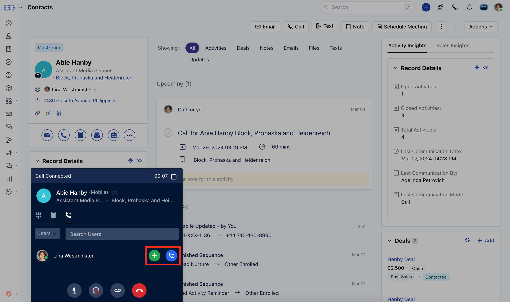
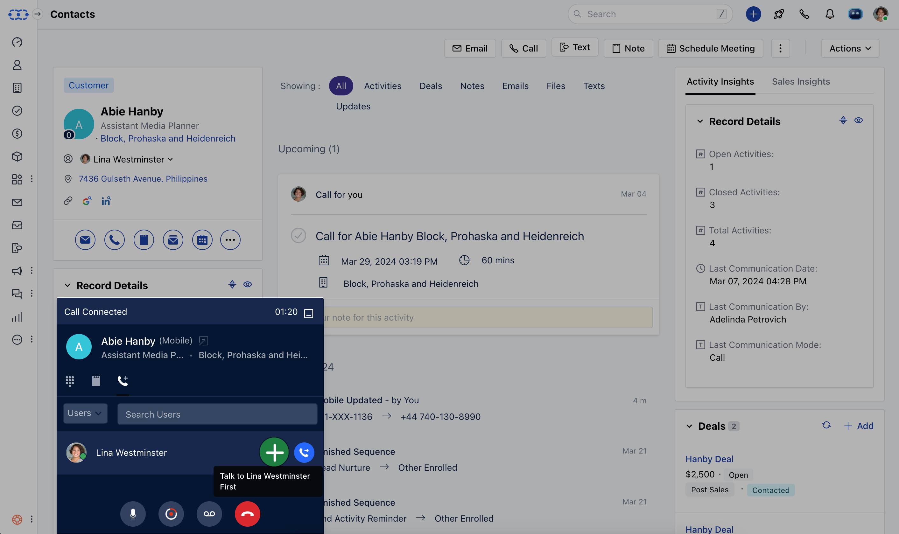
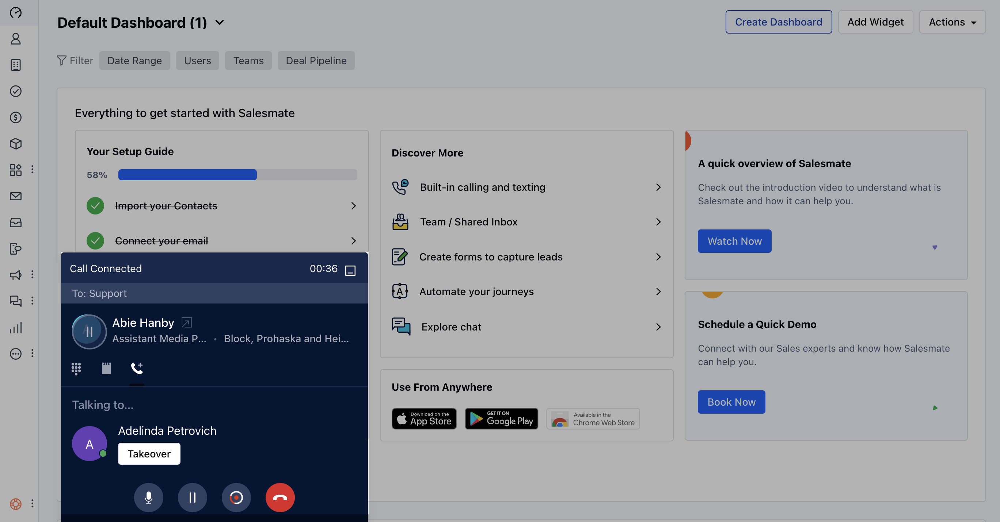
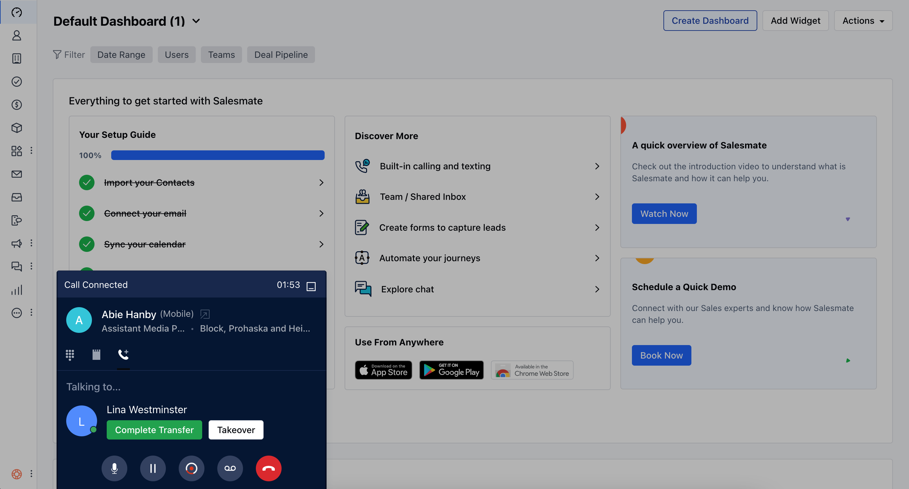
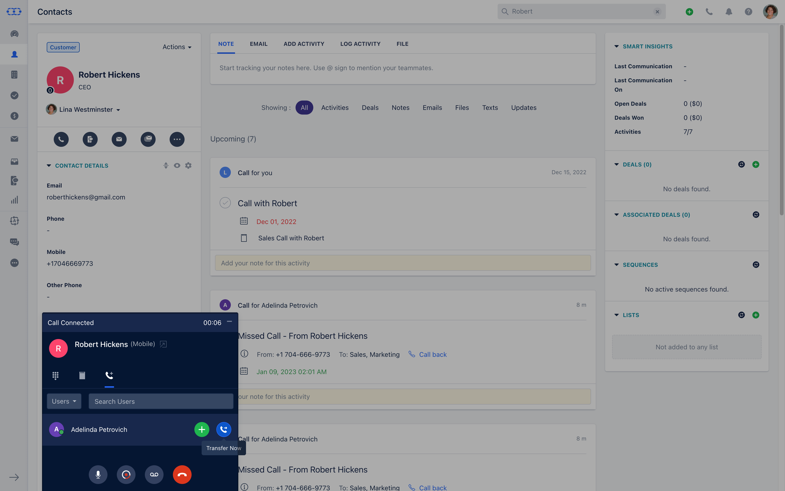
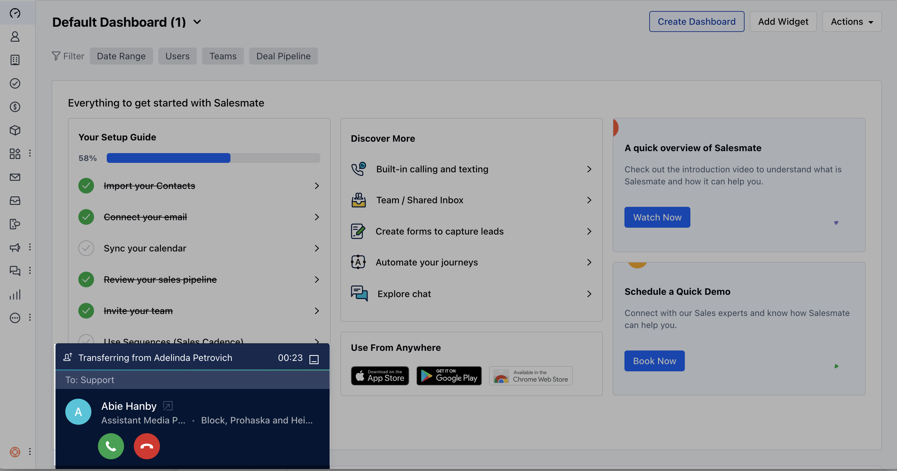

- * There are times you need to discuss with your teammate or need to find out some additional information. You can transfer an ongoing call to your teammate OR to a member of another team OR even a number in your Salesmate account.***When clicking the** Transfer** button you can choose to either-**
- [Warm Transfer-](#warm-transfer-talk-to-your-colleague-first)
- [Talk to your colleague first](#warm-transfer-talk-to-your-colleague-first)
- [Cold Transfer-](#cold-transfer-to-transfer-the-call-right-away-if-you-want-to-transfer-the-call-right-away-cold-transfer-without-speaking-to-your-teammate-first-hit-the-transfer-now-button-you-can-then-select-a-user-or-a-salesmate-number-to-which-you-wish-to-transfer-this-call-they-will-then-receive-the-call-and-can-accept-or-reject-the-transfer-once-the-transfer-has-been-initiated-you-will-be-dropped-off-the-call-in-case-the-teammate-is-busy-then-a-busy-message-will-be-played-and-the-call-will-go-to-voicemail-if-configured-and-the-call-dropped)
- [Transfer the call right away](#cold-transfer-to-transfer-the-call-right-away-if-you-want-to-transfer-the-call-right-away-cold-transfer-without-speaking-to-your-teammate-first-hit-the-transfer-now-button-you-can-then-select-a-user-or-a-salesmate-number-to-which-you-wish-to-transfer-this-call-they-will-then-receive-the-call-and-can-accept-or-reject-the-transfer-once-the-transfer-has-been-initiated-you-will-be-dropped-off-the-call-in-case-the-teammate-is-busy-then-a-busy-message-will-be-played-and-the-call-will-go-to-voicemail-if-configured-and-the-call-dropped)

###  Warm Transfer - Talk to your colleague first

- The **Warm Transfer** option allows for a smoother communication flow. You can take advantage of the warm transfer to give context to your teammate before transferring the call.

If you choose this option, you can **go back and forth** between a teammate and the contact as many times as needed before transferring the call completely.

Once you hit the green **Complete transfer** button, your call with the client ends and your colleague can continue with the call. If you want to take back the call then hit the **Take over** button.

### **Complete Transfer** If you select complete transfer then another user and contact will be connectedContact will be marked as **un-hold** You will be dropped from the callWhatever you have talked about before hitting on the transfer button will be available as a recording (if enabled) and that will be logged with your call.When the other user finishes his call, the activity would be logged with a recording from where he started to talk to the customer ( provided auto recording was ON )

### **Take Over** If during the call or while it was ringing, you hit on takeover then the other user to whom the call was being made will be disconnected.You will be able to talk back to contact.Contact will be marked as **un-hold.

- **In such cases, once we end the call, we will be able to log our activity.

While you connect with your colleague the contact will be placed on hold and can hear the hold music which can be set from the [phone number settings.](https://support.salesmate.io/hc/en-us/articles/360004733311)You can take notes as the call has been transferred and it will appear as an activity on the timeline.

###  Cold Transfer- To transfer the call right away **If you want to transfer the call right away (**cold transfer **) without speaking to your teammate first, hit the** Transfer now** button. You can then select a user OR a Salesmate number to which you wish to transfer this call. They will then receive the call and can accept or reject the transfer. Once the transfer has been initiated, you will be dropped off the call. In case the teammate is busy then a busy message will be played and the call will go to voicemail (if configured) and the call dropped.

- **

**

###  Receiving a Call Transfer

You will get the contact info on your screen similar to other calls, but if you receive a transfer then there will be two options:

### **Cold / Blind transfer** You will only come to know the name of the user who has called.But after picking up the call it just works like any other call you get on the Salesmate platform.

### **Warm Transfer** When you receive a warm transfer, you will be able to see the user, who is transferring the call to you.On receiving a call you will not have the option to write down a note or transfer the call to any other user on the spot. You will have the option to take over the call, stop/start recording the call, or end it.If you end it, the user trying to transfer the call to you will get connected to the contact.On takeover, the person transferring the call to you will be dropped and you will get connected to the contact.If you are receiving a call on your cellular network, then the only person trying to transfer the call can hand over the call to you or it will be auto-handed over if that person drops the call from his end.Once the call is with you, all other screen options will be enabled, just like a normal call.

###  Transfer Pricing

The call is switched to conference mode for transferring. So you will be charged for regular call pricing plus $0.0019 to $0.0044 / participant on the call. These prices are dependent on the network to provide better voice quality based on the location of all participants.
