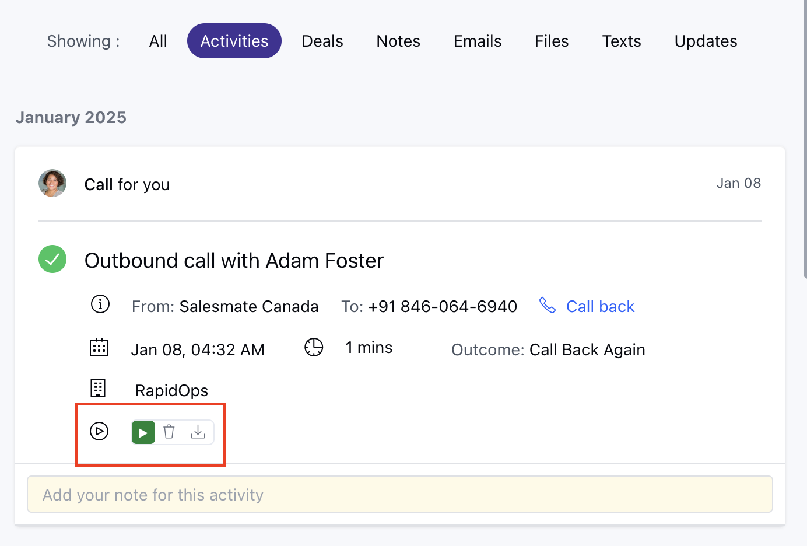

Once you have enabled call recording for all inbound and outbound calls for a number. The call recordings will be logged.You can either view all the call recordings on the
[Dashboard](#dashboard)
or an
[Activity](#activity)
for the contact.

###  Dashboard

Navigate to **Dashboard.

- ** Click on **Add widget** in the top right corner.

Add the **Call Logs** Report.

The Call Logs report can be filtered Sales rep-wise and for the duration you desire.

###  Activity

Navigate to the **contact**. Click on **Activities** on the contact timeline.Here you can view all the recordings associated with the contact.

