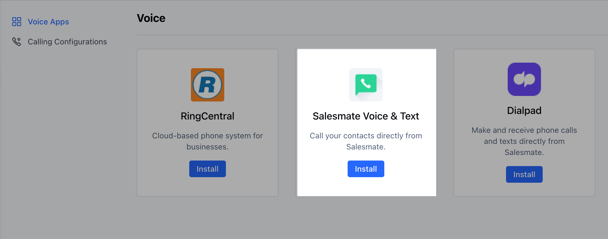
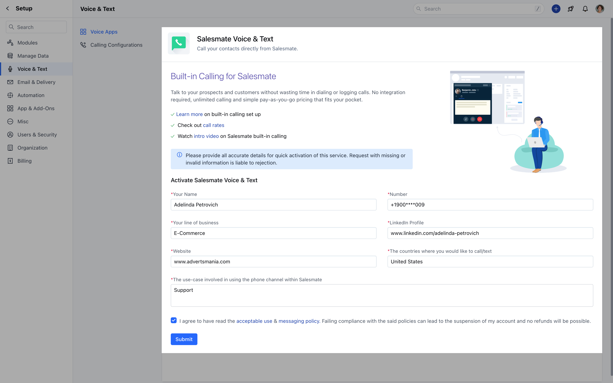

To be able to send text messages out of Salesmate, you will need to enable the Salesmate Voice & Text app.
[**Click Here - Follow the Article linked to know more about the Calling Activation Process**](https://support.salesmate.io/hc/en-us/articles/360004733011)

### **Calling and Text Feature Activation Steps :**Navigate to the **Profile Icon** on the top right cornerClick on **Setup** Head over to **Voice & Text** categoryClick on **Voice Apps**

Click on **Install**(Salesmate Voice & Text)

- *Fill in the Request Form :**(Please provide all accurate details for quick activation of this service. Request with missing or invalid information is liable to rejection.)

Once Activated, you need to Purchase a number that has the **Capability** to allow **Text Messaging**.

Refer to the capability column while purchasing the number to do so.

