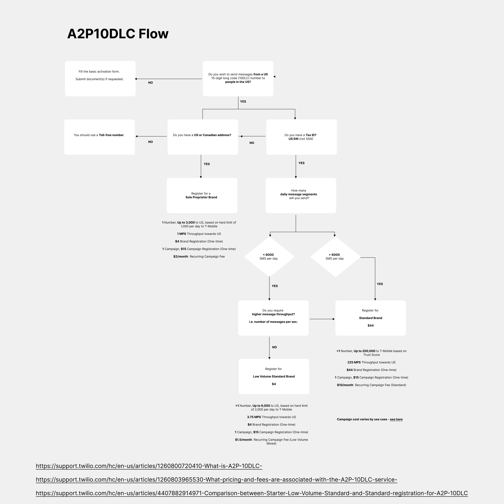

[Salesmate Calling](https://support.salesmate.io/hc/en-us/articles/360004664432-Introduction-to-Salesmate-Calling)
is the best tool for making sales calls and sending text messages right from your account with your Salesmate's VOIP number.Text Messaging through Salesmate doesn’t require any additional setup as it uses your existing Salesmate Calling number. If you don’t have a Salesmate Calling number yet, find out
[here](https://support.salesmate.io/hc/en-us/articles/360004733031)
how you can get one.

- **Cloud-based system:** You do not require any hardware setup or software installation. It works completely over the internet (VoIP Technology) and it is set up by default in your Salesmate account.Similar to calling, you can refer to the
- [text pricing page](https://support.salesmate.io/hc/en-us/articles/360011216212-SMS-Rates)
to know the charges for sending and receiving text messages in Salesmate.Note: To use texting feature within Salesmate you would need to first activate the Calling and Texting Feature from
[here](https://support.salesmate.io/hc/en-us/articles/360007155752)

####

- **Salesmate Text Messaging covers:**
- [Sending Text Messages](https://support.salesmate.io/hc/en-us/articles/360007155992-Sending-Text-to-a-number)
- [Receiving Text Messages](https://support.salesmate.io/hc/en-us/articles/360007406671-Receiving-Text-Messages)
- [Conversational View](https://support.salesmate.io/hc/en-us/articles/360037039112-Text-Conversation-View)
- [Text Messaging Templates](https://support.salesmate.io/hc/en-us/articles/360007156412-Text-Messaging-Templates)
- [Bulk Text Messaging](https://support.salesmate.io/hc/en-us/articles/360007156012-Send-Bulk-Text-Messages)
- [Text Message Scheduling](https://support.salesmate.io/hc/en-us/articles/9189865180185)
