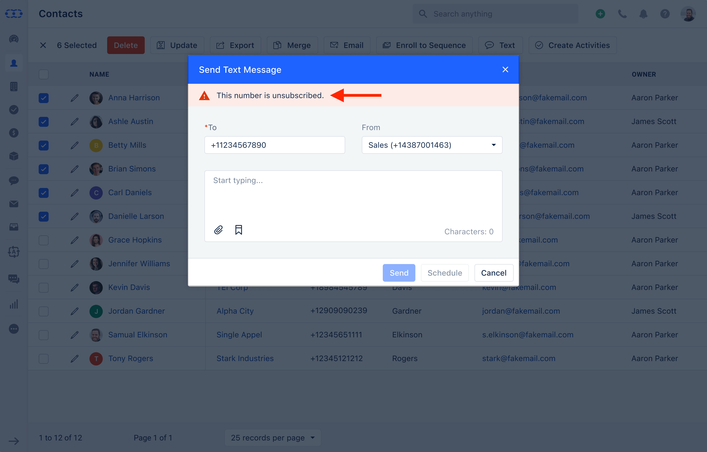

Salesmate offers the valuable feature that puts control in the hands of your contacts, allowing them to easily **opt-out** of receiving text messages. This feature ensures that your communication remains respectful, compliant, and aligned with the principles of user consent. By giving individuals the ability to manage their messaging preferences, we help foster better engagement and build trust with your audience.

###  **Topics covered:**

- [H](#topics-covered)

- [ow Contacts Can Opt-Out](https://support.salesmate.io/hc/en-us/articles/26437837041561-Opt-In-and-Opt-Out-of-Text-Messages#h_01JJ2MHNTCCEWRA06D8ZGQZ62N)

- [How the Opt-Out Process Works](https://support.salesmate.io/hc/en-us/articles/26437837041561-Opt-In-and-Opt-Out-of-Text-Messages#h_01JJ2MHNTC92HXSHHW2H654P79)

- [Re-Opting In: How Contacts Can Start Receiving Text Messages Again](https://support.salesmate.io/hc/en-us/articles/26437837041561-Opt-In-and-Opt-Out-of-Text-Messages#h_01JJ2MHNTC495THHEKH1JJPE4M)
- [Why This Matters](https://support.salesmate.io/hc/en-us/articles/26437837041561-Opt-In-and-Opt-Out-of-Text-Messages#h_01JJ2MHNTCBM90JQR5GWXPXGES)### **How Contacts Can Opt-Out** Your contacts now have the ability to unsubscribe from text messages with just a simple reply. They can opt-out by sending any of the following (case-insensitive) keywords in response to your text message:** STOP **STOP ALL **UNSUBSCRIBE **CANCEL **END **QUIT ** These easy-to-use keywords give users the flexibility to stop unwanted messages and regain control over their communication preferences.

### **How the Opt-Out Process Works** Once a contact opts out, the system will automatically update their preferences across your account:**Contact Information Update**: The phone number that sent the opt-out request will be marked as unsubscribed in your contacts list. A timeline entry will also be created for reference.

- **Skipped Bulk Text Messages**: Any future bulk text messages will be skipped for this contact, and the failure message will read:**"Unsubscribed from Text"**.

- **Sequences**: If the contact is part of any automated sequence with text steps, they will automatically be skipped from receiving text messages in that sequence.

- **Text Message Status**: If a contact in automation has opted out of receiving text messages, the system will note the attempt as **unsuccessful** and label it as:**"Text Unsubscribed"**.

### **Re-Opting In: How Contacts Can Start Receiving Text Messages Again** If a contact changes their mind and wants to start receiving text messages again, they can easily opt back in by sending any of the following keywords:** START **UNSTOP **SUBSCRIBE ** This simple process allows contacts to re-engage with your messages whenever they choose, ensuring flexibility and control over their communication preferences.

### **Why This Matters** Giving your contacts the ability to opt-out or opt-in to text messages is not only about respecting their preferences but also about staying compliant with legal requirements. With this feature, Salesmate helps you create a more transparent, user-friendly experience that strengthens your relationship with customers while maintaining compliance with communication regulations.
