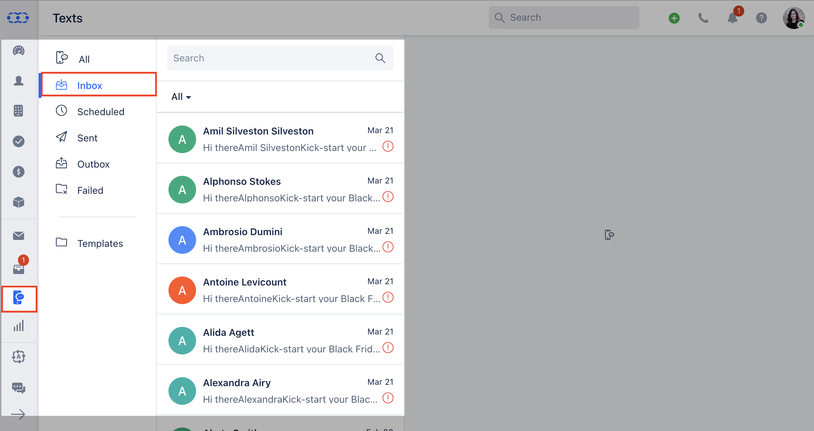
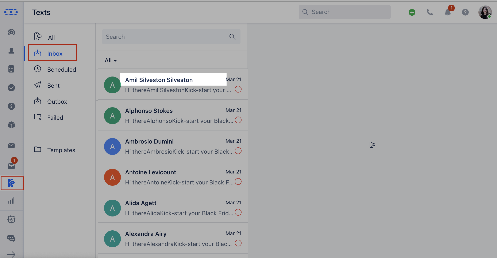
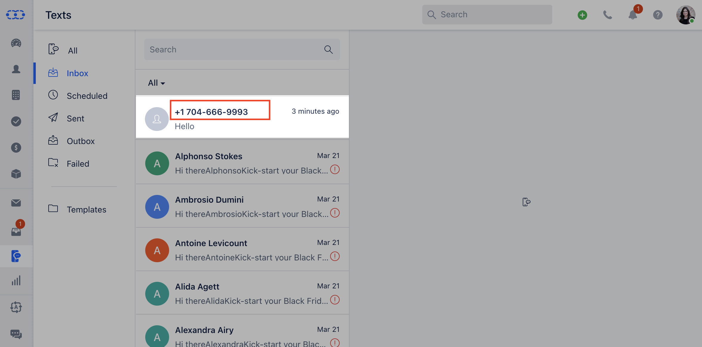
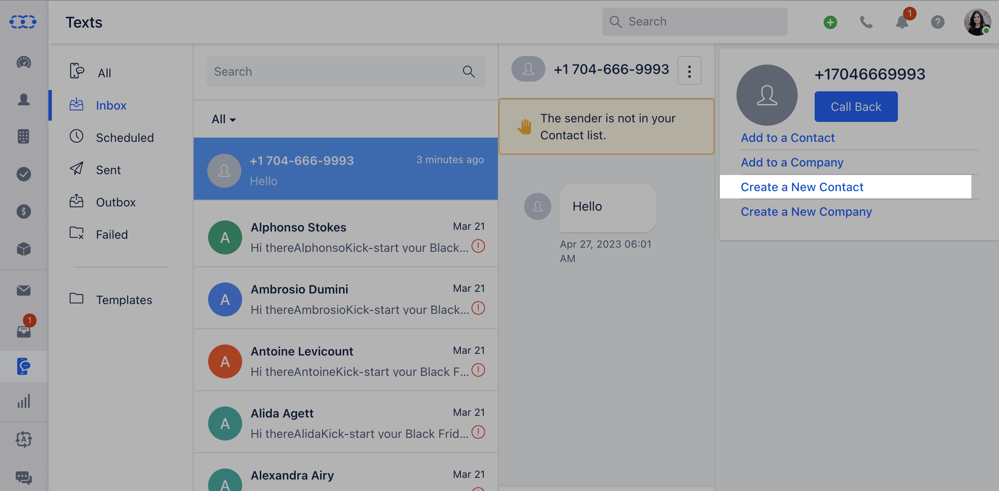

Salesmate facilitates receiving Text messages can your VoIP number.

###  Received Messages

All text messages received on your VoIP number can be seen in one place.Go to **Texts** Click on **Inbox** You will see the list of messages received inside Salesmate on your VoIP number

If the number is identified the associated contact name will be displayed.

If the number is not identified then the number will be displayed

The unsaved numbers can be added as a contact.

**Note:** You will receive notifications for the text messages received on your number in the notification panel ( the bell icon ) in the top menu bar and the message will be reflected on Contac's Timeline
