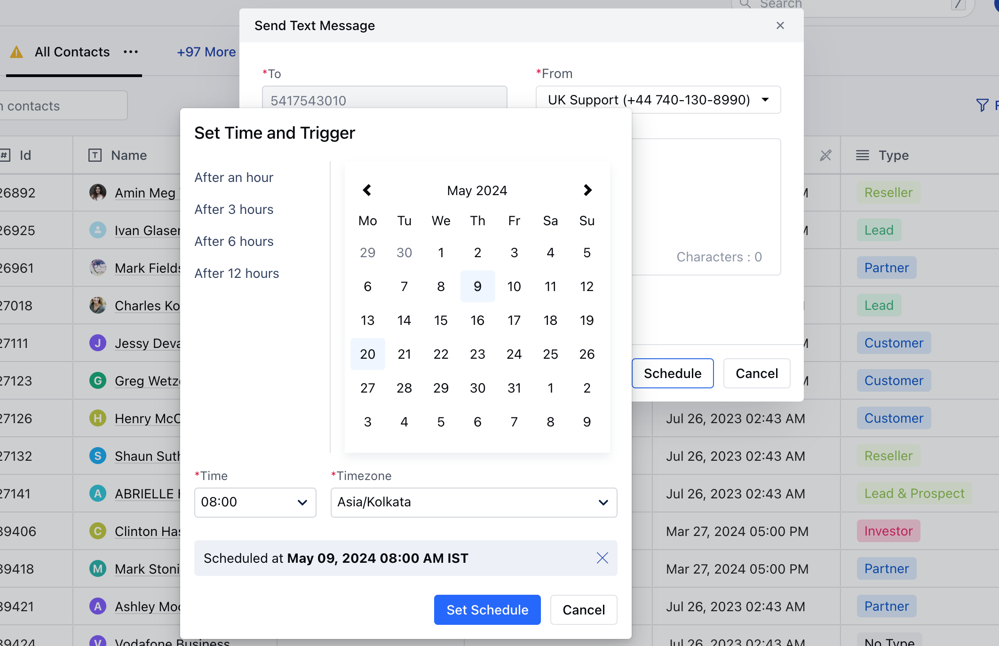
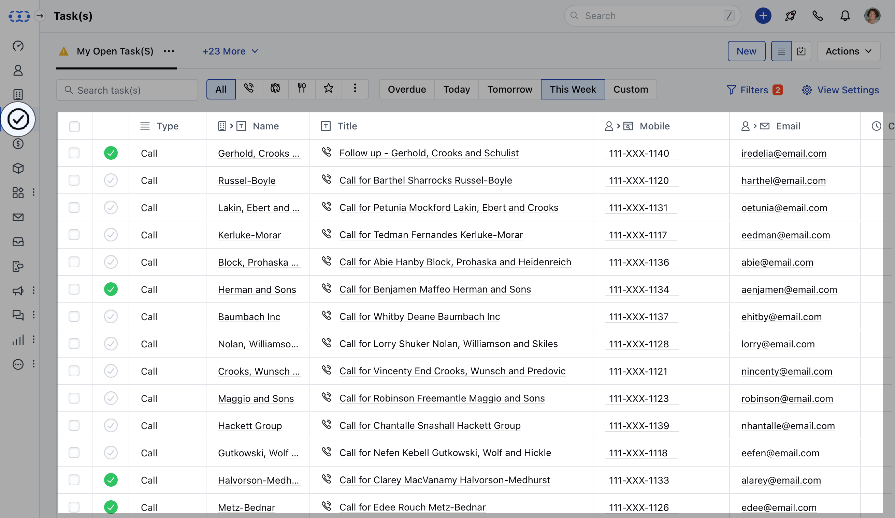
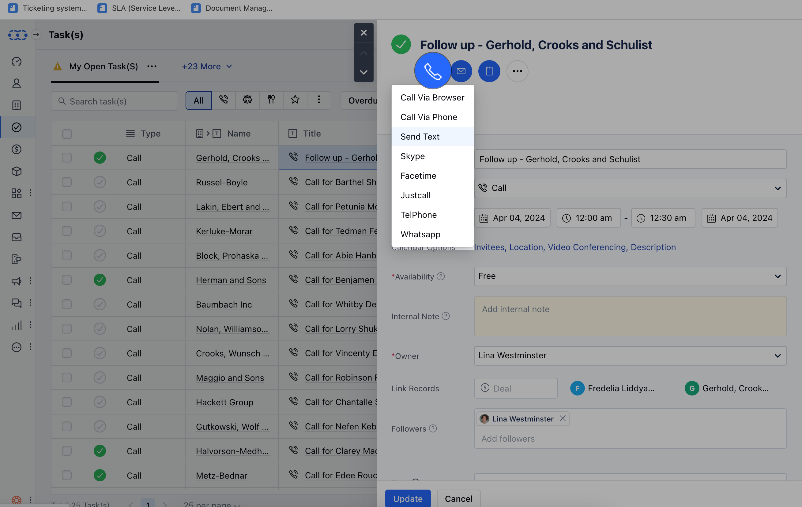
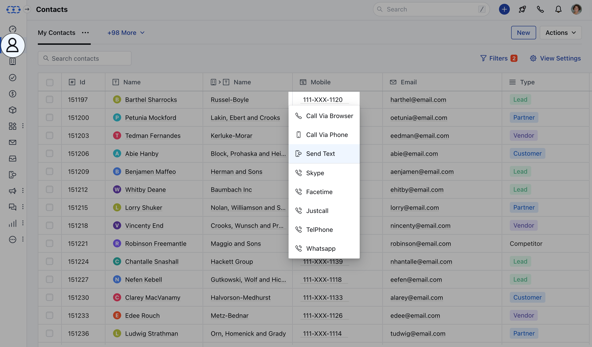
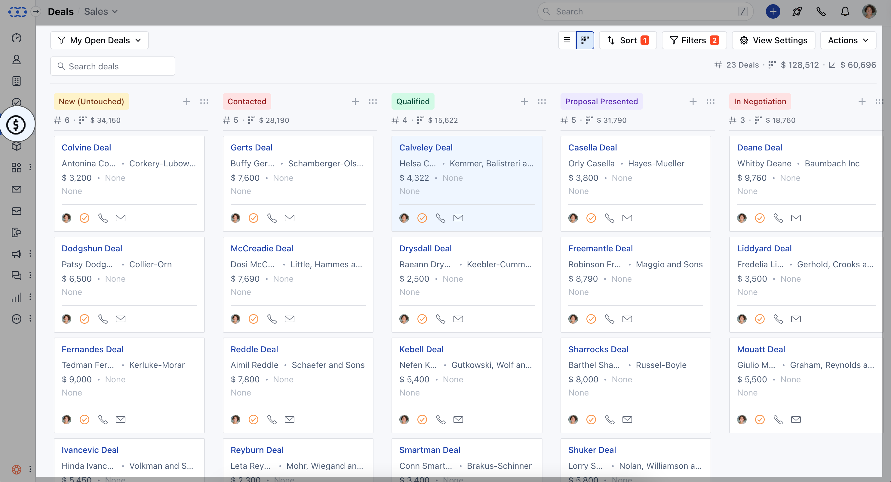
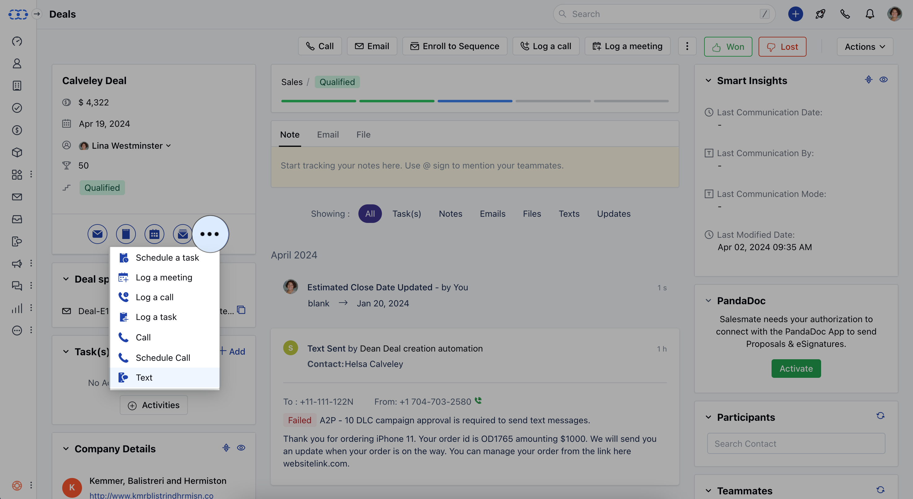

###  Salesmate CRM can work best when you would like to schedule text messages. It helps you to be in touch with your prospects on their special days and avoid procrastination from your busy schedule.

###  How to Schedule Text Messages?

While trying to send a text message, hit **Schedule** to Schedule sending the messageYou can select the date and time and hit the Schedule buttonMessages will land inside the** S **chedule ** Folder and be sent at the particular Date and TimeIn case of an error, then the user will be notified about sending failure.

- *Note**:

Salesmate voice and text should be enabledEnsure the phone number is in the correct format to ensure proper delivery.If you are using variables inside your templates, the actual character length can change at the time of sending the message.If a text message is fired from the deal then it will get auto-attached to the deal too. You can send from the deal detail page, deal's listing grid, or deals listing grid using bulk message. It will also replace deal variables inside the text body.

- **[In case you wish to send text messages in bulk refer to this article.](https://support.salesmate.io/hc/en-us/articles/360007156012)**### **From**: Contact / Company / Activity / Deal **Preview** Page

Navigate to the **Activity Module** from the left menu bar

Click on the desired Activity TitleClick on the **Call** Icon and select **Send Text**

Compose and Send or Schedule your Message as required (Refer steps above for sending Text Messages)Similar operations can be performed for other modules **From:**Contact/Company/Activity/Deal **List** Page

### **From :**Contact / Company / Activity / Deal **Detail** Page

Navigate to the Deal ModuleClick on Deal Title (Board or List View)

Navigate to the **Detail** Page of the dealClick on the three dotsClick on **Text** option

Compose and Send or Schedule your Message as required (Refer to steps for sending Text Messages [here](https://support.salesmate.io/hc/en-us/articles/360007155992-Sending-Text-to-a-number))

### **From:**Text **Conversation** View

Communication isn’t a one-way street. To ensure you have effective two-way communication Salesmate CRM has added the conversation view to its text messages.

- **[Follow this Page for More Insights](https://support.salesmate.io/hc/en-us/articles/360037039112)**
