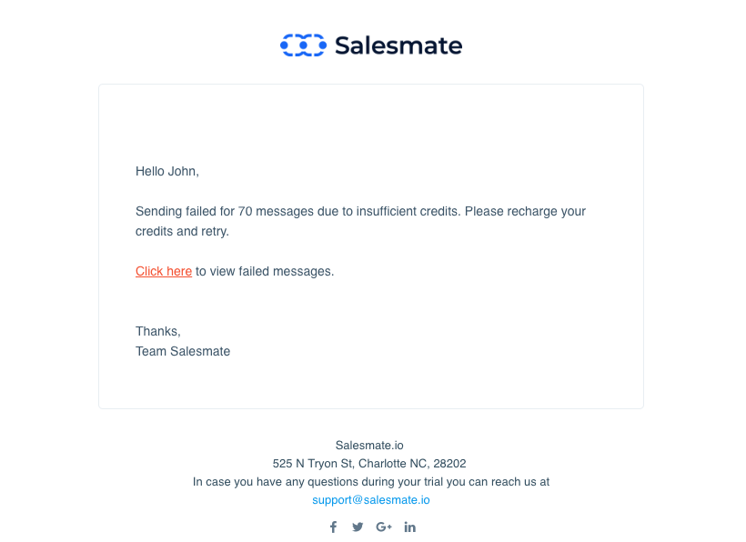

### **To send bulk Text Messages:**Bulk Texting can be initiated from two places **Contact List Page** and **Deal List Page** Go to Contact / Deal List PageFilter the Records that needed to be enrolled for Bulk Text MessagingYou can select records from the list and you will get an option to send **"Text"**

Click on Text - A Pop-up screen will appear for you to populate **To Number**: Select the Phone field from the contact's account to which the text should be fired **From Number**: Select the number from which the text should be fired if you have multiple numbers assigned to yourselfYou can compose your text message or select from the predefined ** Template **Insert Attributes**\- to insert Variables to be replaced with the actual field value ** Schedule **- with this option Text Messages can be scheduled and delivered at the user's choice and time zone selection. Hit Send and Salesmate will put a message in the outbox for sending

If any bulk message sending failed due to insufficient funds then Salesmate will reject all other bulk text messages with the same bulk queue to fail and send an email alert to the person who fired those text messages.

- *Note**:

You can select to send bulk messages to all Mobile, Phone, Other Phone, or Custom Phone numbers associated with the contact.You can use predefined **Text Templates** while you send out the message.If you are using variables inside your templates, the actual character length can change at the time of sending the message.
