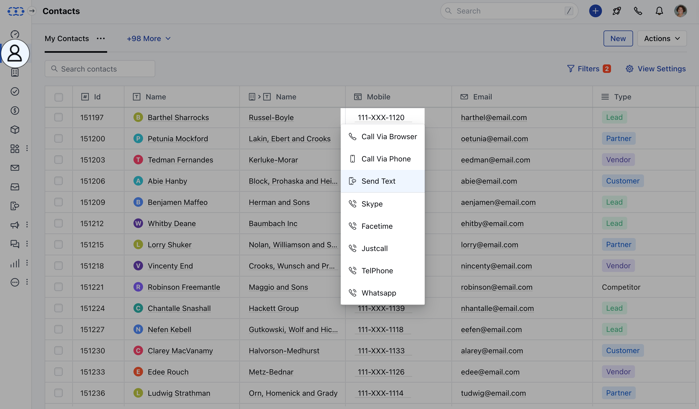
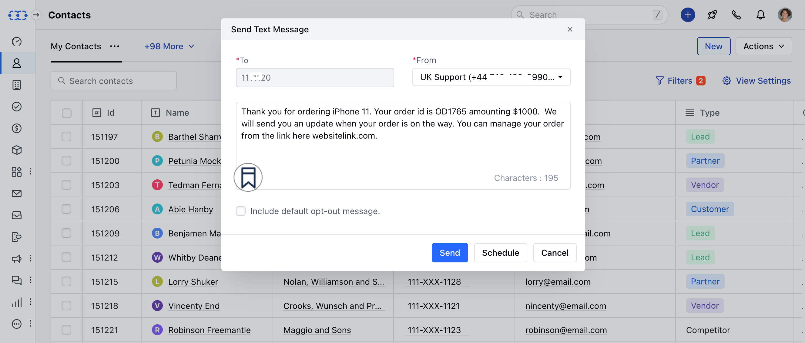
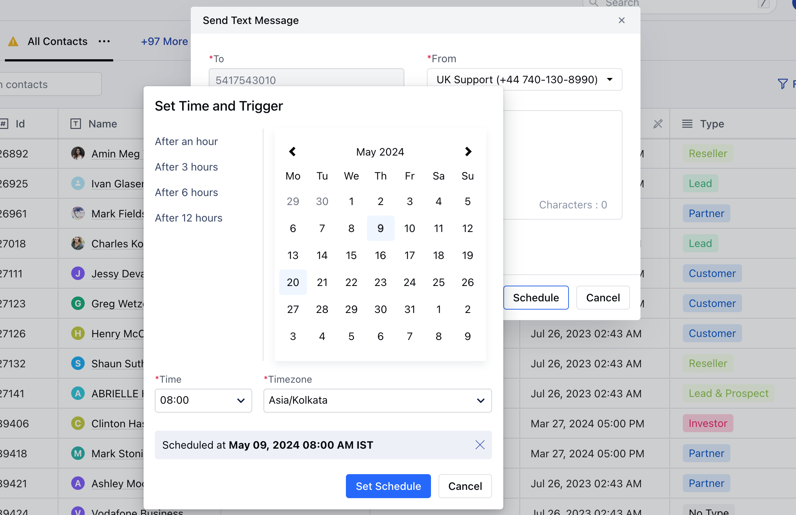
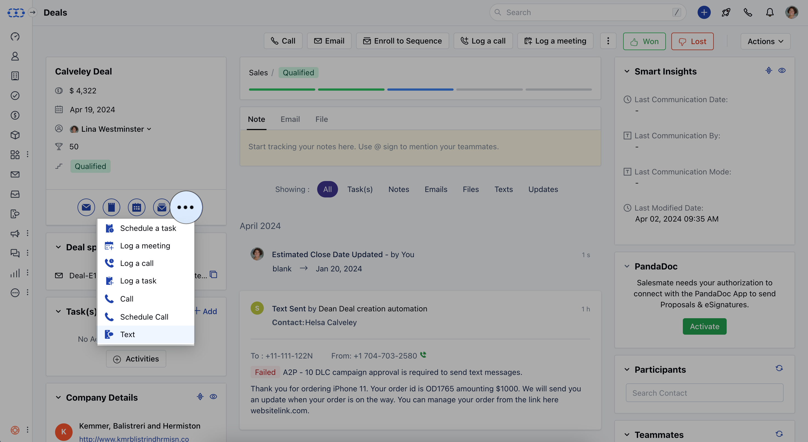
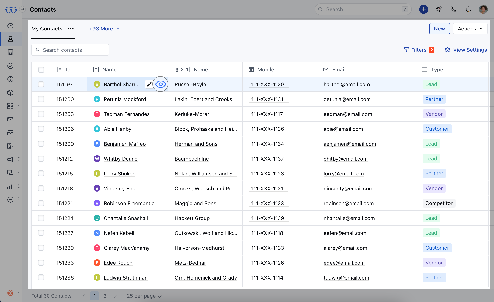
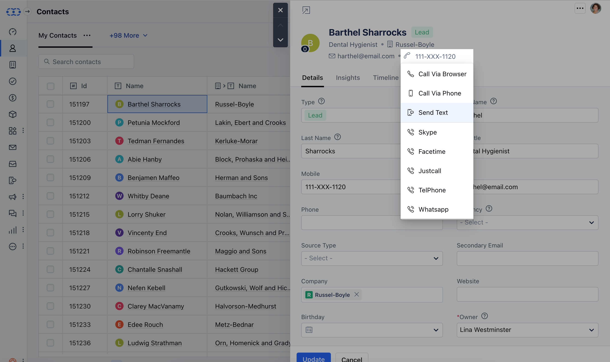
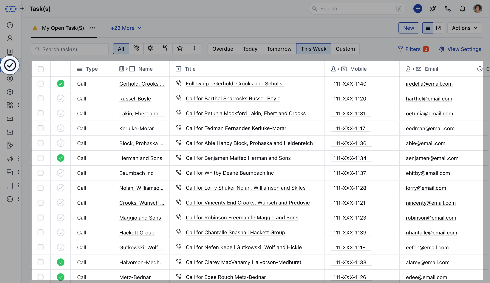
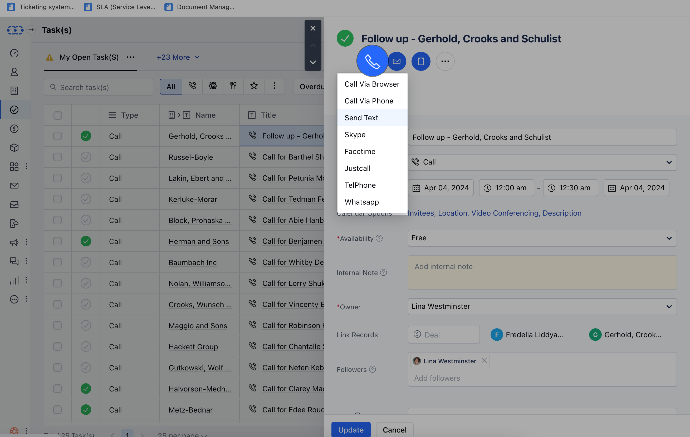
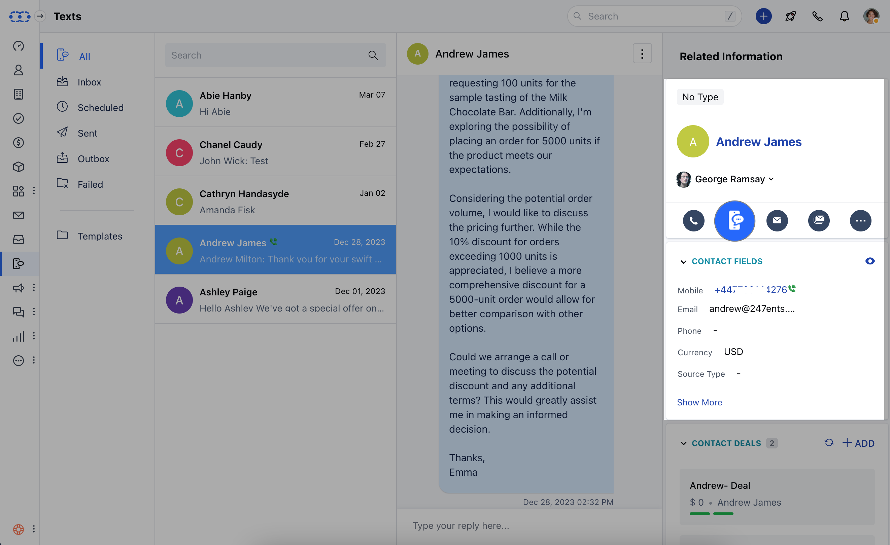

Once the Salesmate Voice & Text app are enabled and you see a phone number, you can send a text message from there. Common places where we see the phone number.

- [From Contact/ Company/ Activity/ Deal List Page](#from-contact-company-activity-deal-list-page)
- [How to Schedule Text Messages](#how-to-schedule-text-messages)
- [From Contact/Company Detail Page](#from-contactcompany-detail-page)
- [From Contact/Company Preview Page](#from-contactcompany-preview-page)
- [From Activity Preview Page](#from-activity-preview-page)
- [From Deal Detail Page](#from-deal-detail-page)
- [Text **Conversation** View](#text-conversation-view)

### From Contact/ Company/ Activity/ Deal List Page

Navigate to the Contact / Company / List / Deal - ModuleLook for Phone Column ([Manage Columns](https://support.salesmate.io/hc/en-us/articles/360042192371-Manage-Columns-in-the-List-View))Hover on any **Phone**/**Mobile** Number or any **Custom** Field of the Type **Phone**, a pop-over will appear with an option to "**Send Text**"By default, the primary number selected under general dialer settings would be selected to send out the texts.In case you have been assigned multiple numbers, you will be able to select the **From** number from which you wish to send out the texts.

Hit on that option and popup will appear to **Send a text message** The number will be auto fetched and shown in the popup windowYou can **Compose** your message or select any of already created templateClick on **Insert Templates** to Add predefined messages

Keep Note of the Character CountSimilar operations can be performed for other modules **Note:**The character limit for a single SMS message is **160** characters, however, most modern phones and networks support concatenation and segment and rebuild messages up to 1600 characters. Messages not using [GSM-7](https://www.twilio.com/docs/glossary/what-is-gsm-7-character-encoding) encoding are limited to 67 characters.When you send an SMS message over 160 characters the message will be split. Large messages are segmented into 153 character segments and sent individually then rebuilt by the recipient's device. For example, a 161 character message will be sent as two messages, one with 153 characters and the second with 8 characters.

Hit **Send** to send the Text messageOn success, we will put a message in the **Outbox to be sent** If any error occurs then an error message will be displayedThis message can be seen in the **Failed** folderThe user will be given a notification about "Sending Failed" with a detailed reason about why it failed (Cases: Low Balance, Wrong Number, etc.)

### How to Schedule Text Messages

Hit **Schedule** to Schedule sending the messageYou can select date and time and hit the Schedule buttonMessages will land inside ** S **chedule ** Folder and sent at the particular Date and TimeIn case of an error, then the user will be notified about sending failure.

- *Note**:

Salesmate voice and text should be enabledEnsure the phone number is in the correct format to ensure proper delivery.If you are using variables inside your templates, actual character length can change at the time of sending the message.If a text message is fired from the deal then it will get auto attached to the deal too. You can send from deal detail page, deal's listing grid, or deals listing grid using bulk message. It will also replace deal variables inside the text body.

- **[In case you wish to send text messages in bulk refer to this article.](https://support.salesmate.io/hc/en-us/articles/360007156012)**

### From Contact/Company Detail Page

Navigate to the respective ModuleClick on the desired Contact/CompanyClick on the Mobile Icon to send text

### From Contact/Company Preview Page

Navigate to the respective Module from the left menu barClick on the desired Contact/Company's preview icon

Hover on the Mobile Number to send text

### From Activity Preview Page

Navigate to the Activity ModuleClick on the desired Activity

Click on the **Call** IconSelect the **Number** you want to Text to (In case of Multiple Numbers)Click on Send Text Message

Compose and Send or Schedule your Message as required (Refer steps above for sending Text Messages)

### From Deal Detail Page

Navigate to the **Detail** Page of the dealClick on the three dotsClick on **Text** optionWhile under the detail view, you will also be able to change the **From** number from which you wish to send out texts.

Compose and Send or Schedule your Message as required (Refer steps above for sending Text Messages)

### Text Conversation View

Navigate to the **Text** ModuleClick on the **Contact** Hover on the Mobile icon

Communication isn’t a one-way street. To ensure you have an effective two-way communication Salesmate CRM has added the conversation view to its text messages.

- **[Follow this Page for More Insights](https://support.salesmate.io/hc/en-us/articles/360037039112)**
