### Conversational View

Communication isn’t a one-way street. To ensure effective two-way communication, Salesmate CRM includes a Conversation view for text messages. To view the Conversation screen, follow the steps below.

1. Navigate to the **Left Menu** bar and click the **Text** icon.

You will find the following options under the View:

- **All**  
- **Inbox**  
- **Scheduled**  
- **Sent**  
- **Outbox**  
- **Failed**  
- **Templates**

---

#### All

With **All**, you can view every sent and received message within a single view.

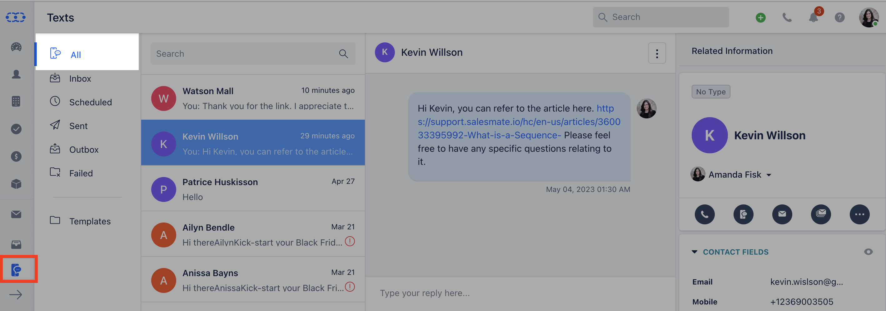

---

#### Inbox

You can view all text messages that have received a reply.

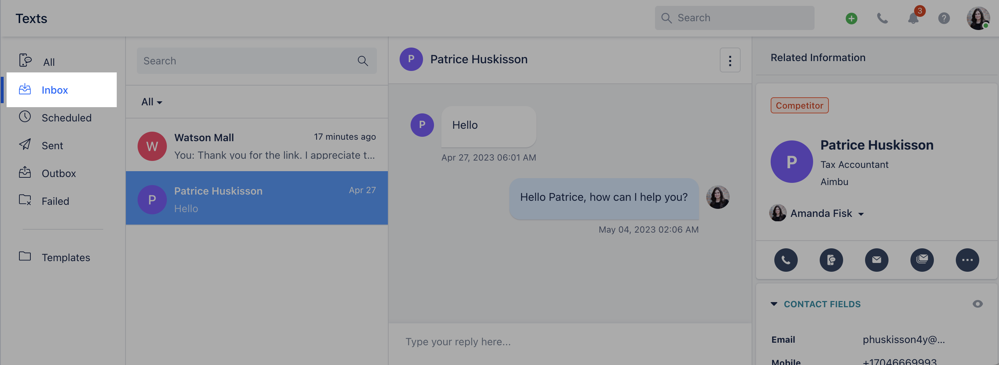

You can **Reply** to a conversation from the relevant conversation view.

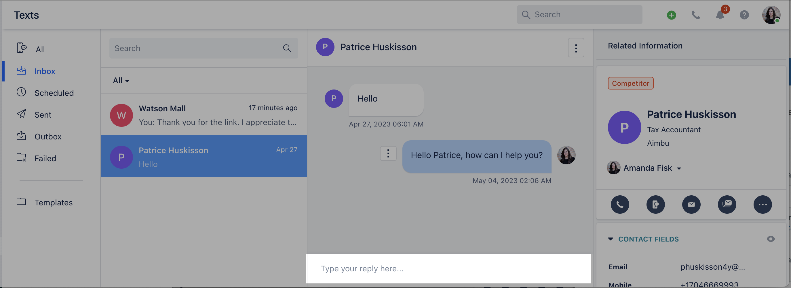

If a contact has multiple numbers assigned, you can select the number to initiate messaging from. You can also insert **Templates** from the predefined list.

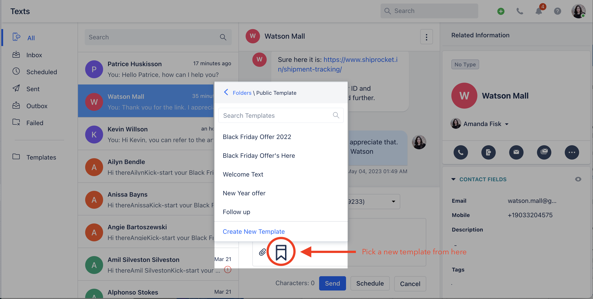

You can **Schedule** the text message.

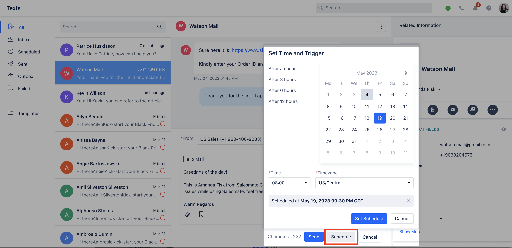

When you hover over the three dots beside a message, you will see the details of the **To** and **From** numbers and can also delete the text.

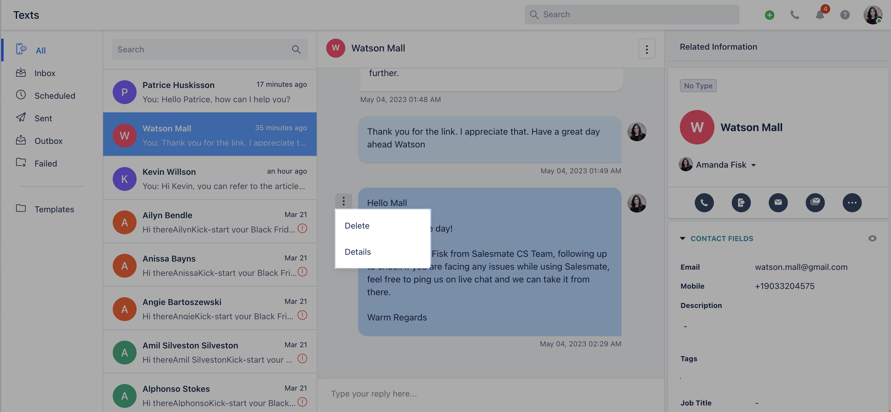

Here's how the details popup looks:

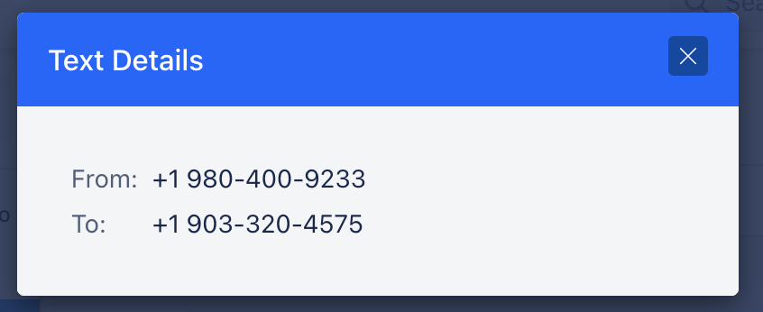

---

#### Scheduled

Contains all text conversations that are scheduled for future delivery. You can check the scheduled timing. From **Actions** (three dots menu), you can:

- **Reschedule**  
- **Edit**  
- **Delete**  
- **Check Details**

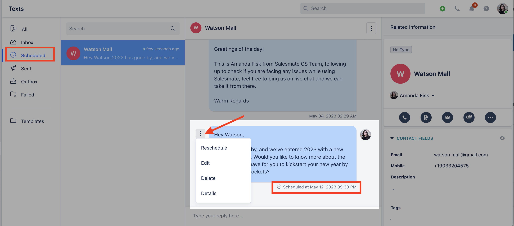

---

#### Sent

If you use bulk texting, you can check the status of bulk messages here.

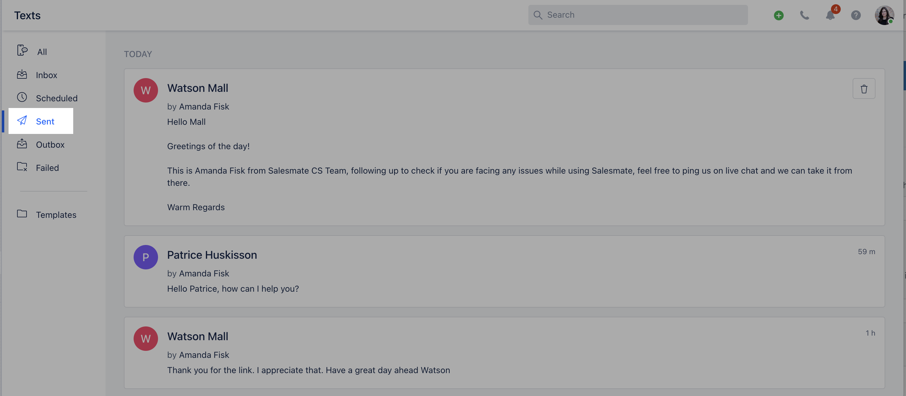

---

#### Outbox

All messages scheduled for instant delivery are queued under **Outbox** and are sent in small batches.

---

#### Failed

Check the status of failed messages in this folder and retry sending from the same screen to the contact.

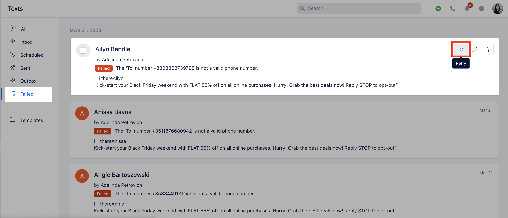

You can also try sending bulk messages by selecting multiple contacts.

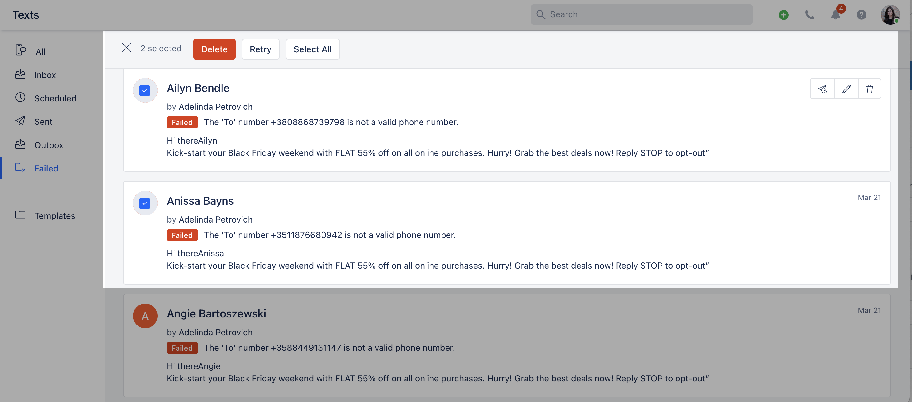

---

#### Templates

You can create and manage text templates.

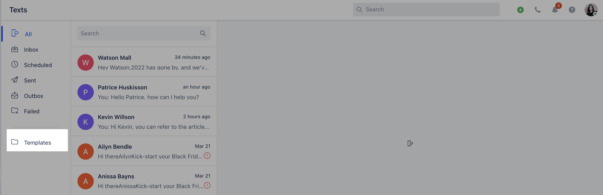

Filter templates under folders and create new folders from the **+** icon.

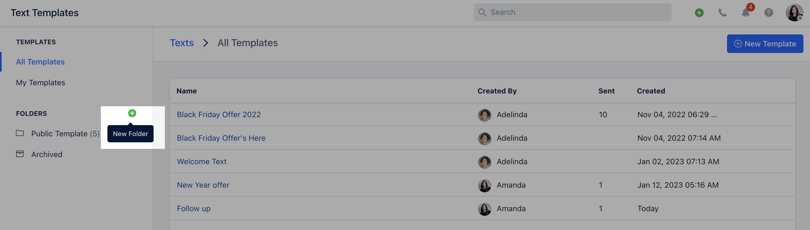

To create a new template, click **+ New Template**.

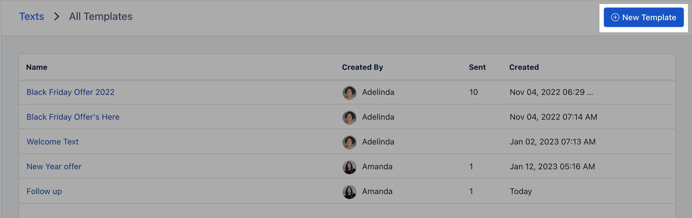

**Template fields**

- **Template Name:** For identification and future reference.  
- **Folder:** Select the folder where the template should be saved.  
- **Text Message:** The message body to be sent.  
- **Insert Attributes:** Use replaceable variables (for example, ``{{Contact.firstName}}`` to insert the contact's first name).

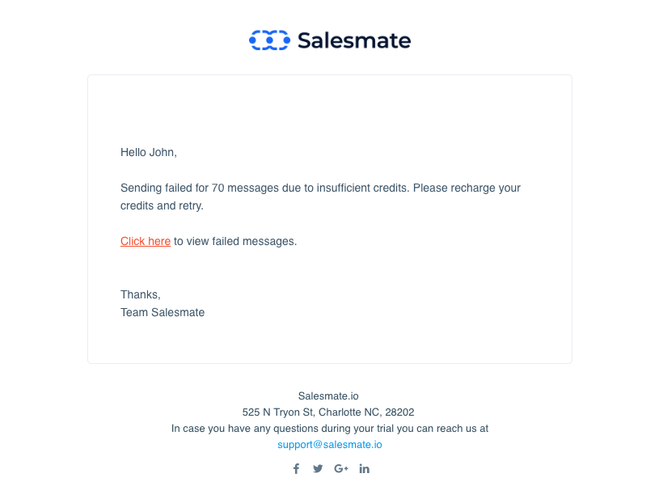

