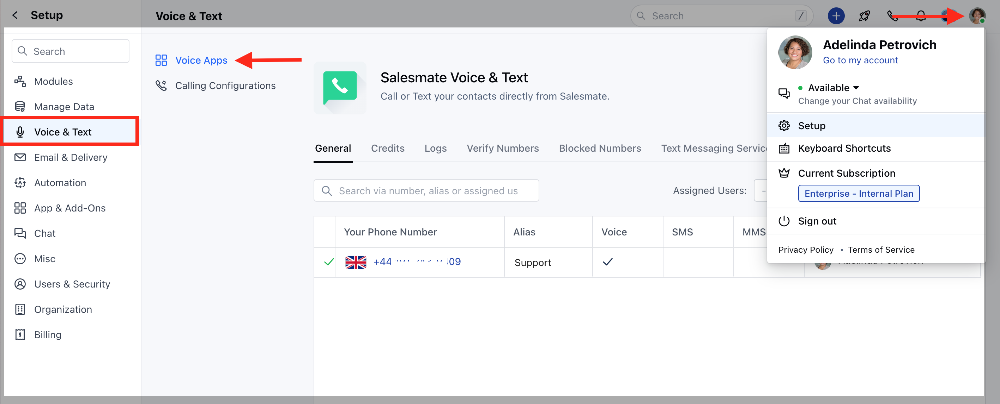
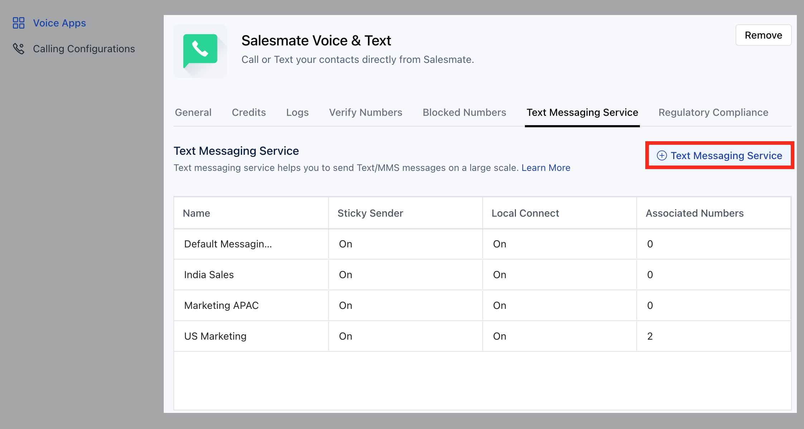
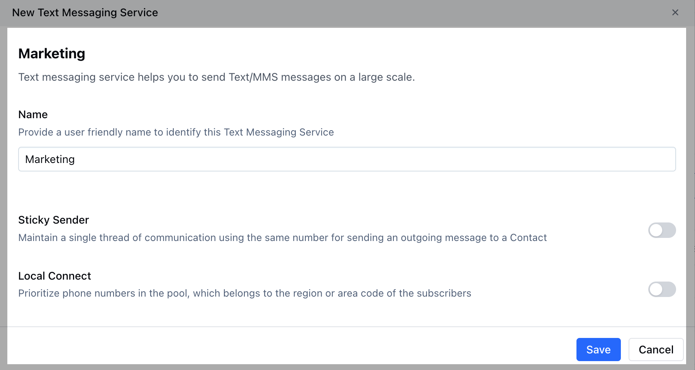
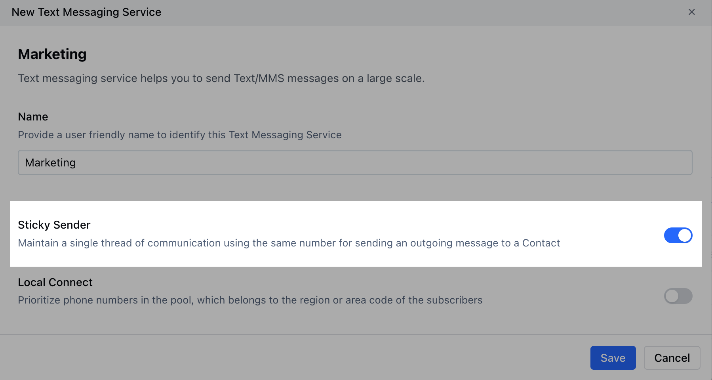
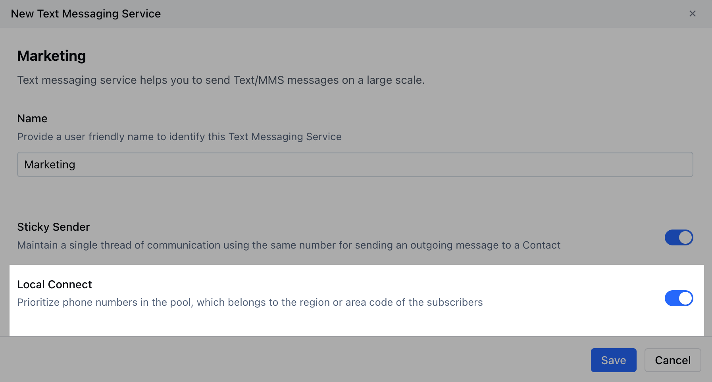
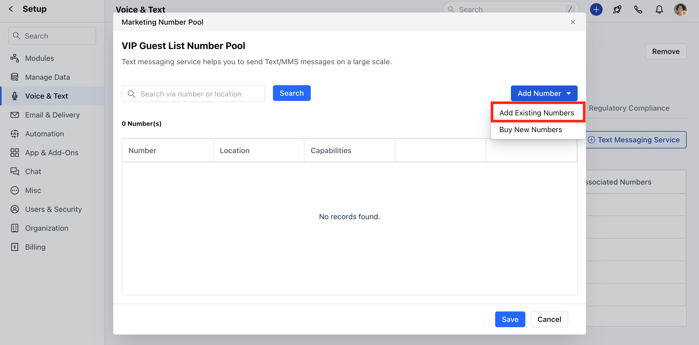
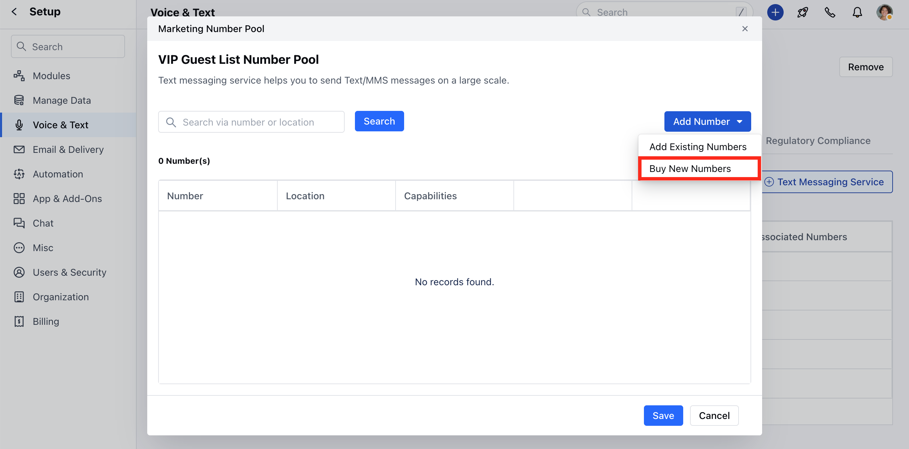
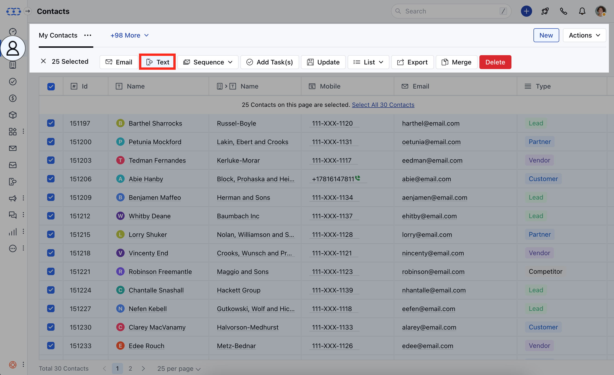
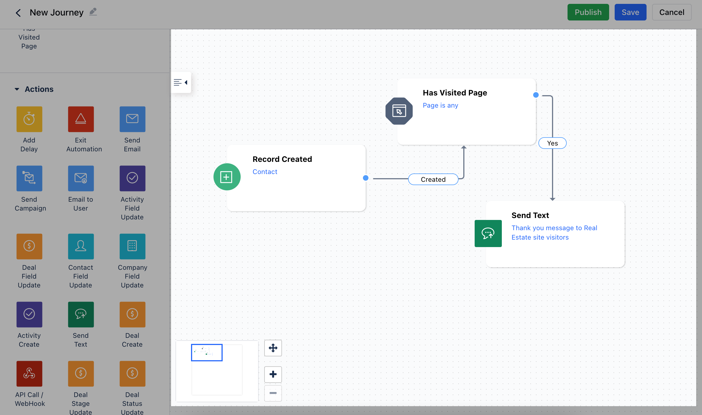
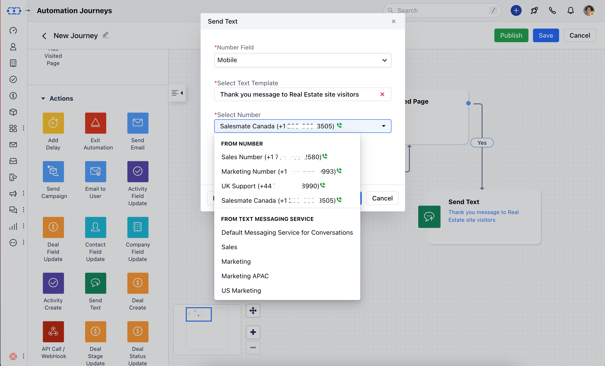

Text Pilot is now called as **Text Messaging Service**. It helps you to send Text/MMS messages on a large scale. It provides users a mechanism where they can group the number to send bulk messages.

### How is the Text Messaging Service feature useful

- **Geo-Match:** Send outgoing messages from a local matching number.

- **Sticky-Sender:** Use the same number for sending new messages to the same client to maintain conversation history

### Create a new Text Messaging Service

### To create a new Text Messaging Service, please follow these steps:

Navigate to the **Profile Icon** on the top right cornerClick on **Setup** Head over to **Voice & Text** categoryClick on **Voice Apps**

Go to the **Text Messaging Services** Hit **\+ Text Messaging Service**

Give it a suitable **Name**

Choose **Sticky Sender** if you want to maintain a single thread of communication using the same number for sending an outgoing message to a Contact

Choose Local Connect if you want to prioritize any phone numbers in the pool, which belongs to the region or area code of the subscribers and **Save** it.

You will get options to choose numbers from your pre-purchased list (Existing Numbers) or quickly purchase the new numbers and associate.
All the numbers purchased will be assigned to nobodyAll the numbers purchased will have default settings same as what the user gets when he/she buys the number individually.

- **Add Existing Number:** Salesmate will let you choose any of your pre-purchased numbers for this service. You can search numbers via Phone Number, Alias, or Location.

- **Buy New Numbers:** Salesmate will let you quickly buy new numbers from a particular state or area code.

### Where can we use the Text Messaging Service Feature

- **Sending Bulk Texts:** Inside from dropdown, we will show an additional name like Real eState Pilot. Users can choose the Text Messaging Service and outgoing messages will be fired using the group of numbers.

- **Sending Via Automation:** Inside the automation, we have an option to send from a number. You can choose Text Messaging Service as a service to send text messages.

Click on the **Select Number** option and choose the **Text Messaging Service**

