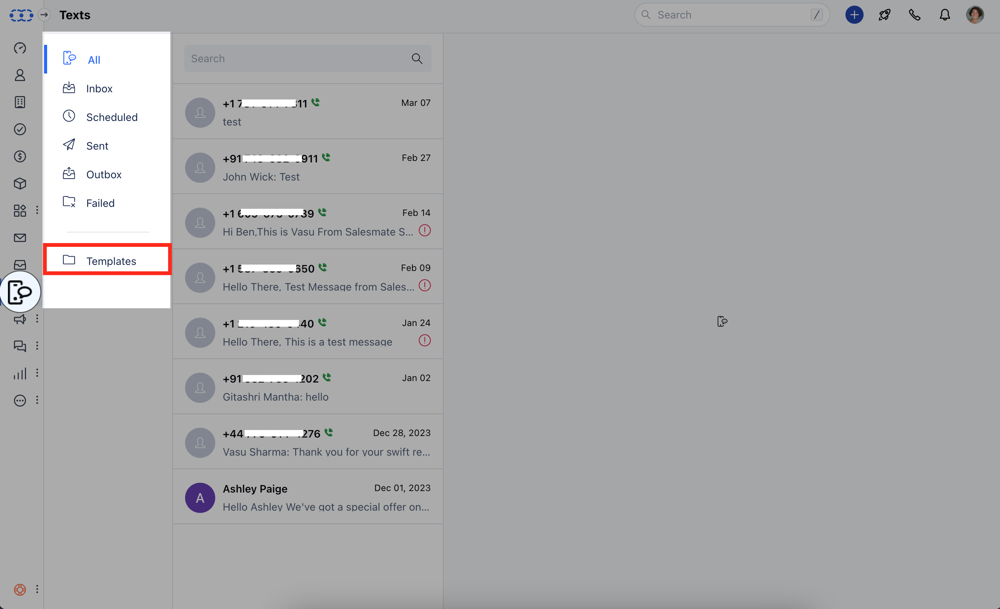
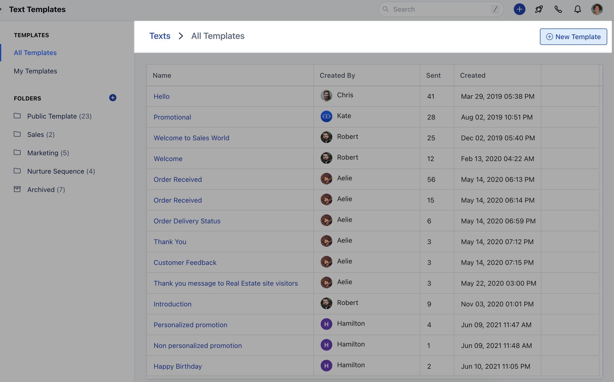
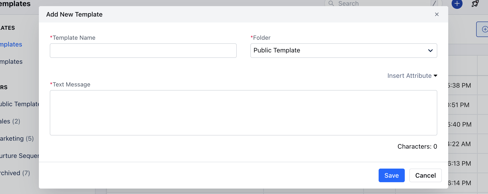
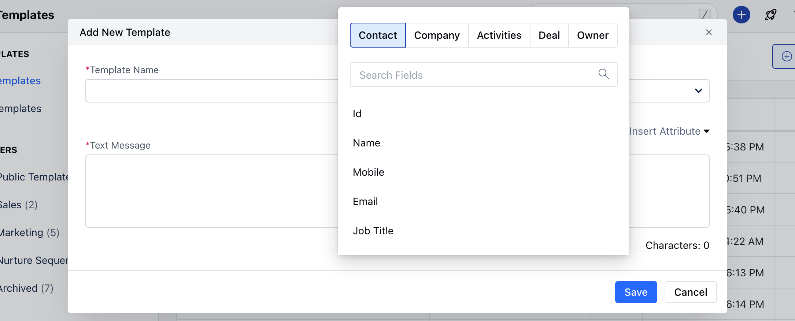
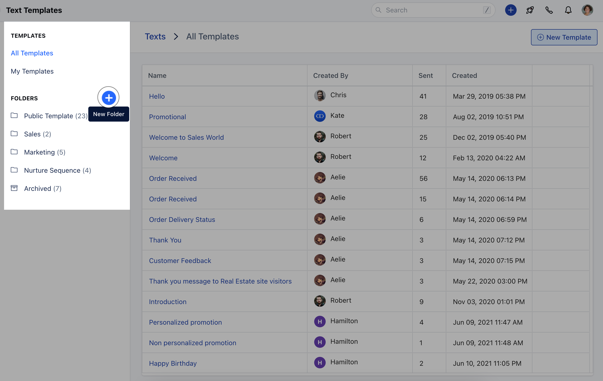

Use of Templates while text messaging makes your work easier to send repeated texts in the same format OR while sending a bulk message.**Create Text Templates:**Navigate to the **Texts** from the left menu bar Click on **Templates**

Click on the **\+ New Template** button to create a new text template

- *Note**: You can create folders and store these templates in them to keep them organized.

### **Using Attributes:**Click on **\+ New Template**

Click on **Insert Attributes** Select **Merge Fields** of your choice

### **Create Text Template Folder:**Click on the **\+ button** beside FOLDERS to create the Text Template Folder

### **Note :** You can select a template at the time of sending a single text message or a bulk one.If a single text message is being sent, and as soon as you choose the template, it will replace all variables with the related module and replace the text message body with a written one. Even users can type a variable after selecting a template inside the message and that should be parsed before sending the message.If you are sending the bulk message, then variables will not be replaced while selecting a template, and they will be replaced at the time of sending the messageThe template count will be increased with each send.
