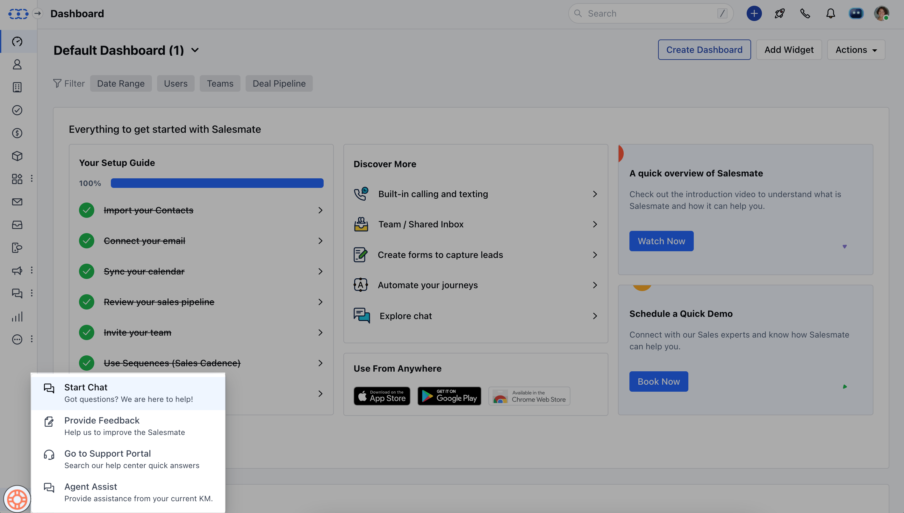

There are specific best practices and troubleshooting guidelines that you should follow to ensure that every call made and received through Salesmate is of the highest quality. Most call quality and transmission issues can be resolved by running the following sanity checks.

- **Quick Links:**
- [Network Connectivity Test](#network-connectivity-test)
- [Network Speed Test](#network-speed-test)
- [Best practices](#best-practices-to-have-a-great-call-experience)

Let's start by learning about the most common call troubles that cloud call centre software users face. And, more particularly, what Salesmate has observed to be the most typical concerns.These concerns can be divided into the following groups:

Unable to initiate a call from Salesmate.Lack of audio or only one-way audio.Call audio gets terminated midway or stops transmittingThe call audio is distorted or contains artifacts.

There could be multiple reasons for all the above scenarios to hinder a clean call experience. The below step by step troubleshooting cues can help you weed out the most basic issues instantly.

###  Network Connectivity Test

This helps you identify and troubleshoot all network-related concerns proactively.

Go to [https://networktest.twilio.com/](#network-connectivity-test). Run Twilio’s network test and check for the below network properties

- **Test diagnosis:** Make sure that you clear all the tests under this network test diagnosis. (Note: Video tests are an exception)
- **Handling network failure instances:** If any of the tests fail, it might be indicative of certain firewall restrictions blocking Twilio from communicating with the internet. Here, TCP, UDP or both of these would have failed. The best way to go forward is to **whitelist all the IP addresses** and **open the ports** that are mentioned by Twilio. The list of these ports and IP addresses is listed below in this article.

- **ICE error:**Next is the ICE error which is the most common issue that you might encounter. (In this scenario, your call will be disconnected within 10 secs. The possible solution for this is to Whitelist the IPs and to open up the respective ports.Next step is to check the **number of simultaneous Twilio connections** that Twilio can support within your network. For example, if a team of 20 users use Salesmate calling at the same time and if the result shows that Twilio supports only 12 simultaneous calls, there would be time lags, call quality issues, one-way audio issues and high possibility of call drops.Ensure that the network test is run on every agent’s local machine, and specifically make it mandatory for ones who report facing call quality issuesYou also need to check if the local machine is connected through **LAN or the wireless channel**(LAN is always the preferred option).Please **increase** the **network bandwidth** if needed. This is a crucial step that would solve most of your call quality issuesAlso, please do check if there are other applications(of lesser priority like Youtube, Chrome, etc.) consuming the available bandwidth. If that’s the case, please ask your network/IT team to **deprioritize the other applications and give maximum priority to call and call related activities** to have a smooth call experience.Check for possible **Jitter and Packet loss** issues( Ideally, there should be zero packet loss and jitter should be less than 3s). Understand how to solve this in detail from [here](https://support.twilio.com/hc/en-us/articles/223133127-What-are-Twilio-Client-s-Deployment-Best-Practices-).While all the above-mentioned precautions are to be considered important, you can ignore “Group Room failed errors” since they are common and not a big issue.The test will also ask you to enable your microphone. If you don’t allow your microphone to be tested, an error message will be thrown by the test.

###  Network Speed Test

Check the network speed with [speedtest.net](#network-connectivity-test) and send a screenshot of the findings to **support@salesmate.io** or over **chat**.

If the router supports [QoS (Quality of Service)](https://www.fortinet.com/resources/cyberglossary/qos-quality-of-service), prioritise the ports listed below or the IP address of the computer(s) making the client calls.Examine your browser for any addons that may be interfering with the calling functions. If there are any, please turn them off.Even after you've completed the above steps, if you're still experiencing call quality issues, keep the. following call details in mind:

\-**FROM** number\-**TO** number\-**The actual timing of the call** Then send it to **support@salesmate.io** or through **chat**.

- **IP’s and Port’s to be Whitelisted in case of Firewall restrictions** The firewall should allow outgoing UDP to the public internet from the browsers that use Salesmate Calling, and allow return traffic in response.

| Component | Address | Server-side port used | Protocol |
| --- | --- | --- | --- |
| Signaling - GLL (Global Low Latency) | chunderw-gll.twilio.com chunderw-vpc-gll.twilio.com | 443 | TCP |
| Signaling - Regional | chunderw-vpc-gll-{region}.twilio.com (Regions: au1, br1, de1, ie1, jp1, sg1, us1) | 443 | TCP |
| RTP | Static IP range * | 10,000 - 20,000 | UDP |
| Insights | eventgw.twilio.com | 443 | TCP |

For the static IP range for UDP, please open up the traffic to the following CIDRs. You have to open up traffic to all the CIDRs mentioned below. Twilio will dynamically connect to one of these IP ranges depending on the browser location.

| Region ID | Location | Media Server IP Address Range | CIDR notation |
| --- | --- | --- | --- |
| au1 | Australia | 54.252.254.64 - 54.252.254.127 | 54.252.254.64/26 |
| br1 | Brazil | 177.71.206.192 - 177.71.206.255 | 177.71.206.192/26 |
| ie1 | Ireland | 54.171.127.192 - 54.171.127.255, 52.215.127.0 - 52.215.127.255 | 54.171.127.192/26, 52.215.127.0/24 |
| de1 | Frankfurt | 35.156.191.128 - 35.156.191.255 | 35.156.191.128/25 |
| jp1 | Japan | 54.65.63.192 - 54.65.63.255 | 54.65.63.192/26 |
| sg1 | Singapore | 54.169.127.128 - 54.169.127.191 | 54.169.127.128/26 |
| us1 | US East Coast (Virginia) | 54.172.60.0 - 54.172.61.255 , 34.203.250.0 - 34.203.251.255 | 54.172.60.0/23, 34.203.250.0/23 |
| Region ID | Location | Media Server IP Address Range | CIDR notation | Port Range |
| --- | --- | --- | --- | --- |
| us1-ix | US East Coast (Virginia) over Interconnect exchange in Virginia | 208.78.112.64 - 208.78.112.127 | 208.78.112.64/26 | 443 (Signaling), 10,000 - 20,000 (Media) |
| us2-ix | US West Coast (Oregon) over Interconnect exchange in San Jose | 67.213.136.64 - 67.213.136.127 | 67.213.136.64/26 | 443 (Signaling), 10,000 - 20,000 (Media) |
| ie1-ix | Ireland over Interconnect exchange in London | 185.187.132.64 - 185.187.132.127 | 185.187.132.64/26 | 443 (Signaling), 10,000 - 20,000 (Media) |

###  Best practices to have a great call experience

- **Browser preference:** Use a Chrome/Firefox browser

- **Channel preference:** Use LAN wired connection instead of wireless.

- **Headset preference:** Opt for a high-quality wired headset.

- **Modem preference:** Go for a modern, well-equipped PC with sufficient RAM.Try to have a moderate tab usage (too many tabs eats up your RAM).Don’t run other processor-intensive applications in parallel to Salesmate Calling.Reduce ambient noise such as nearby speakers, fans, exhaust, etc.Adjust the distance of the microphone from your mouth - having it too close to your mouth could cause audio clipping.Adjust the microphone levels in your computer’s sound settings.Ensure that your computer has resources available to process a call.Try disabling any antivirus software if installed.
