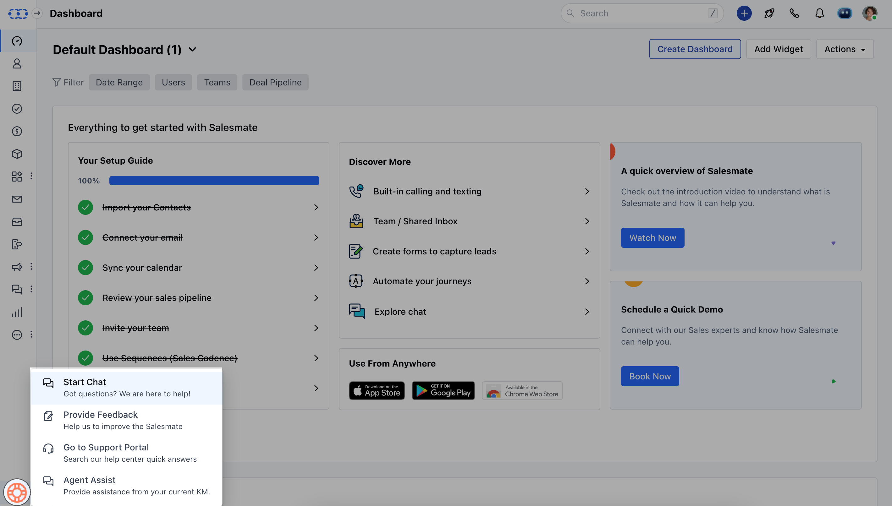
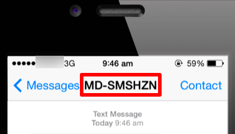

If your team cannot hear the notification sound or sound during the calls or move directly to missed calls. Please take the following steps:**Quick Links**[Chrome](https://support.salesmate.io/hc/en-us/articles/6382198645657-Can-t-hear-sound-for-calls#cant-hear-notifications-in-safari)[Safari](https://support.salesmate.io/hc/en-us/articles/6382198645657-Can-t-hear-sound-for-calls#h_01GANG03EY6QM9YPQ519KTDTS8)[Firefox](https://support.salesmate.io/hc/en-us/articles/6382198645657-Can-t-hear-sound-for-calls#h_a45dee5e05)

### Settings for Chrome

While you're using Salesmate in Chrome browser.

In the**address bar**, click the**padlock icon**. Navigate to '**Site settings**.'

Then, make sure '**Sound**' is set to '**Allow**':

### Settings for Safari

Access the following while using the Safari browser.

SafariPreferencesWebsitesAuto-Play

Then, make certain that '**yoursalesmatedomain.salesmate.io**' is set to 'Allow All Auto-Play':

### Settings for Firefox

Access the following while using the Firefox browser.

FirefoxPreferencesPrivacy & Security

Click '**Setting**' aligning to**Autoplay**:

Then, for '**yoursalesmatedomain.salesmate.io**,' modify the default to 'Allow Audio and Video' or establish a custom setting:While you're using Salesmate,

In the**address bar**, click the**padlock icon**. Navigate to the '**Connection Secure Settings**' section.

Click '**More information**'

Click '**Permissions**' tabUncheck, '**Use Default**'Select '**Allow Audio and Video**'

