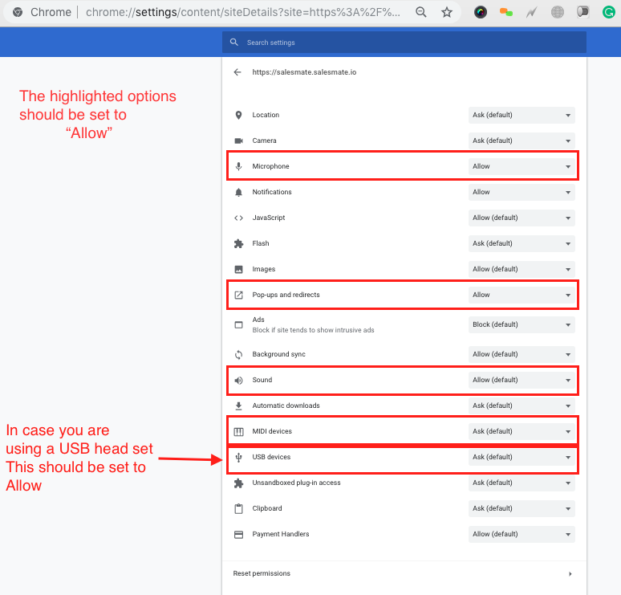

Calling is affected by a variety of hardware parameters as well as the browser settings of the system from which you are calling:

It is possible that you will be unable to hear what the caller is saying.It is possible that you might not hear anything.It is possible that you will only hear a beeping sound.

Follow the below options to troubleshoot your system:

###**Option one:**Remove and reconnect your audio equipment (**headset/headphone, microphone, etc.**) to the system.Check the following link in your Chrome browser to see if you have granted access to your microphone, sound, USB device, or MIDI device (whichever is applicable). Sound and a microphone are required.)chrome://settings/content/siteDetails?site=https%3A%2F%2F**demo.salesmate.io**My Salesmate URL is**demo.salesmate.io.****

**If allowed,**refresh/reload (Ctrl/Command+Shift+R)**the page and make a call.It should work 😃

###**Option two:**If it is still not working,Navigate to the following address:**[https://networktest.twilio.com/](https://networktest.twilio.com/).**This will check your call settings and, if necessary, authorise access to your microphone.If it is a PASS, refresh/reload the website (**Ctrl/Command+Shift+R**) and make a call.It should work 😃

Still facing issues feel free to contact us over chat or email on [support@salesmate.io](mailto:support@salesmate.io)

### Best Practices

Use ethernet and not WiFi. The wireless medium adds to the packet loss and can cause issues with call quality and hence must be avoided.If you are using WiFi, reduce packet conflicts by reducing the number of devices operating on same channel.Avoid transferring huge amounts of data in the same WiFi network as the voice because this can add to the latency.Use high bandwidth internet connection as a lower bandwidth adds to the inherent latency involved in algorithmic processing, network traversal etc.Local network conditions have the highest impact on voice quality. Make sure you have sufficient bandwidth and try using ethernet for voice data.If you have addressed the above issues and continue to have jitter related impact on your voice quality, you may consider configuring your router with QoS rules to prioritize traffic on the UDP ports ranging from 10000-20000. (You can read this great article on setting up QoS for VoIP in your network.)We recommend you use USB / 3.5mm headsets over bluetooth ones. Even while using bluetooth ones, it is better to connect to the USB dongle that comes with the headsets rather than rely on native bluetooth capabilities. This is because each browser behaves differently with different hardware vendors and it becomes impossibly difficult to troubleshoot such issues.

### Troubleshooting procedures for problems with the phone channel

Upgrade Browser and Flash to latest version.Ensure your network ports aren’t being blocked by Firewall / router / antivirus software. Check out the section “Firewall” under “Minimum Requirements” in this document for the ports to be opened.If your router supports QoS, prioritize UDP ports in the range 10000-20000, and the IP address of the sales reps making/receiving the calls. Tips on setting up QoS for VoIP in your network can be found [here](http://www.pcworld.com/article/212867/optimize_your_office_router_for_voip_video.html).Check your network latency with the [Ping test site](http://www.pingtest.net/). If the grade is less than A, call quality might be degraded.​
