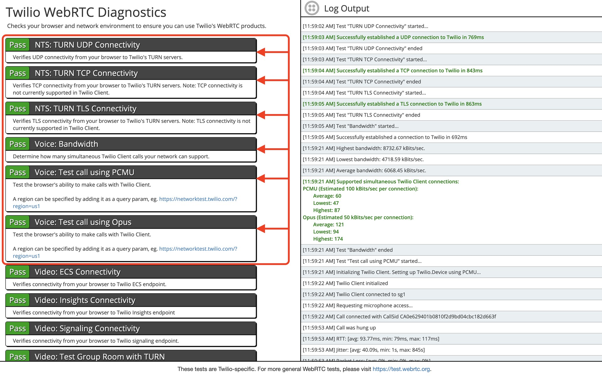

There are certain best practices and troubleshooting norms that you should follow to ensure that every call made and received from Salesmate is of the highest quality. One of them is the **Network Connectivity Test.

- **Note

- ** Before proceeding with the test please ensure that there are no WebRTC blocking extensions or services operational in browser.

# Test for Network Connectivity

We recommend that you run the following tests. This assists you in proactively identifying and troubleshooting all network-related issues.

Run the Twilio network test:**https://networktest.twilio.com/**. In order to have efficient calling, the highlighted parameters must be passed.

For more general WebRTC tests, please visit **[https://test.webrtc.org](#test-for-network-connectivity)**.** The highlighted parameters must be passed in order to have efficient calling.

For more information about Network Test Parameters please visit,
[Calling FAQ's](https://support.salesmate.io/hc/en-us/articles/360033576432)
