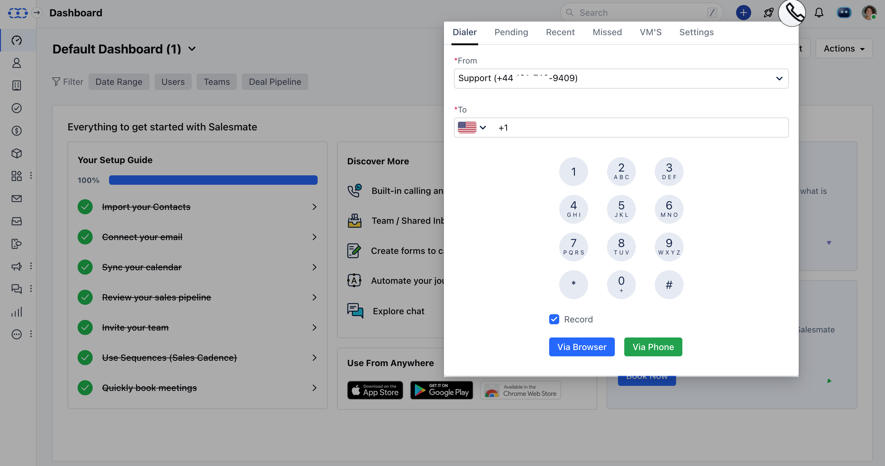
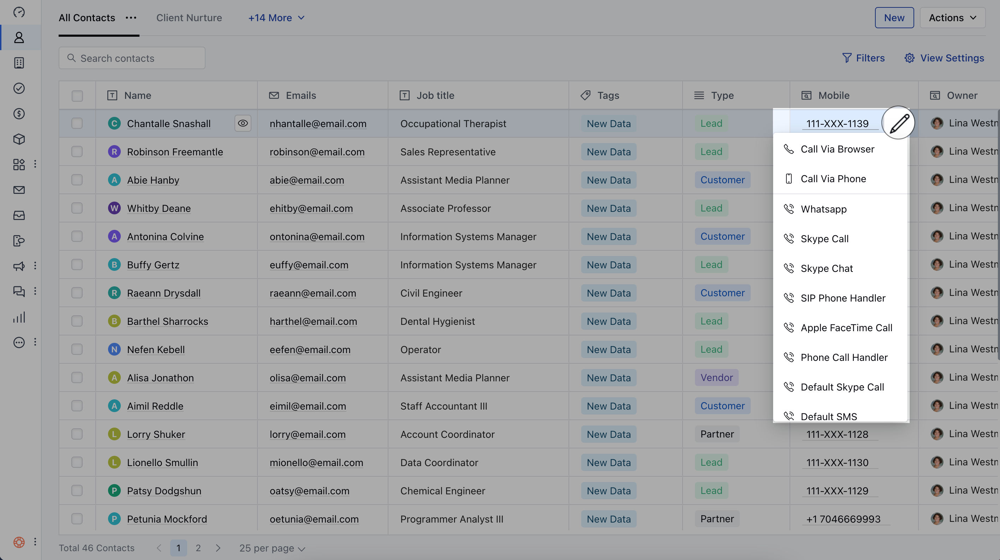
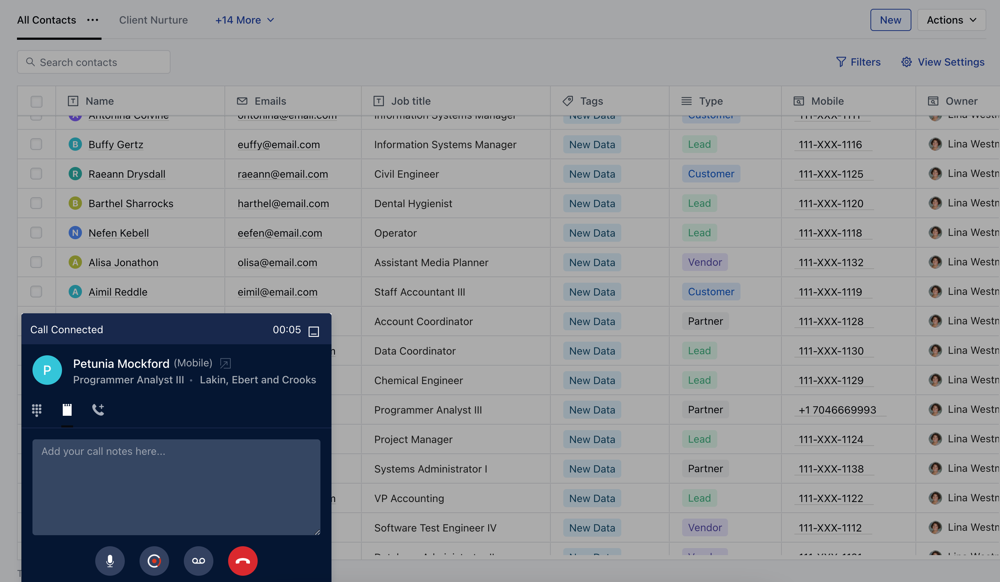
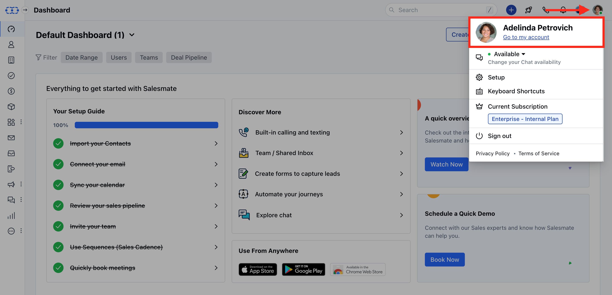
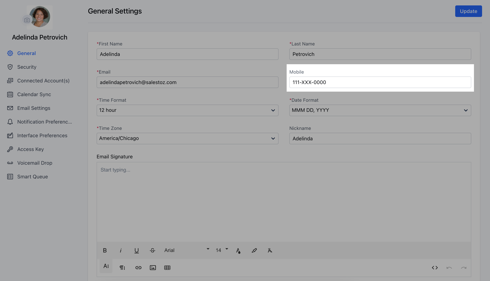
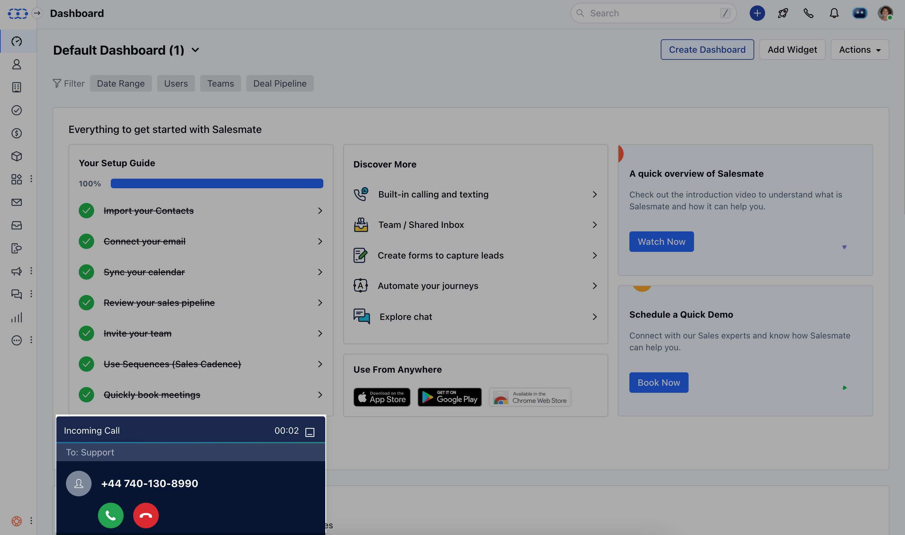

Salesmate CRM’s built-in VoIP-based phone system enables you to call your clients from anywhere with our mobile and web apps.You can Make/Receive Calls via your Browser or Phone.

###  **Topics covered:**

[Making a Call - Dial Out](#making-a-call-dial-out)
[Call via Browser](#call-via-browser)
[Call via Phone](#call-via-phone)
[Receiving a Call - Incoming Call](#to-receive-calls-in-salesmate)

###  Making a Call - Dial Out

To make an Outgoing Call,

Click on the **Make a call** button (

) on the top right. Copy/Type the number into the **To** field to dial out.This option is if you have a number that is **not associated with a contact.

###  Call via Browser

You can also call out of Salesmate by heading to the **Contact List Page**. To make a Call via Browser,Note: Make sure you have included Mobile OR Phone fields in the list of columns from the [Manage Columns](https://support.salesmate.io/hc/en-us/articles/115000650829-The-List-View-Bulk-editing-filtering) option

Go to Contact List/Detail Page.Hover over the number you wish to call.It will display the option to **Call via Browser** OR **Call via Phone.

Click on **Call via Browser.

- **As you hit the option a pop-up will be displayed with the Contact Name.On this pop-up, you can take notes, disconnect the call, or [start OR stop recording](https://support.salesmate.io/hc/en-us/articles/360004733491-How-do-you-enable-call-recording-) the call.

###  Call via Phone

In order to place a Call via Phone, You will need to add a mobile number,

Navigate to **Profile Icon** on top right cornerClick on ** Go to **My Accounts **.

Add your **Mobile Number**.

Now, Go to Contact List/Detail Page.Hover over the number you wish to call.Click on **Call via Phone**. This will make calls from your mobile number to the contact.

###  To receive calls in Salesmate:

When you have an incoming call on your number a pop-up will be shown with the number if the number is not saved as a contact in Salesmate. If the number exists in Salesmate-related contact will be shown.You can choose to pick up (receive) the call using the **Green** button or Hang Up using the **Red** button.Once you receive the call, you can [log](https://support.salesmate.io/hc/en-us/articles/360004672292-How-do-calls-get-logged-) it.

