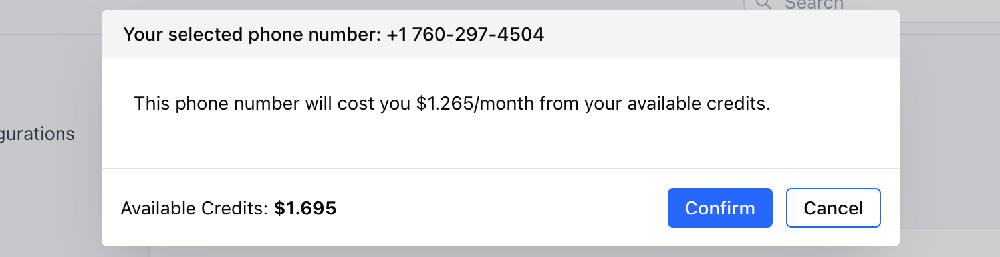

In accordance to the recent changes in regulatory compliance for purchasing numbers, you are required to submit one document each from the below list as**proof of identity**and**proof of address.**Verification of documents can take up to 48 hours after which you should be able to purchase a number and get started.

| For Individuals | For Companies |
| --- | --- |
| Government-issued ID showing addressPassportVisaUtility billTax noticeRent receiptTitle deed | Commercial registry or equivalent showing addressUtility billTax noticeRent receiptTitle deed |

When you try to buy a phone number, it will show the details of how much it is going to cost you each month for the selected number. Once you click on**confirm**, the number will be added to your account and then you can assign it to the users to whom you would like to give access to that number.

**Note:**You may note that some numbers are subject to regulatory approval and cannot be purchased directly, in the case a Regulatory Bundle has to be raised which takes up to 72 hours for approval and is subject to which the numbers can be purchased.**Please read the guidelines for the documentation here: [https://www.twilio.com/guidelines/regulatory](https://www.twilio.com/guidelines/regulatory)**
