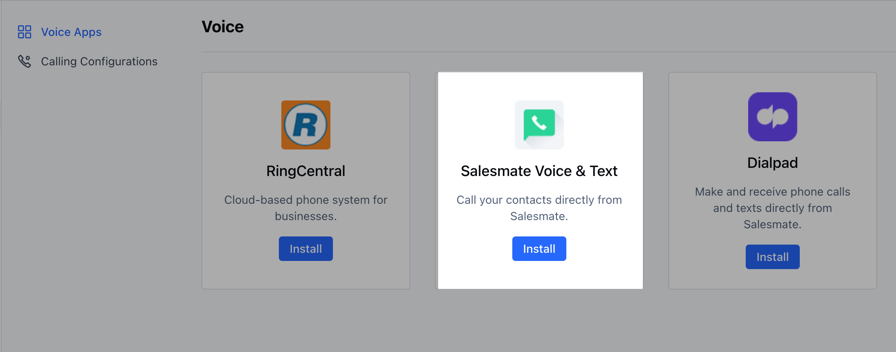
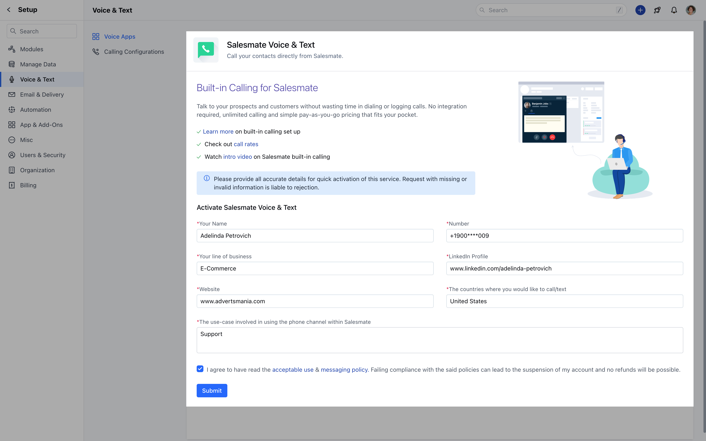
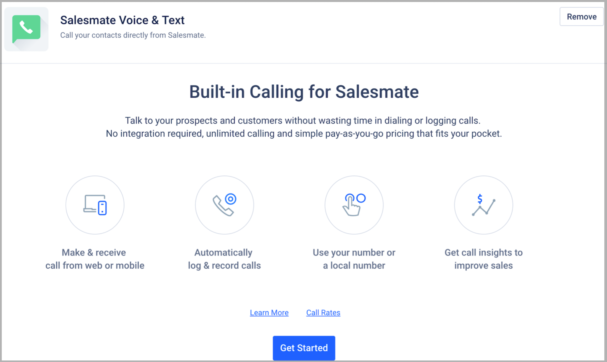
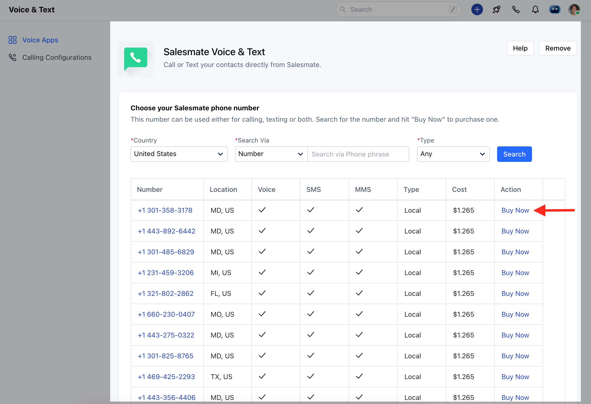

In Salesmate, to be able to call out of the app using Salesmate Calling, you will need to activate the Voice app.Below are the steps to help you with the activation :

Navigate to the **Profile Icon** on the top right cornerClick on **Setup** Head over to **Voice & Text** categoryClick on **Voice Apps**

Click on **Install**(Salesmate Voice & Text)

To **activate** Voice and Text, you'll need to provide us with the following information. Once verified, Salesmate Voice and text will be activated in your account.

**Note:**It will take 24 working hours to validate the information and process the request. If any, additional information is required; it will be communicated via email.Once the calling feature has been activated you'll get the below page.

Select **Get Started**

You will see the **Salesmate Voice & Text** page with the list of numbers to buy.Salesmate provides an option to choose the number on basis of
CountrySearch Via - Number and LocationTypeSelect the number of your choice and click on **Buy Now**.

**Note:**Phone/Calling is an add-on service (pay-per-minute / pay-per-SMS service) to the CRM subscription. Thus you will be paying for a user subscription as well as load calling credits and utilize them towards purchasing the number, calling, and texting.
