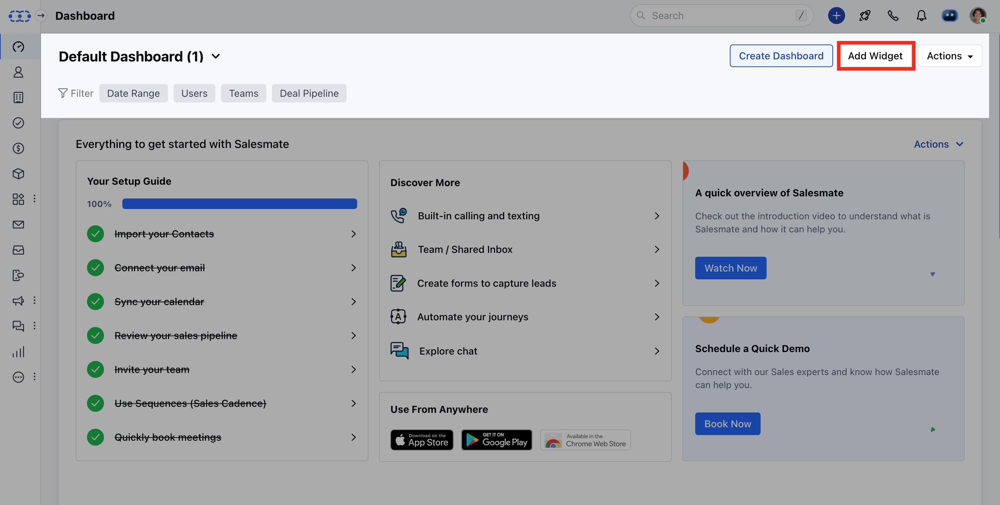
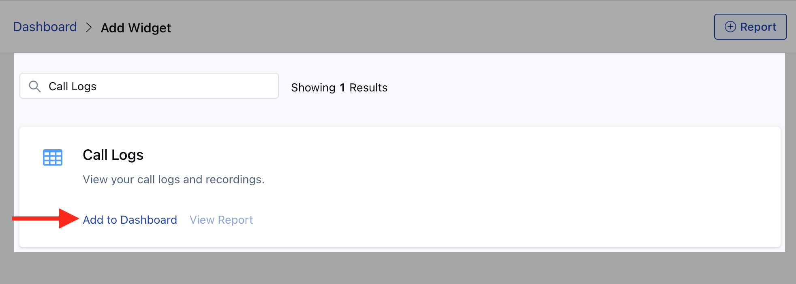

In Salesmate, all phone calls you make and receive are automatically logged.You can check them by:

Navigate to**Add Widget**on**Dashboard**

Search for**Call Logs.**Click on**Add to Dashboard.**

However, on the off chance that you receive a call from a contact on your personal number. You might want to have it logged too, for that Salesmate allows you to manually log calls and also add notes for the same.
