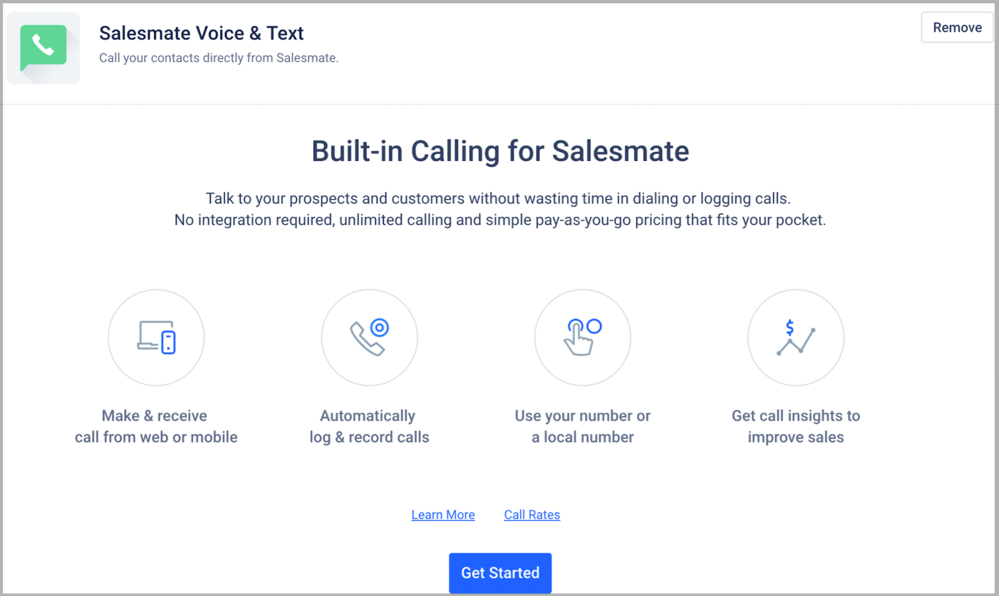

Salesmate CRM’s built-in VoIP-based phone system enables you to call your clients from anywhere with our mobile and web apps.Get toll-free and virtual phone numbers in over 80 countries with a specific area code for everyone on your team.Utilize the top-class calling and texting features of Salesmate CRM without any setup charges or hidden costs, and it takes less than 5 mins to start calling. [Learn More](https://support.salesmate.io/hc/en-us/articles/360004733011-How-do-you-enable-the-calling-app)

<iframe
  width="560"
  height="315"
  src="https://www.youtube.com/embed/lMVYg1Cn4G4?list=PLyYol_VsdQ5kQxOkSrnROtnpn08GJ7x2h"
  title="YouTube video"
  frameborder="0"
  allow="accelerometer; autoplay; clipboard-write; encrypted-media; gyroscope; picture-in-picture; web-share"
  allowfullscreen
></iframe>

### Why use Salesmate calling?

### Cloud-based system:

A simple web-based service that efficiently handles calls, voicemails, and messages for your business using the internet connection and VoIP technology. You do not require any hardware setup or software installation, it is set up by default in your Salesmate account.

### Local and Toll-Free numbers:

You can purchase Toll-free numbers which your customers can call for free. Or if you’d rather have them pay each time they call, you can buy local numbers for the same.

### Assign a number to your teammates:

You can purchase multiple local and toll-free virtual phone numbers from Salesmate CRM and assign them to your sales reps.

### Custom greetings:

When customers call, you can choose to greet them with a custom message by typing your welcome message and have it converted to speech.

**OR**record a [custom message](https://support.salesmate.io/hc/en-us/articles/360004733311-How-can-I-change-my-phone-number-settings-) in your own voice.

### Answer via Browser or Phone:

Your sales reps get the flexibility of taking calls from the browser and on their phones. They can switch between the two by answering urgent calls on their mobile phones when they are away from their desks and vice versa.

### Automatic call recording:

You can choose to automatically record all calls made and received in Salesmate. You can add tasks, and appointments and link call logs to existing records or create new records for the same.

### Call Logs:

You can find out how many calls your rep made, total time spent, and the outcomes of their calls. Use Salesmate to track all inbound and outbound calls. Salesmate’s virtual phone system automatically logs all incoming and outgoing calls for you as an activity. Moreover there is a dedicated**Call Logs report**which you can add it as a widget on your Salesmate's dashboard.

