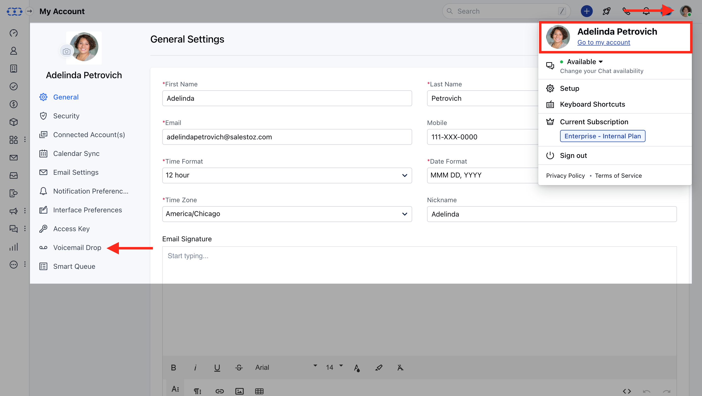
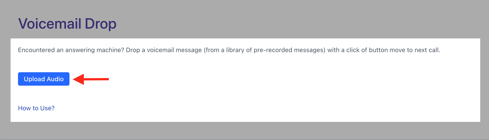
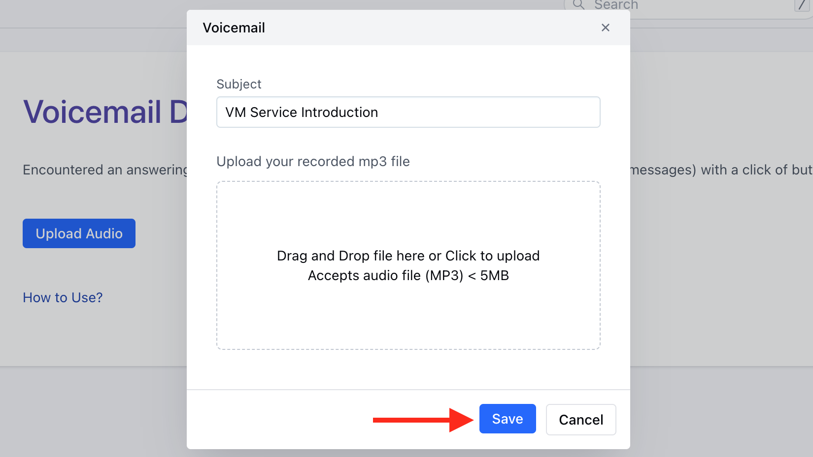
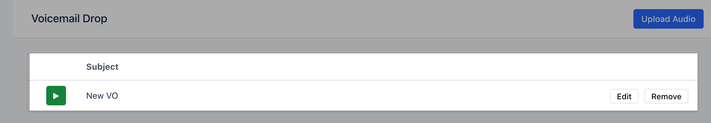
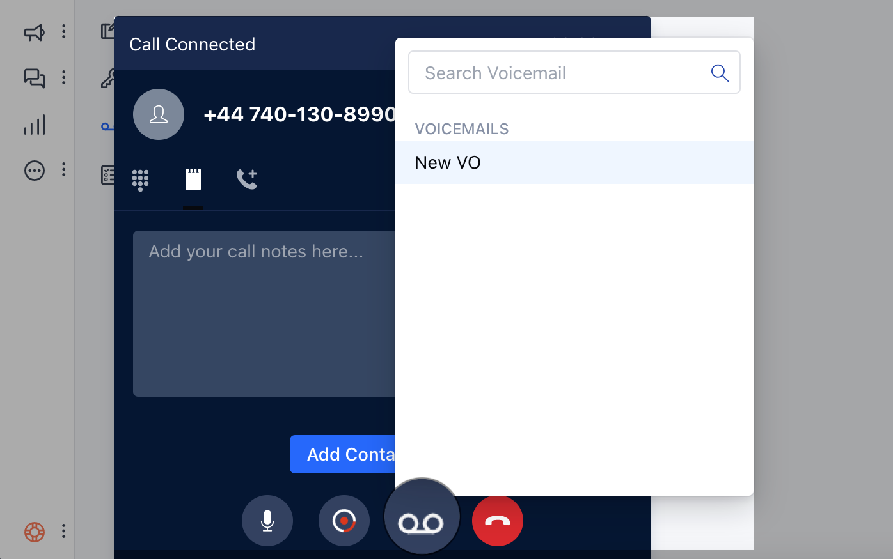

Sales reps spend a lot of time doing cold calling and the majority of calls end in**voicemail**. Repeating the same message, again and again, can be hectic and by the end of the day, it loses energy to drop a compelling message to pursue a sale. With the Salesmate**voicemail drop**feature, you can store multiple pre-recorded messages and choose one to be auto-dropped when the call ends to a voicemail.**Note:**The Feature is available on Business Plan and above only. The VM Drops can be uploaded/added by an Admin user only.

### Topics Covered:

[Uploading a pre-recorded voicemail message.](https://support.salesmate.io/hc/en-us/articles/360041959352-Voicemail-Drop#h_01GF09P44P6WDVPXWBTKVBA0SX) [Recording an mp3 file.](https://support.salesmate.io/hc/en-us/articles/360041959352-Voicemail-Drop#h_01GF09PF3B78WQNN7KV4ZHCQJ8) [Drop a voicemail for an Outgoing Call.](https://support.salesmate.io/hc/en-us/articles/360041959352-Voicemail-Drop#h_01GF09PPM42AG60PZ5MJ6C2VYF)

### Uploading a pre-recorded voicemail message

To upload a pre-recorded message in Salesmate.

Navigate to the**Profile icon**on the top right cornerGo to**My Accounts**Click on**Voicemail Drop**

Click on Upload Audio

**Subject**- To choose a proper voicemail from multiple voicemails.**Upload MP3 File**- A pre-recorded message in MP3 format.**Note:**The maximum size of an Audio file for upload is 5MB.

Click**"Save".**Similarly, additional files can be uploaded to be used as VM Drops.You can also update and remove the uploaded file via Edit and remove option.

### Recording an MP3 file

These days there are many tools available on your desktop or mobile apps to record MP3 files.

Recording using [QuickPlayer.](https://support.apple.com/en-ph/guide/quicktime-player/qtpf25d6f827/mac)Record MP3 online via [your browser](https://online-voice-recorder.com/)

### Drop a voicemail for an outgoing call

While you are on an outgoing (outbound) call and as soon as you hear the voicemail beep, click on the**drop voicemail button**and choose one of the pre-recorded messages. The voicemail will be dropped to the customer in the background, and you may continue your work henceforth.

**Note:**If you have dropped a VM to a customer, then the call discard option will not be visible in the calling widget. So that a recording can be dropped in the background and it gets auto-associated with the customer's timeline.
