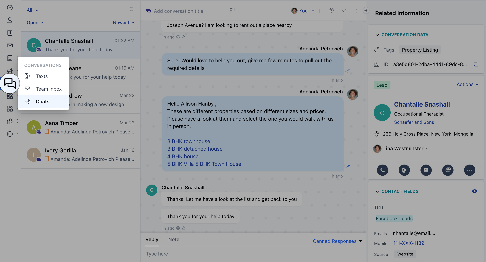
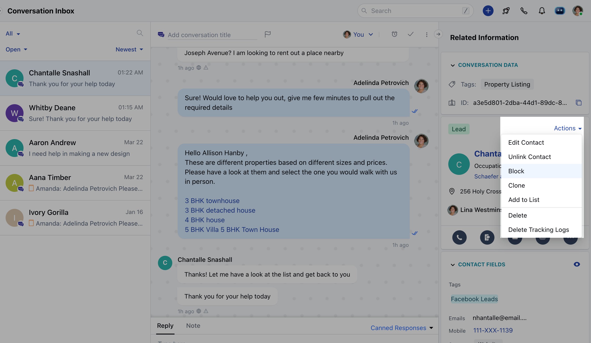
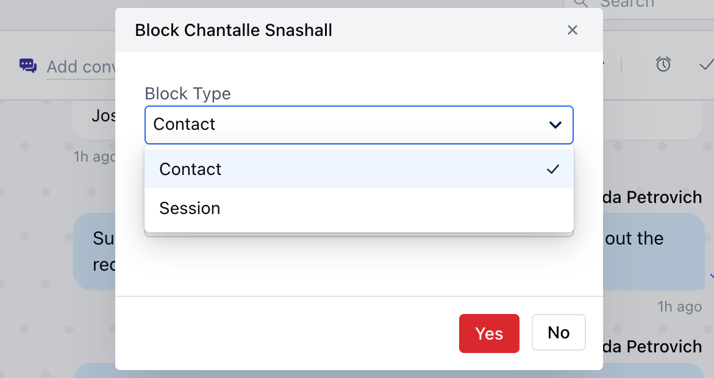
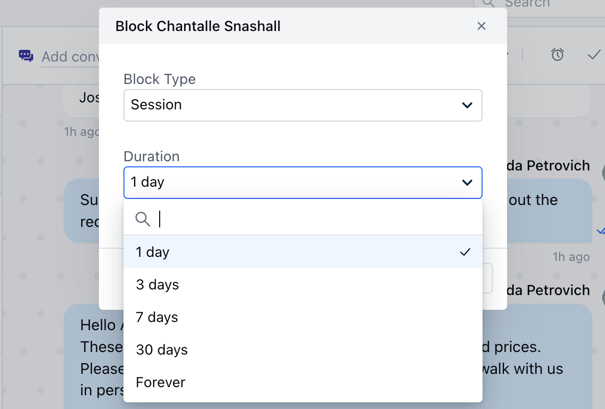
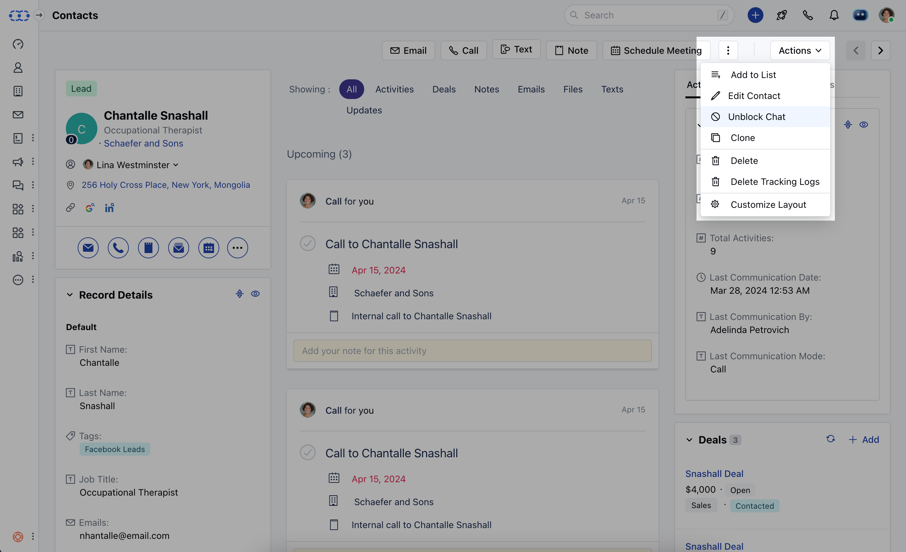
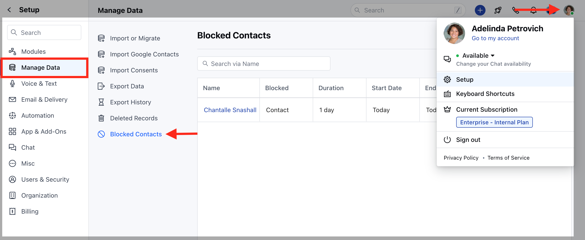
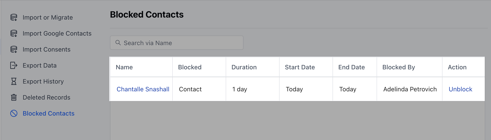

Salesmate allows you to **block/unblock** a contact. If a contact is abusive, offensive, or spamming, then they can be blocked by selecting the block option from the contact's detail view.

Once a contact is blocked inside Salesmate there will be no new emails or chat requests received from the blocked contact.

If you want to unblock a blocked contact, in that case, you can manually do it in order to start receiving new messages from them in the future.

### Example:

If someone is constantly sending messages to you in chat and is spamming your chat box you can block them so that no further messages come from them in Salesmate.

If you are constantly receiving some unnecessary emails from a particular contact, then you can block them so that no more emails come from them in Salesmate.

### **Topics covered:**

in the article:

- [**Block a Contact from the Chats**](#block-a-contact-from-the-chats)

- [**Unblock Contact from the Contact Detail View**](#unblock-contact-from-the-contact-detail-view)

- [**Unblock Contact/Visitor from the Blocked Contact List**](#unblock-contactvisitor-from-the-blocked-contact-list)

### Block a Contact from the Chats:

- Navigate to the **Chat icon** from the sidebar menu
- Click on **Chats**
- Open the respective **chat conversation**

* In
your **Chat conversation**, go to the **contact** details widget * Click on
the **Actions menu** on the right * Select **Block option**

* A pop will appear asking the following options: - **Types of Block** 

- **Contact**- In this option, the contact will not be able to send a message or email to you irrespective of the device or browser.

- **This option will be available only for contacts and not for visitors.**
- **Session**- In this option, irrespective of the contact or visitor, they will be blocked for that particular session

- *Duration** 

- 1 day
- 3 days
- 7 days
- 30 days
- Forever

*
Click on the **yes**

### Unblock Contact from the Contact Detail View

- Open the **Contact Detail View**
- Click on the **Actions option** on the top left
- Select the **Unblock Chat** from the drop-down

### Unblock Contact/Visitor from the Blocked Contact List

- Navigate to the **Profile icon** on the top right corner 
- Click on **Setup**
- Head over to the **Manage Data** category
- Click on the **Blocked Contacts**

* Search the **contact/visitor** or the **email address** you want to unblock
* Click on the **Unblock option** listed below the **Action column**

<Note>

**Note:**

- Once you Block the Contact it will hide the Associated Conversation
- In the case of group conversation, the action option will only be visible in the primary contact and not in the secondary contacts, thus only the primary contact can be blocked with the above-mentioned steps, in case of a group conversation.
- In the blocked contact list, the default sorting is based on the date the contact is blocked, i.e the contact which is blocked most recently will show on top.

</Note>
