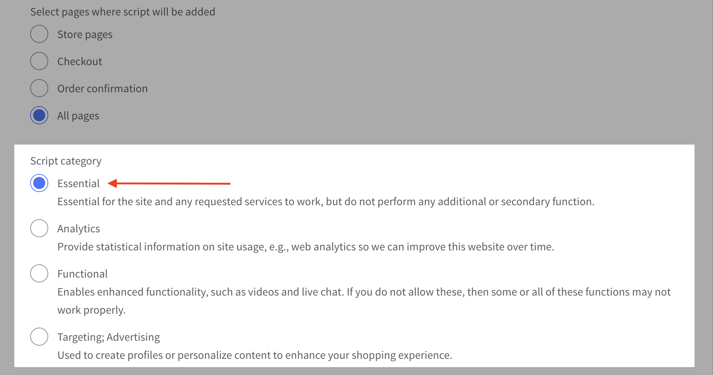
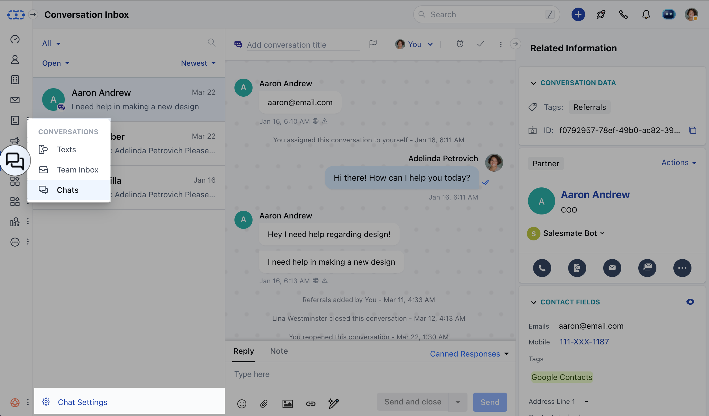

Tracking the customers on your website lets you trace the visitor's footfall on respective pages without bothering them. It allows you to market your products or services more effectively as you can know your customers and understand their buying habits. [Learn More](https://support.salesmate.io/hc/en-us/articles/37057741761945-Website-Tracking-in-Salesmate)

- **Topics covered:**
- Installing the tracking code:
- [BigCommerce](#installing-messenger-code-from-bigcommerce-admin-panel)
- [WordPress](#installing-messenger-code-from-wordpress-admin-panel)
- Event-Based Tracking:
- [Making Event-Based Action](#making-event-based-action)
- [Making Landing Page-Based Action](#making-landing-page-based-action)
- [FAQs](#faqs-can-i-track-my-website-visitors-without-paying-any-additional-cost-for-messenger)

Now let's understand each of the processes in detail.

**Installing The Tracking Code**

Installing Messenger code from BigCommerce Admin Panel

- **Log in** to your **BigCommerce Store**


- Select the account


- Select the right store from the drop-down in case if you have multiple stores.


- Navigate to the **Channel Manager** from the left panel


- Under that, click on **Scripts**.


- Now click on **Create a Script** button.


- Add the **Name** and **Description** of the Script


- Keep the location of the page as **Footer**.


- Select the pages where the script will be added as **All Pages**.


- Keep the script category as **Essential**.



- Select script type as **Script**.


Please follow the below steps to locate Messenger Code and **Copy** it:

- Navigate to the **Chats** from left menu bar
- Click on **Chat Settings**

  
- Go to the **Installation** section from the left panel and **Copy** the code.


<Note>
  \*\*Note:\*\*This access is subject to the user’s profile permission relating to Manage Messenger Settings assigned by the Admin user.
</Note>

- **Paste** your Messenger Code along with the below code i.e.**Add one line of the script below tenant_id:** "**salesmateio.salesmate.io**"and **Save it**. This code hides the launcher icon yet keeps the tracking on. Please take a look at the image below:

```
hide_default_launcher: true
```


- You can also refer to the installation process for BigCommerce below:

<iframe width="560" height="315" src="https://www.youtube.com/embed/1_7w1TfdNwU" title="YouTube video" frameborder="0" allow="accelerometer; autoplay; clipboard-write; encrypted-media; gyroscope; picture-in-picture; web-share" allowfullscreen />

### Installing Messenger Code From WordPress Admin Panel

- **Login** to the WP admin.


- Navigate to the **Plugins** section and Click on **Add New**.


- Search for **Skara Messenger** from the search bar and **Install**.


- Now click on **Activate**.


- Now click on **Skara Messenger** and enter the  **Workspace ID, AppKey, and Tenant ID **from the Messenger code. - You will get these details from your Salesmate Account. It will be available under the Chat icon, followed by the Messenger Settings and Installation.


- In case you are using the Messenger Service and want to provide chat service only on specific pages, you can disable the launcher icon by adding the page ids with comma-separated values in the “Exclude Text” section.


- You can locate the Page Ids in the following ways: - Navigate to  **Posts** you do not want to display the launcher icon on the blogs published by you. Simply hover on the respective pages, and you will notice the page id getting generated right below. Post is equal to, and the number that you see here is the page id.


- For hiding it on respective website pages, navigate to the Pages section and hover on them to locate the page ids.


- In case you are either editing the pages or posts, you can fetch the page id from the URL section above.


- Check the Hide Launcher Icon if you are not using the Messenger service. It will allow you to track your website visitors without chatting with them.


- Save Changes.


You can also refer to the installation process for WordPress below:

<iframe width="560" height="315" src="https://www.youtube.com/embed/ZMCNAzJGmr8" title="YouTube video" frameborder="0" allow="accelerometer; autoplay; clipboard-write; encrypted-media; gyroscope; picture-in-picture; web-share" allowfullscreen />

### Event-Based Tracking

- Following the Event-Based Tracking method simply collects the data in either of the cases like; while the user is Signing Up, Logging In, Logging Out, Performing any step using the Call-to-Action button, or be it any Custom Event Listener using the JS API Method. You can refer to other events [here](https://support.salesmate.io/hc/en-us/articles/360062373471).

### Making Event-Based Action 

- You can call this method in the situation where the contact or the visitor is not logged in when the page is loaded. You can also use this method to update the contact information that is logged in. Verify your contact by calling this method and passing the email in userid.

For example, on your customer's login page action, call this method when the login button is clicked.

```javascript
SALESMATE.login({
  user_id: "/* user id | string | We recommend passing the user's email id to generate a unique key */",
  email: "/* email | string | Pass a valid email address */",
  first_name: "/* first name of contact | string */",
  last_name: "/* last name of contact | string */"
});
```

### **Example:**

```javascript
SALESMATE.login({
  user_id: "john.doe@example.com",
  email: "john.doe@example.com",
  first_name: "John",
  last_name: "Doe"
});
```

This is how you can capture the contact details of the visitor without bothering them. You can then plan any [Automation Journeys](https://support.salesmate.io/hc/en-us/articles/360057066552) or enroll them in [Sequences.](https://support.salesmate.io/hc/en-us/articles/360033759131)

### Making Landing Page-Based Action

You can use "**Page Visited Trigger**" to set up the journey and perform a certain set of actions in the automation journey. This method will initiate the trigger as soon as the visitor lands on any specific page.


### FAQs

### Can I track my website visitors without paying any additional cost for Messenger?

- Ans: No. You need at least one license messenger license. Our messenger script works as a website tracking script itself where it requires a trigger / interaction to start tracking your visitor / customer activity.

**How can I collect data from customers?**

- Ans: These are the ways you can collect the data:
- Add Call-To-Action Button on your website and use any of the Event-Based Action using Event-based Action via the JS API Method. This could be any Login action, Logout, Signup, Contact Us, etc.
- You can redirect the users to another page where you can collect the basic details like Names and Email addresses. It could be any specific landing page with a form. Use the Track Custom Event Code to capture the information in Skara.

  **Where can I see the tracking in Skara?**
- Ans: In the Contact Detail Page, you will find the details in the Page View section on the right.


**How can I automate the process once the data is collected?**

- Ans: Automation Journey and Sequences can be used to make it a non-manual process to stay connected with your customers.
- - **Instance 1:** With Automation Journey, you can use the "**Event**" Trigger to initiate the journey and send automated Emails using Sequences. On Event trigger, you can enroll that Contact to a Sequence.


- **Instance 2:** If you do not want to enroll the Contacts to Sequence, you can perform Bulk/Mass Operation too. Using the Event trigger in Automation Journey, you can assign Tag to those Contacts and further filter the data to perform Bulk/Mass operation.
- Step 1: Create Automation Journey to assign Tag to Contact


- Step 2: Filter the Contacts based on the Tag. Bulk select the Contacts and perform "Send Email" or "Sent Text"


This is how the Contacts created via website tracking can be contacted further for marketing purposes.