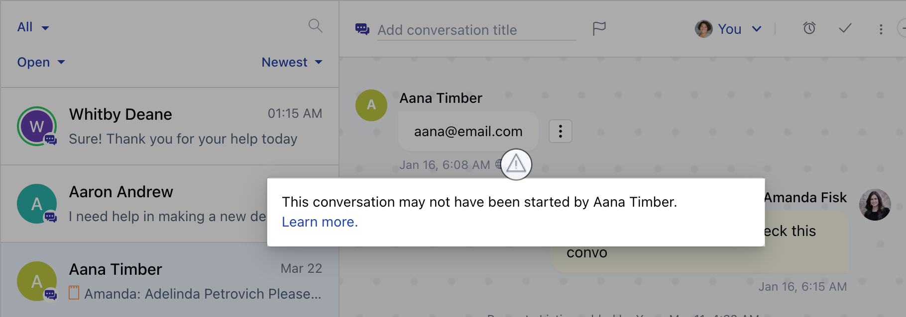

When a new visitor starts a chat with you, he might share an email address that might not belong to him.

- If Salesmate cannot identify the visitor as a [verified contact](https://support.salesmate.io/hc/en-us/articles/360058808931) i.e. the email shared by the visitor belongs to him or not, then messenger will show an impersonation warning with every chat message sent by this visitor.
- Salesmate will auto consolidate contact information once the visitor is identified as verified contact after login or signup.
- The impersonation warning is removed once the visitor identifies himself by logging in with the same email in Salesmate.

<Note>

**Note:** This impersonation warning is only visible on the inbox side to
 users of the messenger.

</Note>
