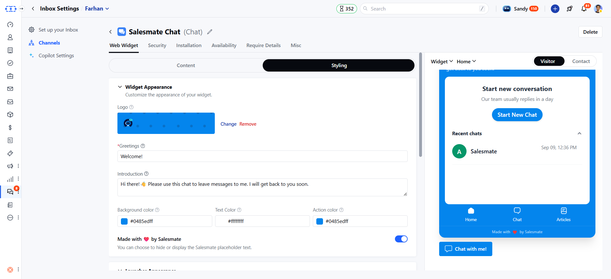
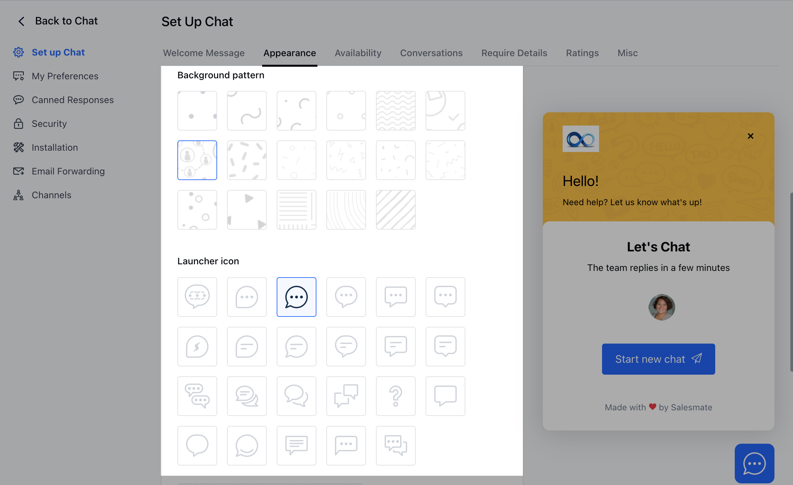
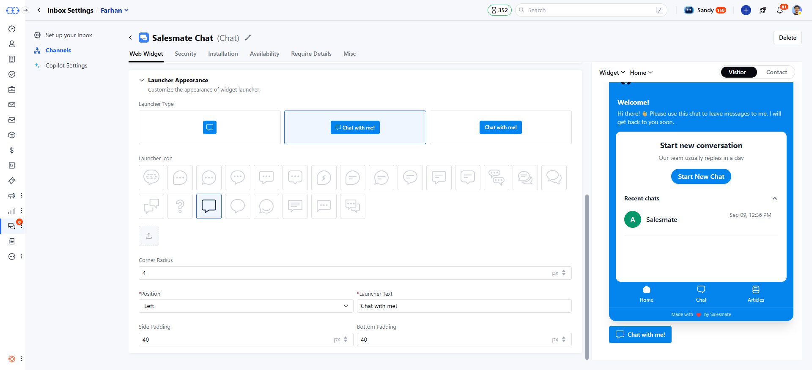

#### A user can choose the appearance of the Chat as per their brand's needs.

Messenger appearance can be customized while [installing Chats](https://support.salesmate.io/hc/en-us/articles/360058369732) and you can also customize it anytime in the future by following these simple steps:

- Navigate to **Conversations Icon** on the left menu bar
- Click on **Chats**
- Head to **Inbox Settings** on bottom left**.**
- Select the **Channel** from the list of available channels in your Unified Inbox.

Switch to the "**Appearance"** tab and set up the customization options available below

- **Header Logo:** You can upload the header image which can be of **PNG**, **JPG**, or **GIF** type with a file dimension of 160pixels \* 40pixels
- **Background Color:** Set the background color that will appear behind your welcome message, team profile, and chat header
- **Action Color:** Select the action color that will be used to assign primary colors for the buttons, links, and highlighted options

- **Background Pattern:** Select the background pattern from the given samples that will appear in the background of the background color you set
- **Launcher Icon:** Select the launcher icon that you want to display on the website. [Learn more](https://support.salesmate.io/hc/en-us/articles/4408437831705)

- **Launcher Position:** Select if the launcher should appear left or right side of the screen on your website and how much spacing is needed from the bottom and side
- **Salesmate Link:** Select to display Salesmate link at the bottom of the launcher by turning the toggle On/Off

Once the customizations have been done, hit the **Update** button to save your changes.
