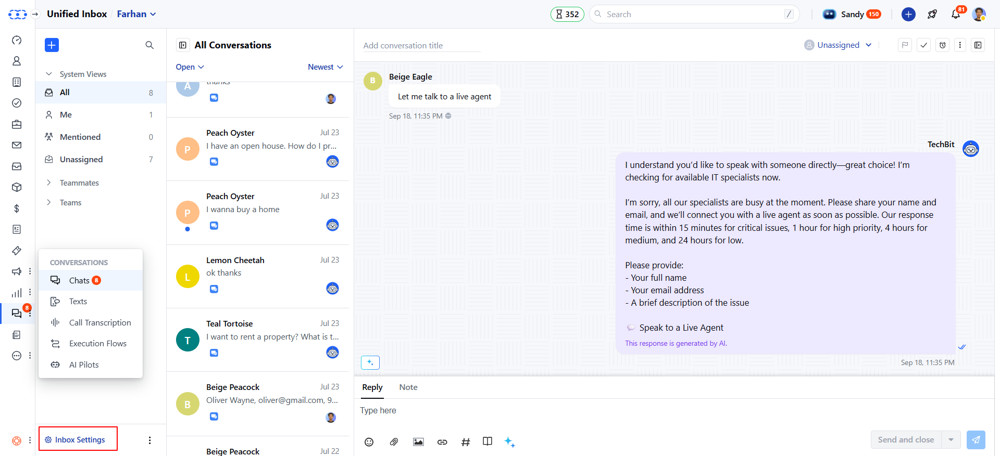
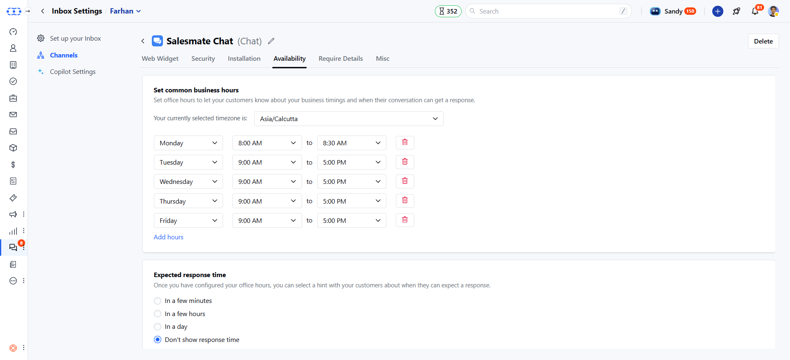
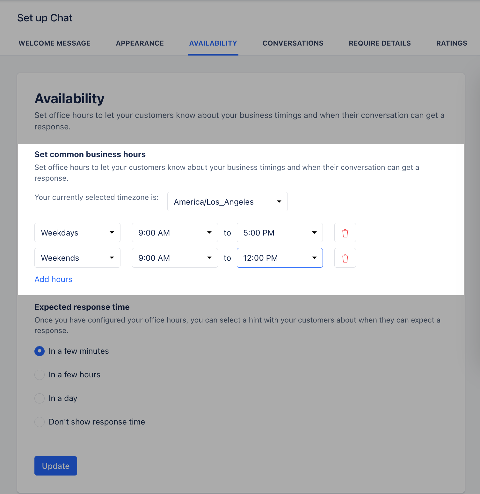

### Users can set **Office Hours** to let their customers know about your **Business Timings** and when their conversation can get a response.

Once the Chats is successfully [installed](#users-can-set-office-hours-to-let-their-customers-know-about-your-business-timings-and-when-their-conversation-can-get-a-response), you can set up the working hours and availability that will be visible to your website visitors in the Chat widget.

To set your Availability,

- Navigate to **Conversations Icon** on the left menu bar
- Click on **Chats**
- Head to **Inbox Settings** on bottom left.
- Select a **Channel** from the list of the available channels

* Switch to the **Availability** tab and select the **timezone** in which your
team operates

* Set your **working hours** from the option available and you can add more**
hours ** if your team operates in different time zones

<Note>

**Note:** By default, the working hours are set to** Weekdays (9 AM - 5
 PM)** and if you remove all hours then it would mean your team is available
 24x7.

</Note>

- Set the **expected response time** for your customers on how quickly they can get a response from you, choose from the below options:
- In a few minutes
- In a few hours
- In a day
- Don't show response time

* Once done, hit the **Update** button to save your changes.
