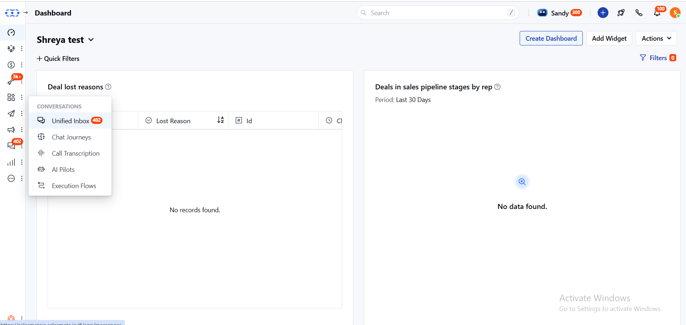
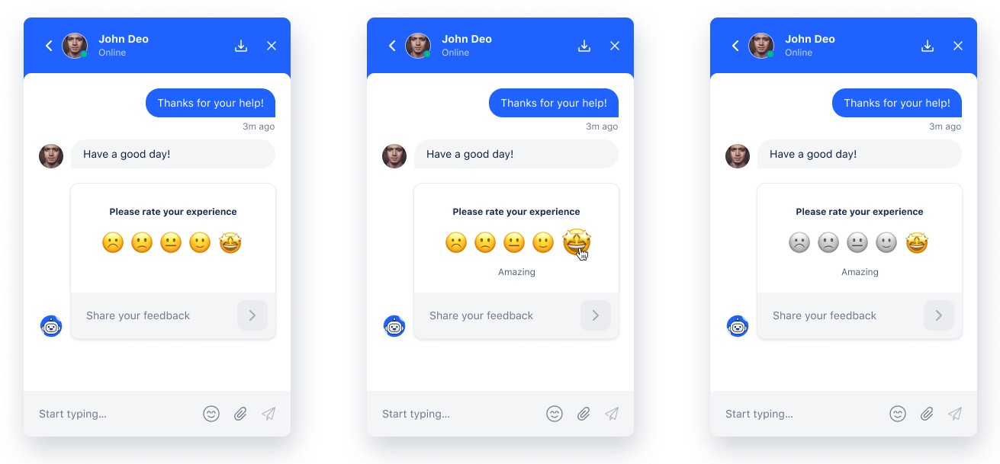
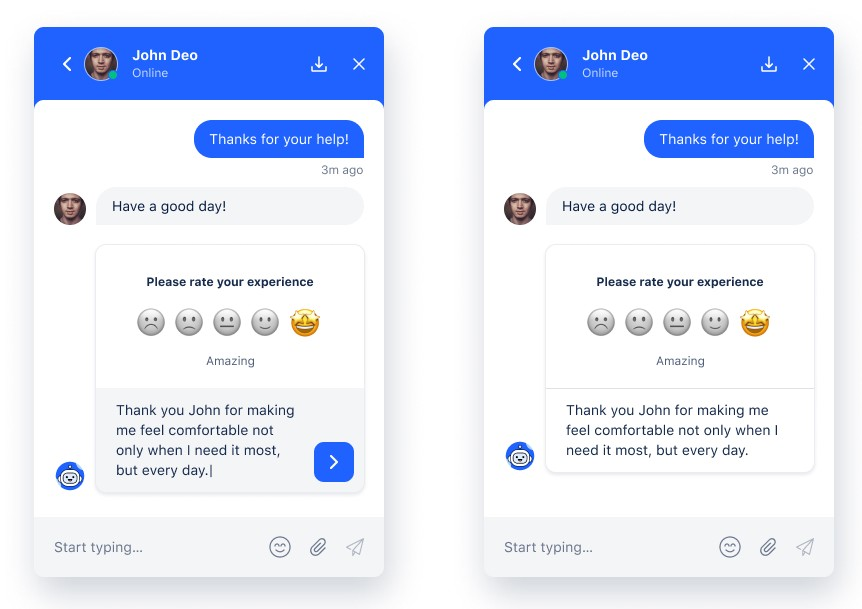
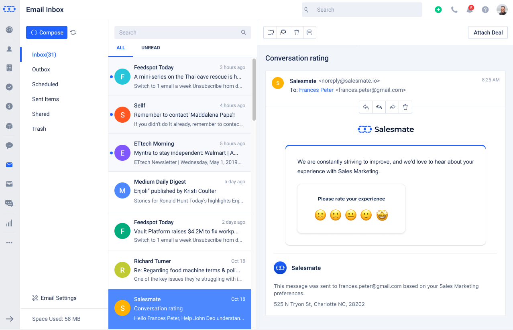
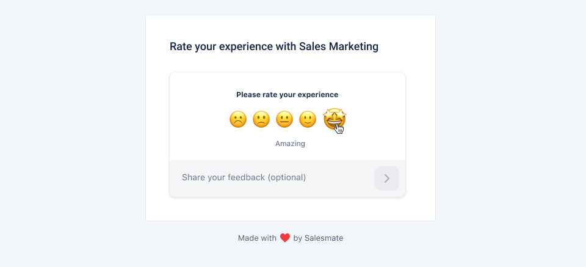
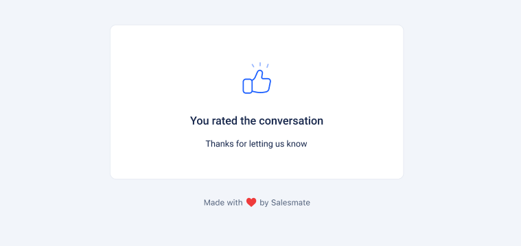
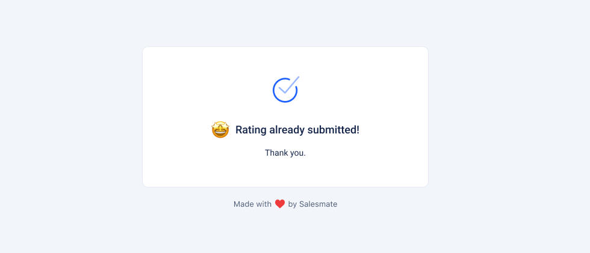

Feedback is imperative in understanding if we are on the right path and the quality we are targeting is doing its magic or not. It would benefit us in improving and also in outlining the points which need our immediate attention. In this article, we will discuss about the conversation rating by a customer or visitor. To make it simple for you, we will call them "end-user".

Let's quickly check out how can we achieve this via **Skara Chats**.

<Note>
  **NOTE:** User needs to have **“Manage chat settings”** permission enabled to access the below-mentioned steps.
</Note>

### **Enabling conversation rating in Skara Messenger:** 

- Navigate to **Chats** on the left menu bar

- Click on **Inbox Settings** on bottom left

- Click **Set up Messenger** in the left sidebar.
- Switch to the "**Ratings**" tab.
- Select, if you want to collect ratings from visitors or contacts or both.
- By default, the conversation rating option is enabled for links, if required user can disable them.
- Hit "**Save**".

### How does the conversation rating screen look like?

Ratings can be captured on the messenger as well as on emails. End-user can choose the rating and also leave a message. They can change their rating any number of times unless they have submitted a message with the rating. The system will always take the last rating under consideration.

When the end-user will hover over the emojis, he/she will find the label in the center for each emoji, following are the labels that have been introduced:-

- Poor
- Not great
- Satisfactory
- Good
- Amazing

If the end-user wish to compliment or add additional feedback in detail that can also be captured by adding it in the "Share your feedback" section as shown below.

- **Example:** John is a support engineer and the end-user is highly impressed with his help in quick resolution with one of the issues, so he rates the conversation as amazing and adds additional details in the text field.

!

<Note>
  **Note:** Please note that minimum five messages should be exchanged between the User and the Contact/Visitor before the Contact/Visitor can rate the conversation.
</Note>

### Conversation Rating Via Emails

End users can also rate the conversation via emails.

- Once the email is received, the conversation can be rated the same as in Chats. You can select an emoji and add additional details (if needed) \> Submit.

- Once done, the end-user will get an acknowledgment that their feedback has been submitted.

<Note>
  **Note:**

  - The conversation will be closed within seven days of the last message. If the User or the Visitor/Contact has not replied to the chat within seven days, then the system will not ask for a rating to prevent the message from appearing in old conversations.
  - If the rating was not been submitted earlier, the system will prompt the customer to provide a rating every time the conversation is closed.
  - When a group conversation is closed, the system will prompt the primary contact to provide a rating. The primary contact will be able to see the rating in the widget. If the rating is not captured within 2 minutes, an email will be sent to the contact to provide the rating, as they can only rate via email.
  - When the primary contact submits the rating with feedback or comment, then the rating will be closed for that conversation, and clicking on the link again will show 'Rating already submitted.'
  - In the above picture ‘Thank you.’ is the feedback message submitted by the end-user.
  - The above picture is shown when the rating is opened via email and is already submitted in the case of multiple participants.
</Note>

- Sample view for Skara users once a rating is completed by the end-user:

### **Need help?**

Feel free to chat with us or write us at [support@skara.io](mailto:support@salesmate.io) & we will be glad to assist you.