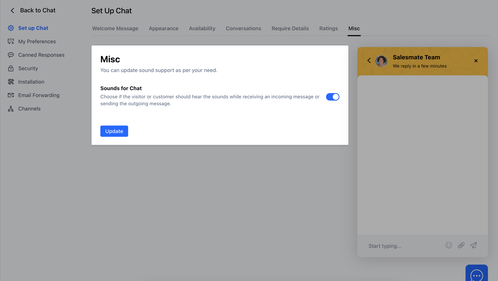

Users can choose if the visitor or customer should hear the sounds while receiving an incoming message or sending the outgoing message.

To configure the sounds, please follow these steps:

- Navigate to **Conversations Icon** on the left menu bar
- Click on **Chats**
- Head to **Chat Settings** on bottom left.

* Switch to the **Misc** tab where you can toggle the switch to enable or
disable the sound and hit the **Update** button to save the changes.

<Note>

**Note:** This setting is only for the Chat widget installed on your website,
 and not for the users who are using the Chat inbox.

</Note>
