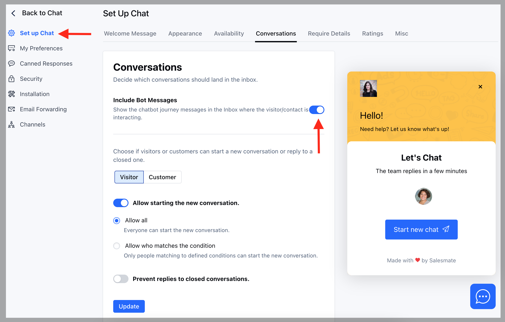

You can decide if the bot messages should be visible in the Inbox while the visitor/contact is interacting. For example, you have a chatbot that asks for Name, Email, and Phone and you want to monitor any conversations with the bot, If you find a conversation requiring immediate action, you or your teammate can take it over.

To view all ongoing conversations with bots, 

- Navigate to **Conversations Icon** on the left menu bar
- Click on **Chats**
- Head to **Chat Settings** on bottom left

- Under **Set up Chats**.
- Click on the **Conversations** tab.
- Enable the option **Include Bot Messages.**
- Hit on **Update.**

