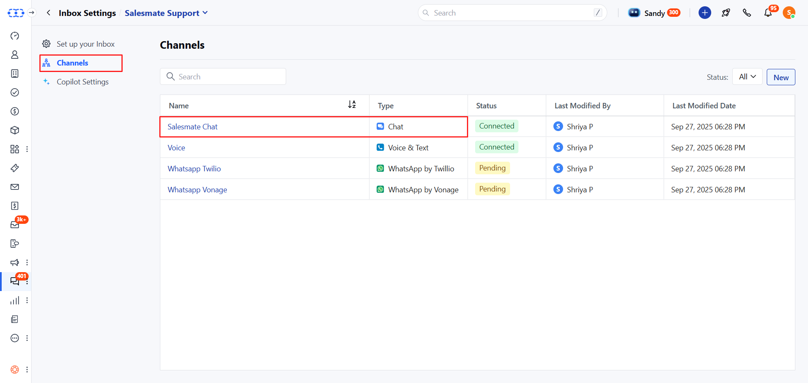
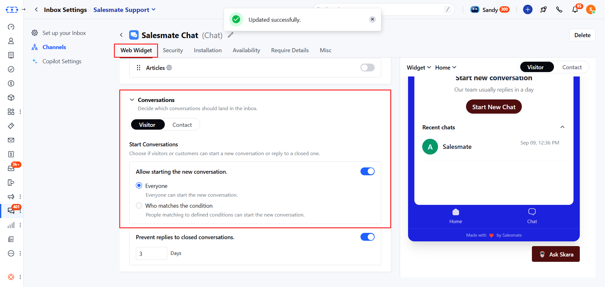
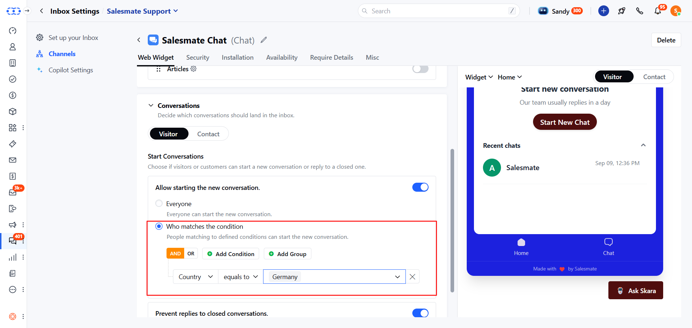

Salesmate Messenger now gives you full control over who can start a new conversation.

You can now choose to allow all visitors to start a new conversation, or you can choose to let only specific visitors or customers start new conversations.

For example, if you only operate for the customers of the United States, then you can now configure the settings such that the **start new chat** button will be visible to only those visitors who are located in the United States.

### Configuring settings for conversations

- Navigate to **Conversations Icon** on the left menu bar
- Click on **Chats**
- Head to **Inbox Settings** on the bottom left

* Click **Channels** in the left sidebar. * Now, click on the **Salesmate
Chat.**

* Under the **Web Widget**>**Conversations**. * Choose the Visitor or Contact
tab to configure their setting respectively. * The option “**Allow starting the
new conversation **” is enabled by default for all

* The settings as shown in the above image will enable everyone to start a new
conversation who visits the website.

- Select “**Allow who matches the condition**” to allow only specific people who can start a conversation.
- Add any number of conditions by clicking on Add condition button
- Choose the AND or OR operator to link the conditions together
- Click on Add Group button to add another set of conditions that can be linked with the previous set.

* The settings shown in the above image will enable all the visitors to start a
new chat whose location is Germany (as per their browser).

These settings are applied asap the widget is loaded on the website. To know about full control over conversations, refer to this article:
[Prevent replies to a closed conversation](https://support.salesmate.io/hc/en-us/articles/4405807330829)

### What will visitors see on your Messenger?

When visitors come to your website, and if they don't match the conditions to start new conversations, then they will not see the button to start a new chat. But they will see the list of their previous conversations if it exists, and can reply to their previous conversations (if allowed).

<Note>

- **Note:**

- Only users with [“Manage messenger settings” permission](https://support.salesmate.io/hc/en-us/articles/360058438992) can access this setting.
- These settings do not apply to the conversations that are created via email.
- The people, however, cannot start a new chat as per the above settings, but they can always reply to their ongoing conversations.

</Note>
