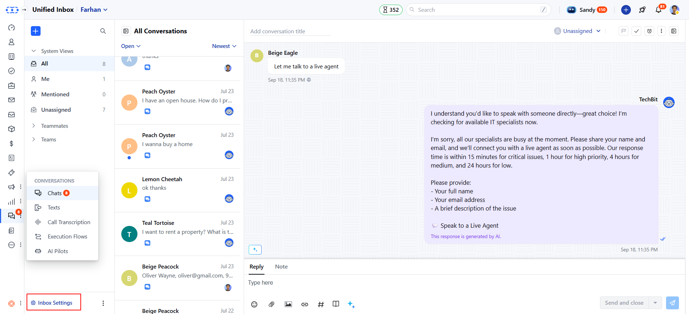
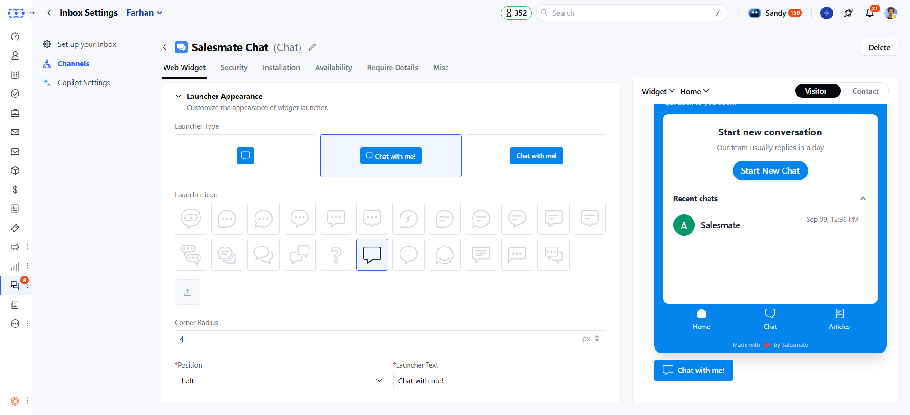

### A User can set a custom launcher icon while [installing chats](#a-user-can-set-a-custom-launcher-icon-while-installing-chatshttpssupportsalesmateiohcen-usarticles360058369732-which-can-also-be-updated-with-the-course-of-time-as-and-when-needed-by-following-the-below-mentioned-steps), which can also be updated with the course of time as and when needed by following the below-mentioned steps.

### The launcher icon will be visible to your **website visitors** when they open your website as per the defined chat launcher position you have set.

### Open Chat settings

- Navigate to **Conversations Icon** on the left menu bar
- Click on **Chats**
- Head to **Inbox Settings** on bottom left.
- Select a **Channel** from the list of available channels.

- Here, go to the **Launcher Appearance** section.
- By default, the Salesmate launcher icon would be selected
- You can select the icons from the given list
- Or you can upload a **Custom icon**

- You can also set the **Launcher Position** as per your requirement on your **website**
- Once you are done, hit the **Update** button to save your changes.

<Note>

**Note:** Only users with [“Manage chat settings”
 permission](#a-user-can-set-a-custom-launcher-icon-while-installing-chatshttpssupportsalesmateiohcen-usarticles360058369732-which-can-also-be-updated-with-the-course-of-time-as-and-when-needed-by-following-the-below-mentioned-steps) can
 access this setting.

</Note>
