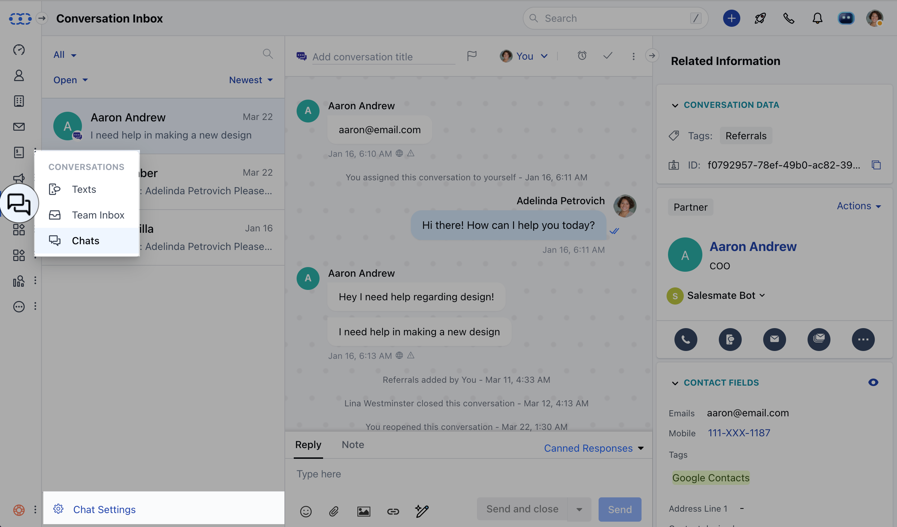
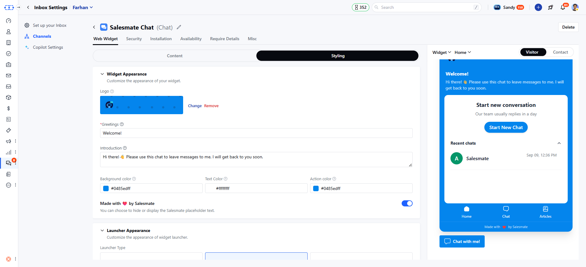

 A User can set a custom message while [installing Chats](#a-user-can-set-a-custom-message-while-installing-chatshttpssupportsalesmateiohcen-usarticles360058369732-which-can-also-be-updated-with-the-course-of-time-as-and-when-needed-by-following-the-below-mentioned-steps), which can also be updated with the course of time as and when needed by following the below mentioned steps. The welcome message will be visible to your **website visitors** when they open the chat widget installed on your website.

### Open Chat settings

- Navigate to **Conversations Icon** on the left menu bar
- Click on **Chats**
- Head to **Inbox Settings** on bottom left.
- Click **Channels** and select one from the available channels in your Unified Inbox.

### Customize the welcome message

- Here the **Welcome Message** tab is opened by default.
- You can put any **Greeting** message to welcome your customers on the platform in the field shown below for example '_Hello there!_'
- Also, a **Team Introduction** message to say how you can help your customers.
- Which will be reflected in the live preview of the widget on the left side. 

- You can also change the name of your workspace by updating value in **Workspace name**
- Once you are done, hit the **Update** button to save your changes.

<Note>
  **Note:** Only users with [“Manage chat settings” permission](#a-user-can-set-a-custom-message-while-installing-chatshttpssupportsalesmateiohcen-usarticles360058369732-which-can-also-be-updated-with-the-course-of-time-as-and-when-needed-by-following-the-below-mentioned-steps) can access this setting.
</Note>