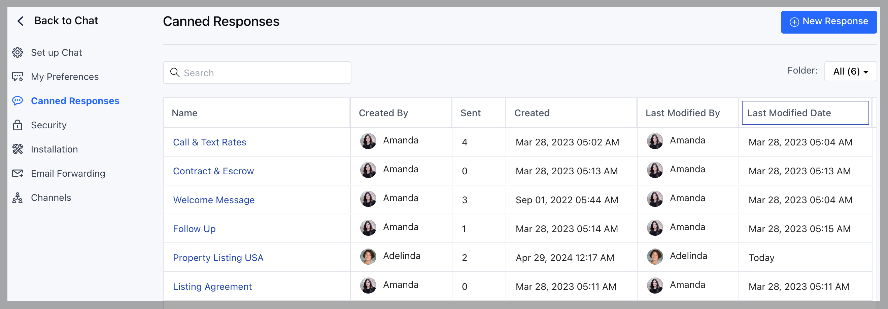
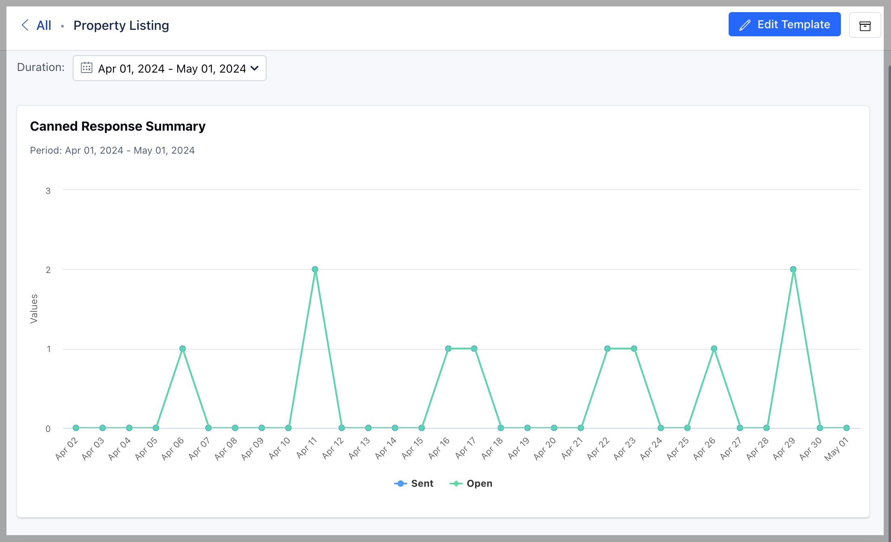

Canned Responses are very handy when it comes to quick messaging, and share quick replies like greeting text, or answers to some common questions.
[Learn more about Canned Responses.](https://support.salesmate.io/hc/en-us/articles/360061360832)

Now you can even view some stats for the canned responses which were sent to customers and the canned responses which got opened by customers. This data plays a major role in reports and analytics to understand more about your customers.

To view a canned response, you need ["Manage Canned Responses" permissions](https://support.salesmate.io/hc/en-us/articles/360058438992), if you have then simply follow the steps:

- Go to **Chat** from the left menu panel.
- Click on **Chat settings** available on the footer of the chat listing column.
- Select **Canned Responses** option in the left sidebar.
- Pick a canned response from the list and click on its name.

* 

System will redirect you to the detail page and you'll see the chart.

* By default, the chart displays results of last 30 days but you can change that
by selecting any option provided in the duration.

<Note>

**Note:** You can also perform edit, archive and unarchive operation on the
 canned response from this screen.

</Note>
