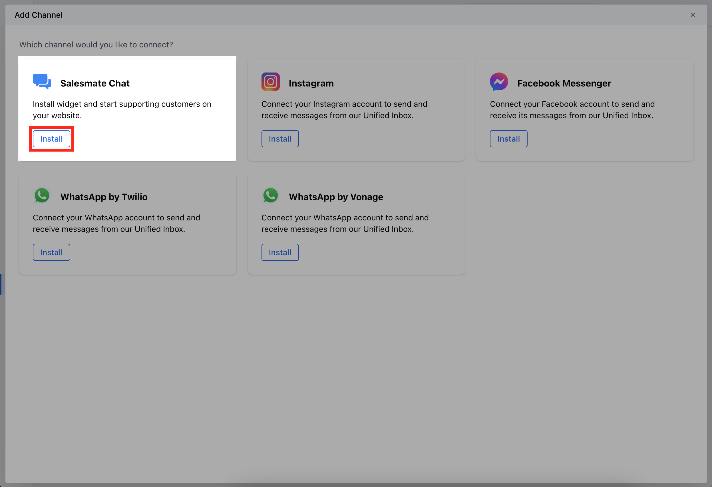
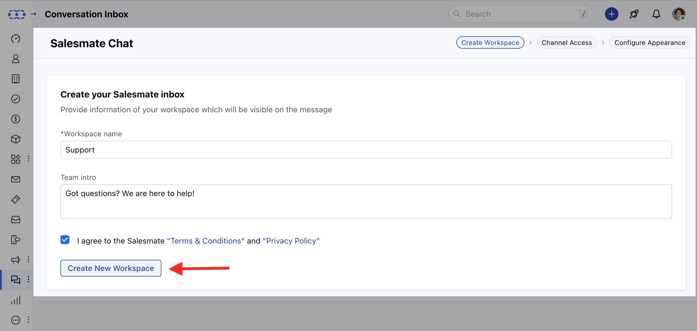
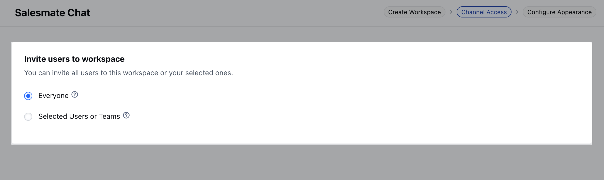
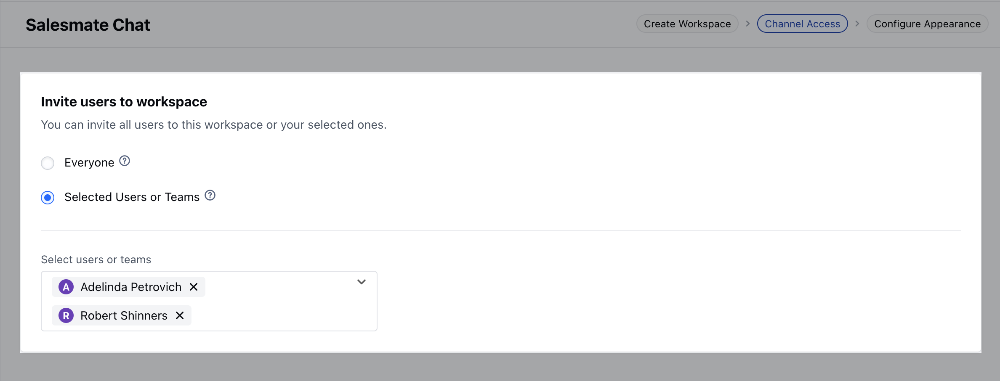
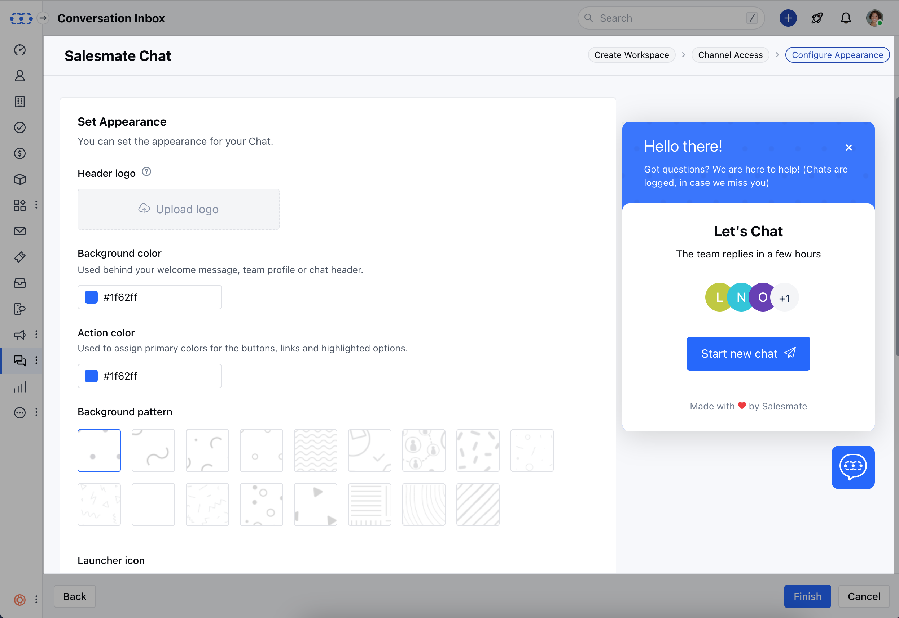
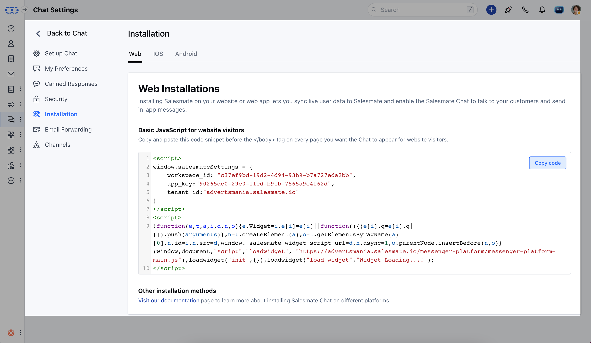

This guide will help you get started with **Salesmate Chats**, There are basically 5 easy steps to activate the chats in your account and install its widget on your website but you need to have an admin account first.

- **Topics covered:**

- [Install Chats](#install-chats)

- [Creating your workspace](#creating-your-workspace)

- [Inviting users to the workspace](#inviting-users-to-the-workspace)

- [Customizing and Personalizing your Chat](#customizing-and-personalizing-your-chat)

- [Installing the Salesmate Chats on your website](#installing-the-salesmate-chats-on-your-website)

### Install Chats

- Activate
- [Unified Conversation Inbox](#faqs-how-can-i-install-the-messenger-code-on-the-wordpress-site)
to
[Install Salesmate Chats](#installing-the-salesmate-chats-on-your-website)
- Select **Salesmate Chat** and click on the **Install** option

<Note>

**Note:**Make sure to check the expiry date mentioned just above the activate
 button for your trial account of the Chats.

</Note>

### Creating your workspace

Here you need to fill in the following information:

- **Workspace name**: It will be visible to your website visitors when they'll start a conversation.

- **Team Intro**: Write your welcome message
- To adhere to the compliances you would need to accept the "
- [Terms & Conditions](https://www.salesmate.io/tos/)
" and "
[Privacy Policy](#faqs-how-can-i-install-the-messenger-code-on-the-wordpress-site)
"

!

- Select I agree to the "Terms & Conditions" and "Privacy Policy" option once you have read it.
- Click on the **Create New Workspace** button.

### Inviting users to the workspace

Now you can invite some users to your workspace who will be communicating with your website visitors. It can be done in two ways:

- - **Invite Everyone to Chat:** This will allow everyone with a chat license to respond to the channel’s conversations

### 

- **Invite selected Users:** This will allow only the selected Users with a chat license to respond to the channel's conversations

- Once you have selected the users for your Chats, you can click on the **Next**
button to Setup
[Appearance](https://support.salesmate.io/hc/en-us/articles/360058874471)
.

### Customizing and Personalizing your Chat

- Here you can customize the appearance of the Chats widget which will appear on your website to the visitors, either you can go with the default settings or
- [Learn to customize your Chat later](https://support.salesmate.io/hc/en-us/articles/360058874471)

- Click on the **Finish** button to save your changes.

### Installing the Salesmate Chats on your website

- Here you'll see some code, which you need to copy and paste before the `</body>` tag of every HTML page of your website where you want the chats widget to appear.

- Click on the **Done** button, and Voila! It's all done. 😃

You are ready to chat with your customers.

### FAQ's **How can I install the messenger code on the WordPress site?

- **SM:**Please follow the below steps to paste the messenger code into your WordPress site.

- Login to your WordPress Store
- Navigate to the Plugins section
- Click on Add New and Search for Salesmate Messenger from the search bar.
- Click on Install Now on the Salesmate Messenger’s Plugin.
- Once it is installed, click on Activate.
- Now go to the Salesmate Messenger and enter the Workspace ID, AppKey, and Tenant ID from the [Messenger code](#faqs-how-can-i-install-the-messenger-code-on-the-wordpress-site).

You can refer to the detailed guide video below:

<iframe width="560" height="315" src="https://www.youtube.com/embed/ZMCNAzJGmr8" title="YouTube video" frameborder="0" allow="accelerometer; autoplay; clipboard-write; encrypted-media; gyroscope; picture-in-picture; web-share" allowfullscreen/>
- *How can I install the messenger code on the BigCommerce store?

- ** - **SM:**
Please follow the below steps to paste the messenger code into your BigCommerce
Store.

- Log in to your BigCommerce Store.
- From the left panel, Go to the Channel Manager section
- Under Storefront, navigate to Scripts.
- Click on Create a Script
- Now add the Name and Description of the script
- Keep the location of the page as Footer
- Now select “All Pages,” where the script will be added
- Move ahead by keeping the Script Category as “Essential”
- Select Script Type as “Script”
- Under the Script Content, place the messenger code.
- Paste this code in the script content section.
- Now update one line of the script below the tenant_id that is "hide_default_launcher: true". This code hides the launcher icon yet keeps the tracking on.

You can also refer to the detailed guide video below:

<iframe width="560" height="315" src="https://www.youtube.com/embed/1_7w1TfdNwU" title="YouTube video" frameborder="0" allow="accelerometer; autoplay; clipboard-write; encrypted-media; gyroscope; picture-in-picture; web-share" allowfullscreen/>
