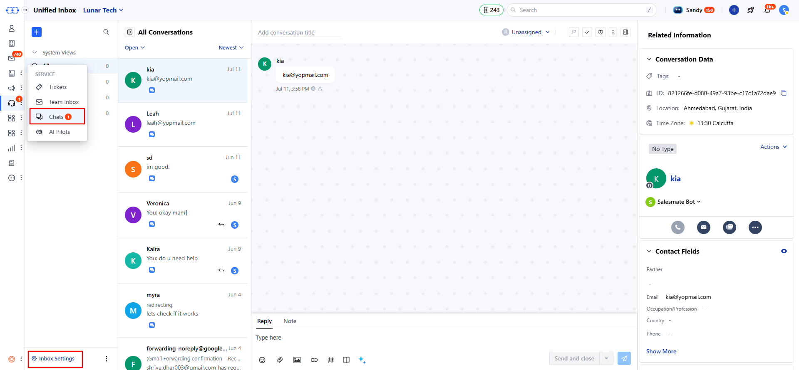
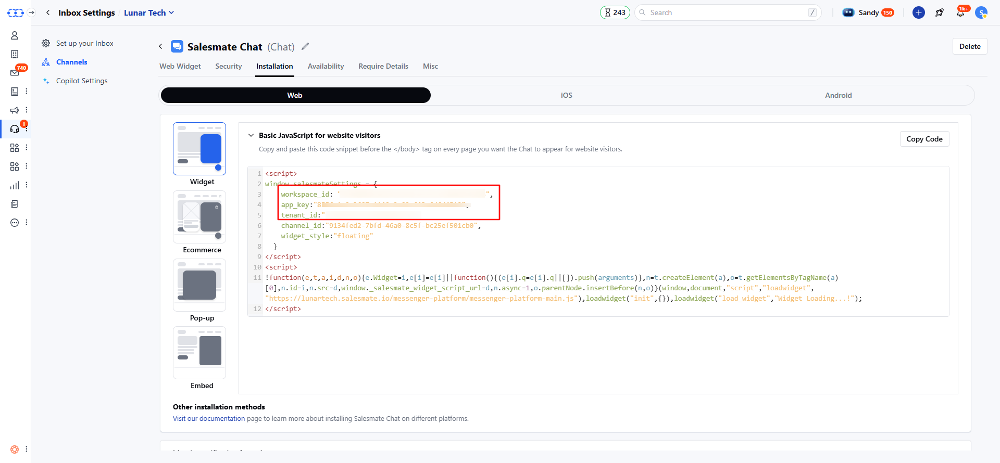

**Note**: In order to track analytics, it is necessary to have the Chat add-on included in your plan.

Viewed Product snippet tracks when customers view specific products on your site, and to enable this tracking you must add a code snippet to your BigCommerce Theme file. Instructions for installing this snippet are described below.

- First, you need to ensure that web tracking is enabled for your BigCommerce website and to do that you need to install the main script on all web pages.
- Navigate to **Storefront \> My Themes** from your BigCommerce dashboard.
- From the current theme, click the **Advanced Settings** dropdown and click Edit Theme Files.
- **This opens the web editor**.
- Navigate to **templates \> pages** and scroll down to open any page and the bottom of the page, paste the below code, and then click **Save & apply all files**.
- For this snippet to work correctly, repeat step 4 and add it to all of your product pages.

```html
<script>
window.skaraSettings = {
  workspace_id: "{{workspaceId}}",
  app_key: "{{appKey}}",
  tenant_id: "demomessenger.salesmate.io",
  hide_default_launcher: true,
  is_include_bigcommerce_tracking_file: true,
  email: "{{customer.email}}",
  name: "{{customer.name}}",
  bigcommerce_store_id: "{{settings.store_hash}}",
};
</script>

<script>
!(function (e, t, a, i, d, n, o) {
  (e.Widget = i),
  (e[i] =
    e[i] ||
    function () {
      (e[i].q = e[i].q || []).push(arguments);
    }),
  (n = t.createElement(a)),
  (o = t.getElementsByTagName(a)[0]),
  (n.id = i),
  (n.src = d),
  (window._salesmate_widget_script_url = d),
  (n.async = 1),
  o.parentNode.insertBefore(n, o);
})(
  window,
  document,
  "script",
  "loadwidget",
  "https://demomessenger.skara.io/messenger-platform/messenger-platform-main.js"
);

loadwidget("init", {});
loadwidget("load_widget", "Widget Loading...!");
</script>
```

<Note>
  **Note**: You need to copy workspace_id, app_key, & tenant_id from the messenger installation settings in your skara.
</Note>

- Navigate to **Conversations Icon** on the left menu bar
- Click on **Chats**
- Head to **Inbox Settings** on bottom left.



- Here, click on **Channel** and then locate the **Skara Chat** channel. From the **Actions** menu, select **Edit**.
- Navigate to the **Installation** section
- Copy the **workspace_id ,app_key** & **tenant_id** from the code snippet of the web installation.



- From your BigCommerce admin, navigate to **templates \> pages** and click to open the product.html page.
- Scroll down to the bottom of this page, and paste the below code.

```javascript
<script type="text/javascript">
window.addEventListener('__SM_ANALYTICS_READY__', () => {
  SKARA.productViewed({
    productId: "{{product.id}}",
    storeId: "{{settings.store_hash}}"
  });
});
</script>
```

Optional:

1. You can also track if a customer viewed the product through a quick view card, but for this an extra step is required.
2. From your BigCommerce admin, navigate to **templates \> components \> products** and open **card.html**, and add the below attribute to the quick view button element.

```html
data-product-viewed="{{id}}"
```