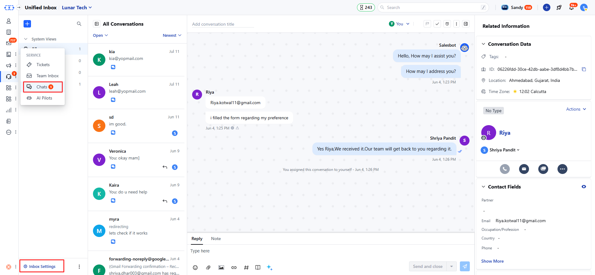
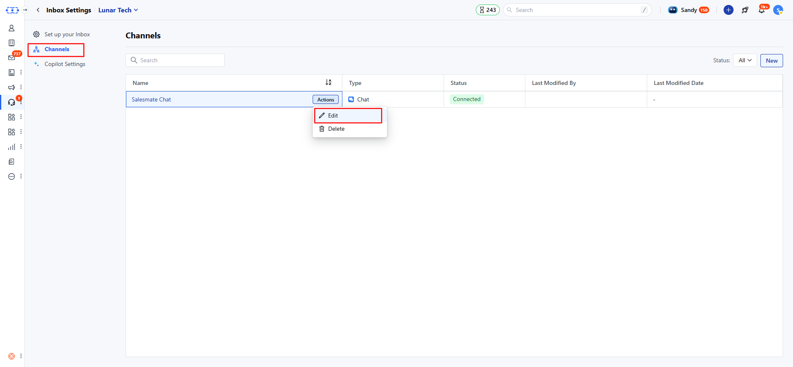
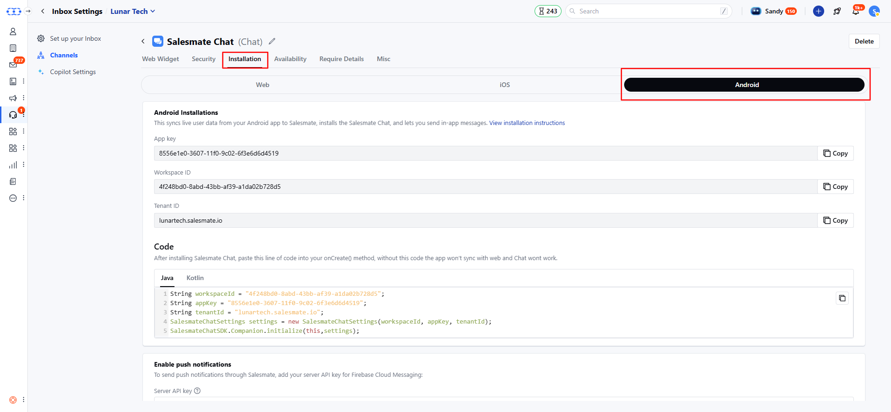
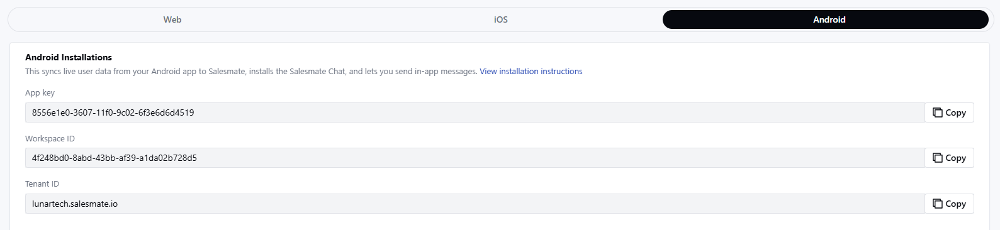
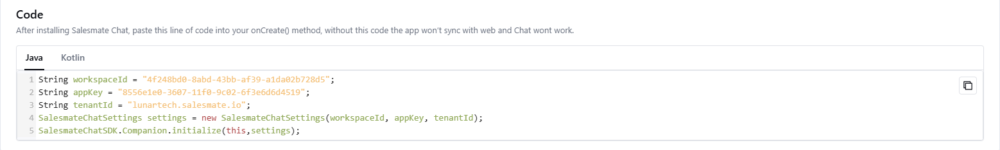
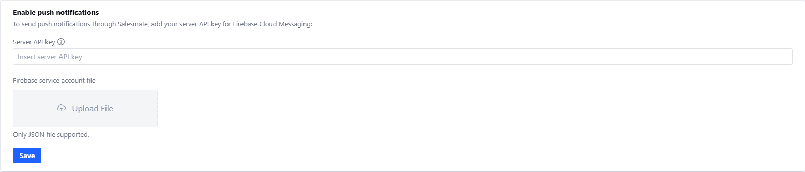

<Note>
  **Note:** Only users with ‘Manage Messenger Settings’ access can configure these settings.
</Note>

Now add skara Chat to your mobile apps directly and provide your customers an in-app chat experience.

- To install chats to your iOS app, [click here](/chats/installing-salesmate-chats/installing-chats-on-your-ios-app).

Follow the below steps to navigate to the Chat installation page:

- Navigate to **Conversations Icon** on the left menu bar
- Click on **Chats**
- Head to **Inbox Settings** on bottom left.

- Here, click on **Channel** and then locate the **Skara Chat** channel. From the **Actions** menu, select **Edit**.

- Here, click on Installation and you will get 3 tabs Web, iOS, and Android, select the **Android** tab.
- Installation of Chat on your Android app helps sync live user data from your Android app to Skara, and lets you send in-app messages.

### Installing:

The android installation screen has two sections

- **API Key**
- **Push Notifications**

### **API Key:** - You can use the below keys to add the Skara Chats to your app.

- **API Key:** A unique key for your Skara account.
- **Workspace ID:** A unique key for your Skara Chat workspace
- **Tenant ID:** This is your Skara domain link.

- The code is available in two languages
- **Java**-**Kotlin**

### **Enable Push Notifications:** - To send push notifications through

- Messenger to your Android device, you need to configure the below settings.
- The push notifications are sent for newly received messages on Skara Messenger when visitor/contact leaves the app. Here, you need to add the below details to the Skara Chat settings
- **Server API Key:** Add your server API key for Firebase Cloud Messaging
- **Firebase service account file (Only JSON file is supported)** Once, you add the above information, the **Save** button would be enabled.

