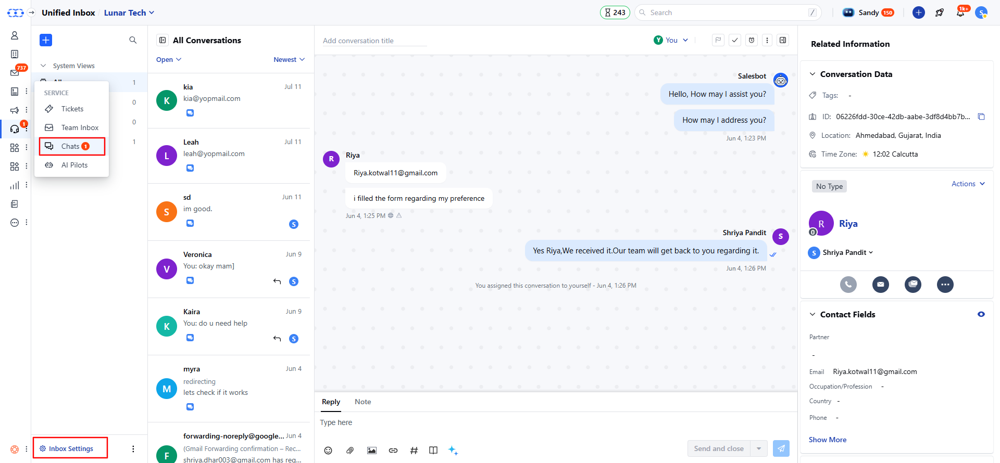
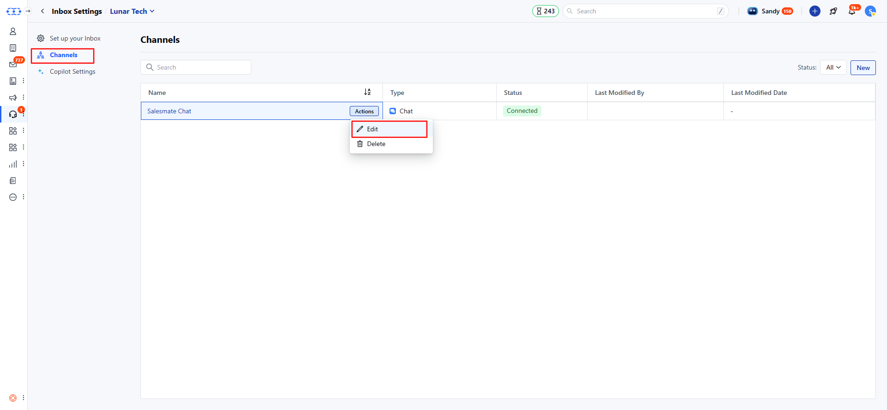
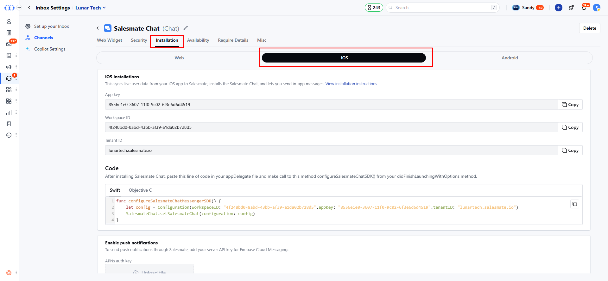
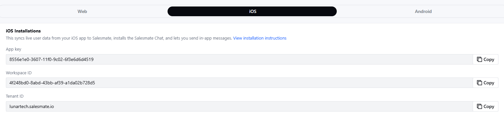
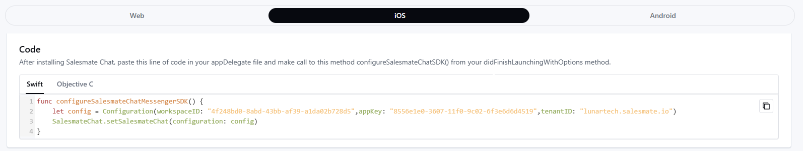
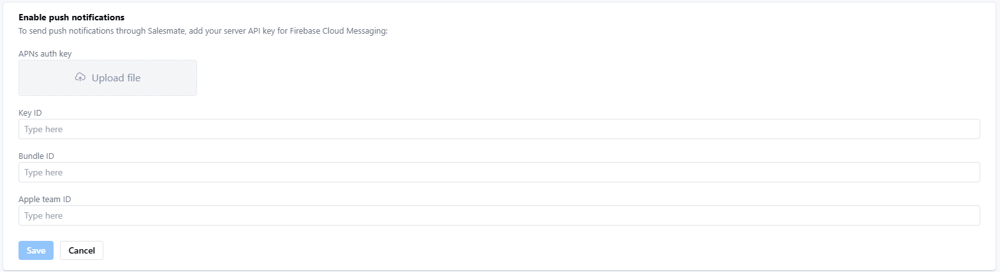

Now add Salesmate Chat to your mobile apps directly and provide your customers an in-app chat experience.

- To install Chats to your Website, click here.
- To install chats to your Android app, [click here](https://support.salesmate.io/hc/en-us/articles/7972447855001).

Follow the below steps to navigate to the Chat installation page:

- Navigate to **Conversations Icon** on the left menu bar
- Click on **Chats**
- Head to **Inbox** **Settings** on bottom left

* Here, click on **Channel** and then locate the **Salesmate Chat** channel.
From the **Actions** menu, select **Edit**.

* Here, click on **Installation** and you will get 3 tabs Web, iOS, and
Android, select the **iOS** tab. * Installation of Chat on your iOS app helps
syncing live user data from your iOS app to Salesmate, and lets you send in-app
messages.

### Installing:

iOS installation screen has two sections

- [API Key](#api-key)

- [Enable Push Notifications](https://support.salesmate.io/hc/en-us/articles/7972525508633-Installing-Chats-on-your-iOS-App#h_01G6QPS4T2PD2S5ZT2SB5J5C90)

### **API Key:**

You can use the below keys to add the Salesmate Chats to your app.

- **API Key:** A unique key for your Salesmate account.

- **Workspace ID:** A unique key for your Salesmate Chat workspace

- **Tenant ID:** This is your Salesmate domain link.

* The code is available in two languages * **Swift** * **Objective - C**

####**Enable Push Notifications:**

- To send push notifications through Messenger to iOS device, you need to configure the below settings.
- The push notifications are sent for newly received messages on Salesmate Messenger when a visitor/contact leaves the app.

Here, you need to add the below details to the Salesmate Chat settings

- **APNs Auth Key:** Upload the .p8 file of the Apple Push Certificate

- **Key ID:** 
- **Bundle ID:**
- **Apple Team ID:** Once, you add the above information, the **Save** button would be enabled.

