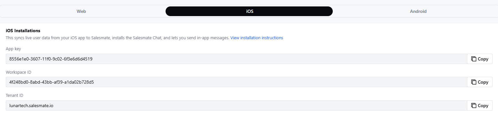
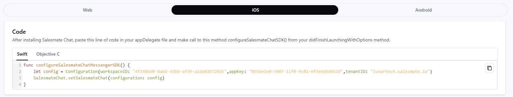
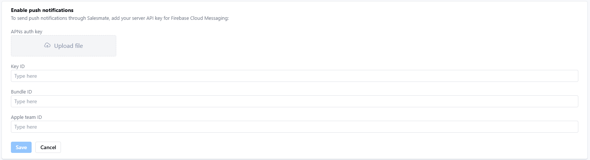

Now add Skara Chat to your mobile apps directly and provide your customers an in-app chat experience.

- To install chats to your Android app, [click here](/chats/installing-salesmate-chats/installing-chats-on-your-android-app).

Follow the below steps to navigate to the Chat installation page:

- Navigate to **Conversations Icon** on the left menu bar
- Click on **Chats**
- Head to **Inbox** **Settings** on bottom left

- Here, click on **Channel** and then locate the **Skara Chat** channel.
- From the **Actions** menu, select **Edit**.

- Here, click on **Installation** and you will get 3 tabs Web, iOS, and Android, select the **iOS** tab.
- Installation of Chat on your iOS app helps syncing live user data from your iOS app to Salesmate, and lets you send in-app messages.

### Installing:

iOS installation screen has two sections

- API Key
- Enable Push Notifications

### **API Key:**

You can use the below keys to add the Skara Chats to your app.

- **API Key:** A unique key for your Skara account.
- **Workspace ID:** A unique key for your SkaraChat workspace
- **Tenant ID:** This is your Skara domain link.

- The code is available in two languages
- **Swift** - **Objective - C**

### **Enable Push Notifications:**

- To send push notifications through Messenger to iOS device, you need to configure the below settings.
- The push notifications are sent for newly received messages on Skara Messenger when a visitor/contact leaves the app.

Here, you need to add the below details to the Skara Chat settings

- **APNs Auth Key:** Upload the .p8 file of the Apple Push Certificate
- **Key ID:** 
- **Bundle ID:**
- **Apple Team ID:** Once, you add the above information, the **Save** button would be enabled.

