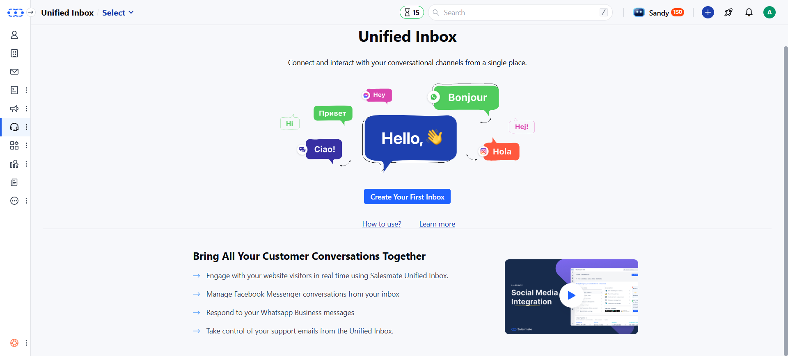

**Salesmate Chats** allows you to connect with your website and app visitors and serve customers better.

<Note>
  **Note:** You need to Activate Unified Conversation Inbox to use Salesmate
  Chats. [Learn
  More](https://support.salesmate.io/hc/en-us/articles/26735788331033-How-to-Activate-Unified-Conversation-Inbox)
</Note>

<Frame>
  
</Frame>

Add a chat widget to your website, and:

- Start talking to your visitors in minutes.
- Engage your customers during their buying process and help them make a purchase.
- Resolve your customer support queries quickly to increase customer satisfaction.

## Key Features

Salesmate Chats is an add-on and its pricing is based on the number of user seats you wish to add for users who will be managing chat communication.

## Requirements

- You need to be an admin to install the Chats.
- Learn More about [Installing Chats](https://support.salesmate.io/hc/en-us/articles/26825530206745-How-to-Install-Salesmate-Chat)
