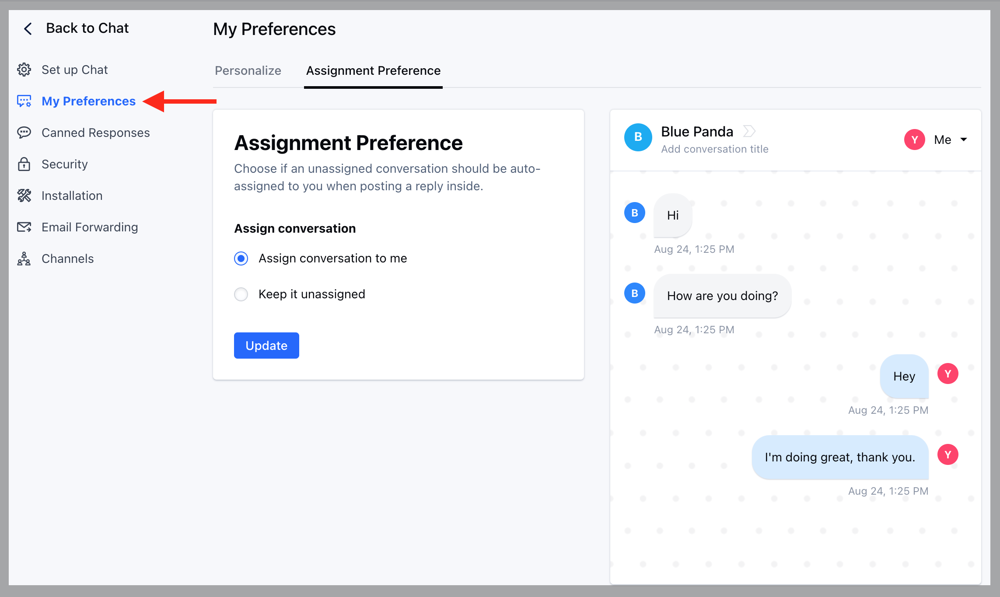

Choose if an unassigned conversation should be auto-assigned to you when posting a reply inside. 

- *To personalize assignment preference, follow these steps**

- Navigate to **Conversations Icon** on the left menu bar
- Click on **Chats**
- Head to **Chat Settings** on bottom left **.**

* Switch to **My Preferences** in the left sidebar * Click on the "**Assignment
Preference **" tab. * Select your preference.

- Assign conversation to me 
- Keep it unassigned

* Hit the **Update** button to save your changes

These changes will reflect in your inbox once a new conversation is created, it will assign to you if you reply inside an unassigned conversation (as per the settings configured in the above image).
