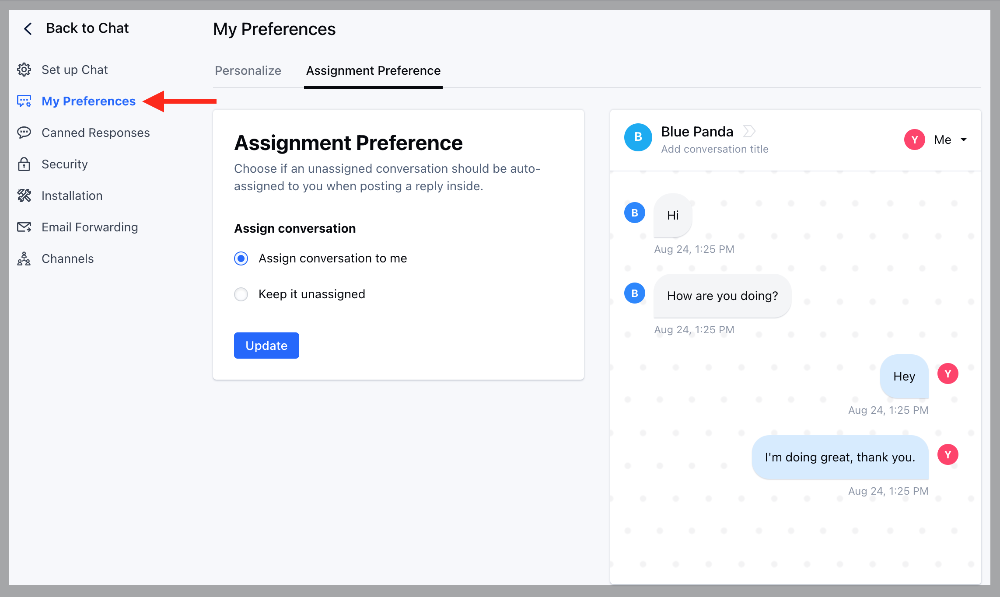

Choose if an unassigned conversation should be auto-assigned to you when posting a reply inside. 

**To personalize assignment preference, follow these steps**

- Click on **Unified inbox**
- Head to **Chat Settings** on bottom left.

- Switch to **My Preferences** in the left sidebar
- Click on the "**Assignment Preference**" tab.
- Select your preference.
- Assign conversation to me 
- Keep it unassigned

- Hit the **Update** button to save your changes

- These changes will reflect in your inbox once a new conversation is created, it will assign to you if you reply inside an unassigned conversation (as per the settings configured in the above image).