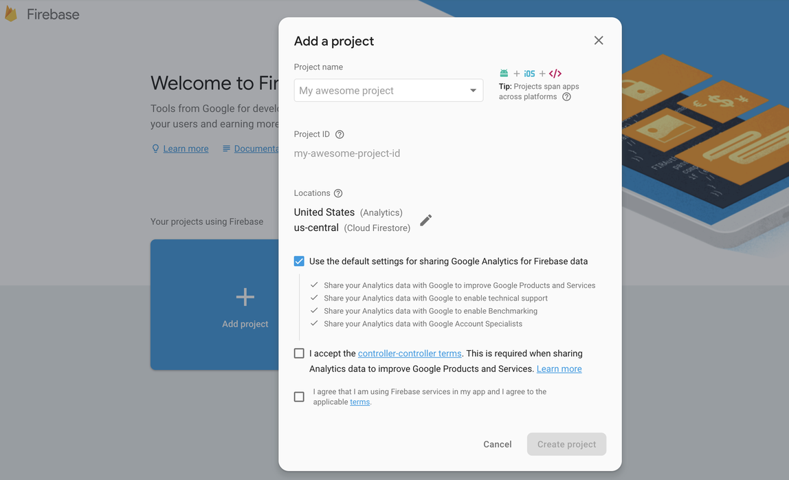
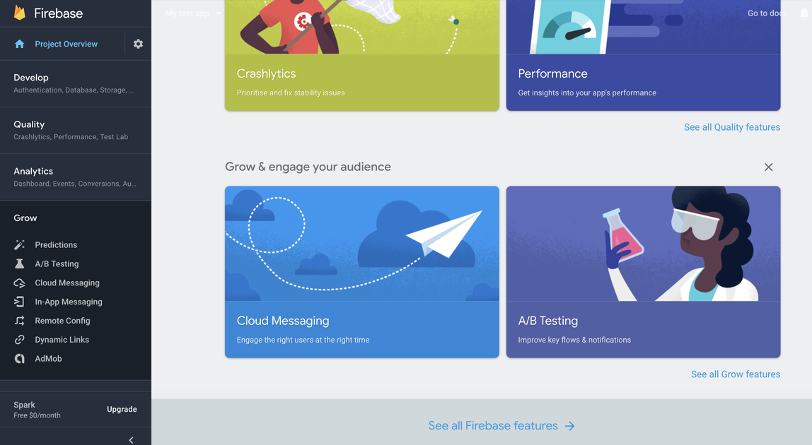
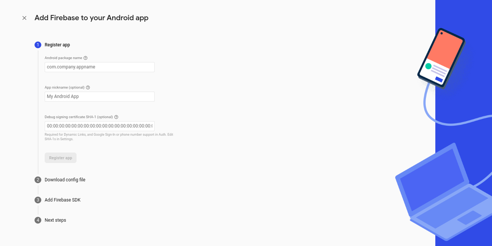
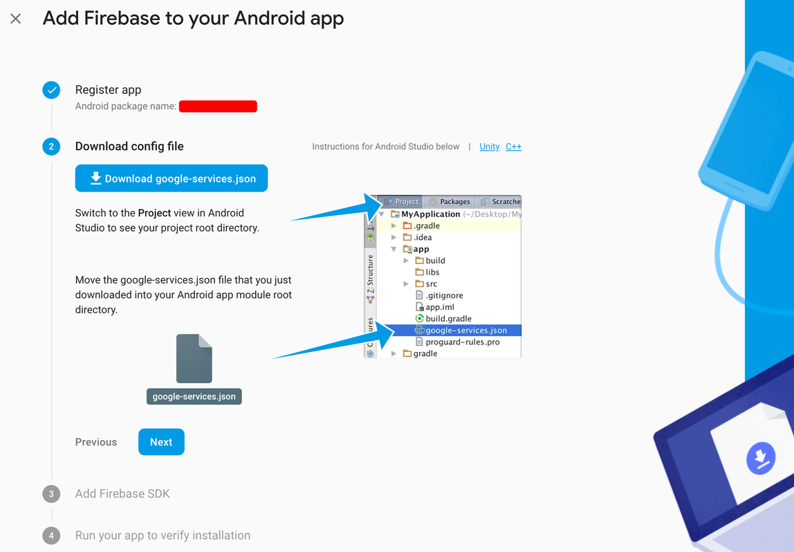
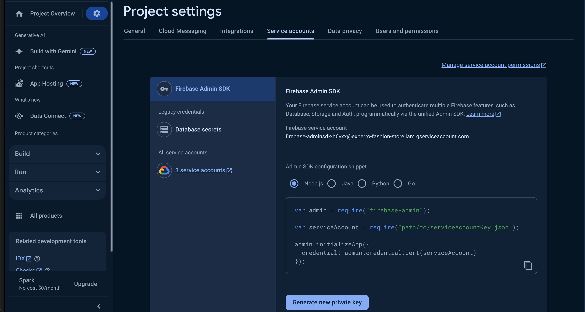
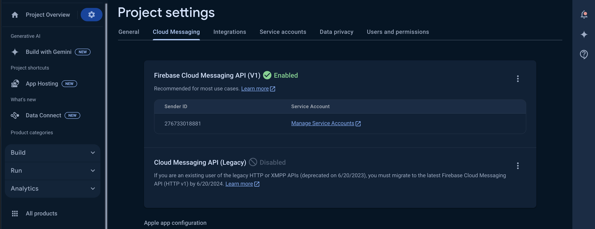
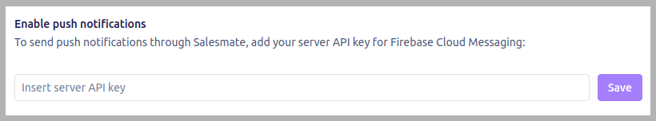

We’ll show you how to send push notifications and/or push messages to your customers, with Firebase Cloud Messaging (FCM) in Salesmate Chat.

- **Topics covered:**

- [Enable Google Services For Your App](#enable-google-services-for-your-app)

- [Set Up Client to Receive Push](#set-up-client-to-receive-push)

- [Enable Push Notification in Salesmate](#enable-push-notification-in-salesmate)

- [Disable Push on Logout](#disable-push-on-logout)

- [Using Salesmate Chat with FCM - Setup](#using-salesmate-chat-with-fcm-setup)

- [Trouble Shooting Tips](#trouble-shooting-tips)

### Enable Google Services For Your App

- If you already have a Firebase project with notifications enabled you can skip to the next step. Otherwise, go to the [FCM Console page](https://console.firebase.google.com/) and create a new project following these steps:
- Give the project a name and click ‘Create Project’.


- Once your project is set up, scroll down and select the ‘Cloud Messaging’’
card.


- Click on the Android icon to continue the setup. - Enter your app’s package
name and click ‘Register App’.

#

### Set Up Client to Receive Push

- Click the button "Download google-services.json" to download the config file. You’ll need to move that file into the same directory as your application level `` `build.gradle` ``.


- Click "next" and then in your apps `` `build.gradle` `` you will need to add
the following lines to your dependencies:

```gradle
dependencies {
    // implementation 'Coming Soon'
    implementation 'com.google.firebase:firebase-messaging:20.2.'
}
```

- At the bottom of your `` `build.gradle` `` you must add:
 `apply plugin: 'com.google.gms.google-services'`
- It is important that this is at the very end of the file.
- Click the Next button and then skip the verification step.

### Enable Push Notification in Salesmate

- Finally, click the settings cog and select ‘Project settings’, then ‘Cloud Messaging tab’ then Cloud Messaging tab.


- For new FCM projects, Firebase Cloud Messaging API v1 is enabled by default.
If it's disabled in an older project, you can enable it in Google Cloud Console
by clicking the three dots icon, selecting Manage API, and then clicking the
Enable button. - Under the Project settings page, select the Service Accounts
tab and under Firebase Admin SDK, ensure that Node.js is selected and then click
on Generate new private key


- Open your Salesmate Messenger settings and select ‘Installation → Android’.
Then find the ‘Enable Push Notifications’ section. Here you'll be able to paste
and save your Server API key.



### Disable Push on Logout

- To stop users from receiving push messages when they have logged out of the app make sure to call:

SalesmateChatSDK.getInstance().logout()

### Using Salesmate Chat with FCM - Setup

- If your application uses FCM for your own content, or if you use a third-party service for FCM. You’ll need to update your `` `FirebaseMessagingService` ``.
- You should have a class that extends `` `FirebaseMessagingService.` `` That service is where you get the device token to send to your backend to register for the push. To register for Salesmate Chat push set it up like this:

```kotlin
override fun onNewToken(token: String) {}
 super.onNewToken(token)
 SalesmatePushClient.getInstance().sendTokenToSalesmate(token)

override fun onMessageReceived(remoteMessage: RemoteMessage) {}
 super.onMessageReceived(remoteMessage)
 val valueMap: MutableMap<String, String> = remoteMessage.data

 if (SalesmatePushClient.getInstance().isSalesmateChatSDKPush(valueMap)) {}

 SalesmatePushClient.getInstance().handleSalesmateChatSDKPush(valueMap)
 return
```

> 📘**Important**> The recommendation of **sendTokenToSalesmate()**is to call it on the initial launch of an app to update the fresh firebase token into Salesmate

### Trouble Shooting Tips

If you’re having trouble getting FCM to work in your app, here's a list of things you should check:

- Check that the notifications are not disabled for your app on your test device.

- **Settings > Sound & Notification > App notifications** _._ This may differ depending on the Android version.
- Did you specify the correct Push Server API key?
- Make sure you added your `` `google-services.json` `` file in the correct directory.

