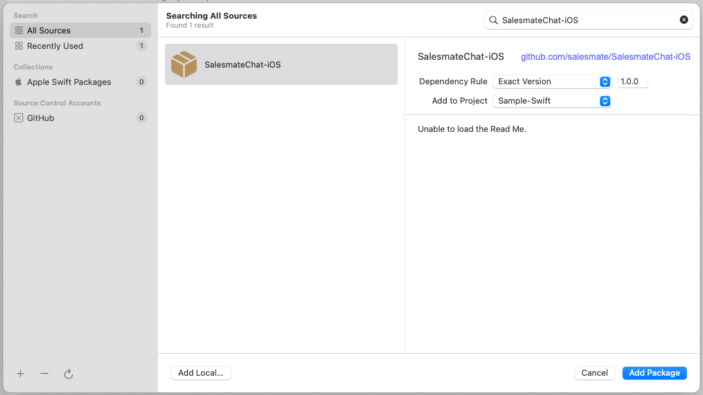
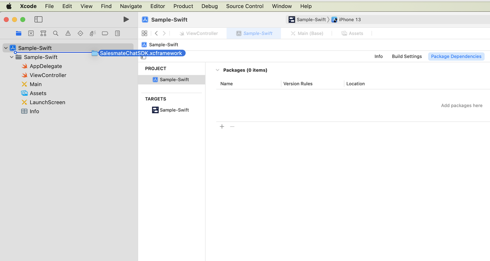
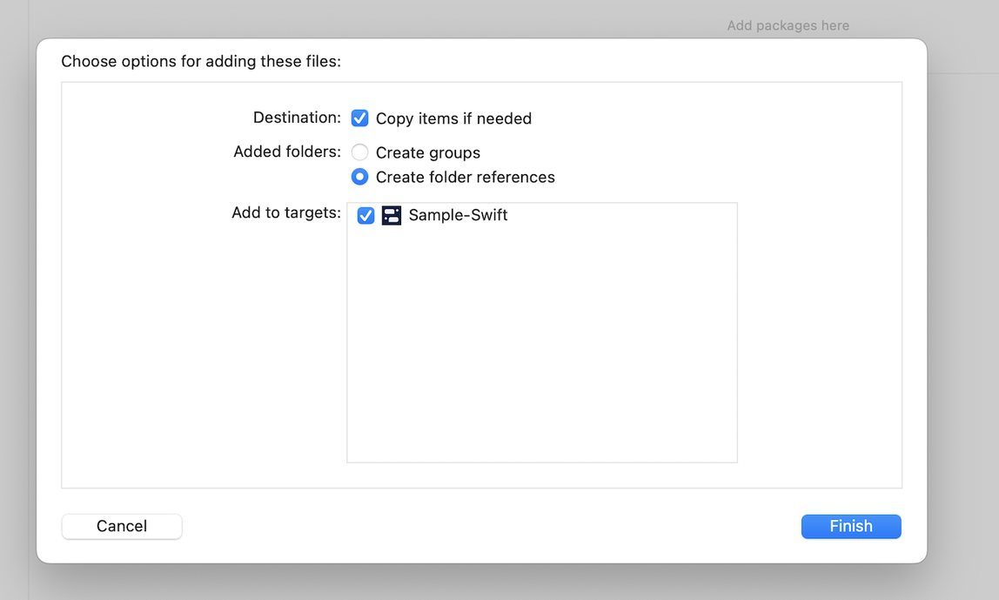
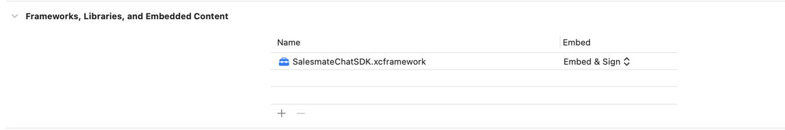
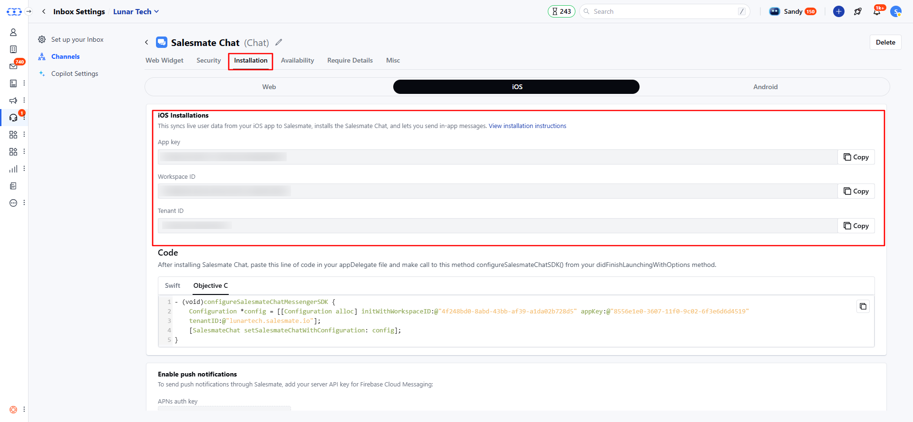

Install Salesmate Chat SDK to communicate with your Customer on your iOS app. The Skara Chat for iOS library supports iOS 13+ and requires Xcode 13 to build. [Click here to learn about navigation to iOS - Installation](/chats/installing-salesmate-chats/installing-chats-on-your-ios-app) .

### **Topics covered:**

- [Install Skara Chat](#install-salesmate-chat)
- [Update Info.plist](#update-infoplist)
- [Initialize Skara Chat](#initialize-salesmatechat)
- [Login a User](#login-a-user)
- [Log Out](#log-out)

**Install Skara Chat**

**CocoaPods** Cocoapods 1.10 is required to install Skara Chat SDK.

- Add Salesmate Chat SDK to your Podfile and run `pod install`

```
target
```

**Swift Package Manager** Add as following Swift Package Repository in Xcode and follow the instructions to add Skara Chat SDK as a Swift Package.

https://github.com/salesmate/salesmate-chat-ios



**Install Skara Chat SDK manually** - [Download SalesmateChat for iOS and extract the
zip.](https://github.com/salesmate/SalesmateChat-iOS/archive/refs/heads/main.zip)



- Drag `SalesmateChatSDK.xcframework` into your project. Make sure "Copy items if needed" is selected and click Finish.



- In the target settings for your app, set the `SalesmateChatSDK.xcframework` to “Embed & Sign”. This can be found in the “Frameworks, Libraries, and Embedded Content” section of the “General” tab.



### Update Info.plist

Photo Library usage: With the exception of apps that only support iOS 14+, when installing Skara Chat SDK, you'll need to make sure that you have a **NSPhotoLibraryUsageDescription** entry in your **Info.plist**.

For apps that support iOS 13, this is required by Apple to access the photo library. It is necessary when installing Skara Chat SDK due to the image upload functionality. Users will only be prompted for photo library permission when they tap the image upload button.

### Initialize SalesmateChat

First, you'll need to get your Skara Chat SDK **App key, Workspace Id** and **Tenant Id**. To find these, just select the 'iOS Tab' option in your Skara CRM Messenger Settings Installation section.



Then initialize Skara Chat SDK by importing `SalesmateChatSDK` and adding the following to your application delegate:

**Objective-C**

```objc
@import SalesmateChatSDK;

- (BOOL)application:(UIApplication *)application 
didFinishLaunchingWithOptions:(NSDictionary *)launchOptions {
    
    Configuration *config = [[Configuration alloc] initWithWorkspaceID:@"<Your iOS Workspace Id>"
                                                                appKey:@"<Your iOS App Key>"
                                                              tenantID:@"<Your iOS Tenant ID>"
                                                           environment:2];
    
    [SalesmateChat setSalesmateChatWithConfiguration:config];
    
    return YES;
}
```

- **Note**:- For environments, 0 for Dev, 1 for Staging, and 2 for Production.

**Swift**

```swift
import SalesmateChatSDK

func application(_ application: UIApplication,
                 didFinishLaunchingWithOptions launchOptions: [UIApplication.LaunchOptionsKey: Any]?) -> Bool {

    let config = Configuration(workspaceID: "Your iOS Workspace Id",
                               appKey: "Your iOS App Key",
                               tenantID: "Your iOS Tenant ID",
                               environment: 2) // 2 = Development

    SalesmateChat.setSalesmateChat(configuration: config)

    return true
}
```

### Login a User

You’ll now need to log in to your users before communicating with them and tracking their activity in your app.

- **Login to your users (to talk to them and see their activity)**- Depending on your app type, you can log in to users. Here are the instructions : Here we will create a user with basic user detail in Skara Messenger.
- If you have an app with logged-in (identified) users only (like Facebook, Instagram or Slack) follow these instructions:
- You’ll also need to log in to your user anywhere they sign in. Just call:

```swift
let email = "user's email address"
let firstName = "user's first name"
let lastName = "user's last name"
```

```swift
let userId = "user's user id" // Unique id recommended

SalesmateChat.loginWith(userId: userId,
                        email: email,
                        firstName: firstName,
                        lastName: lastName) { success, error in
    if error == nil {
        // Login successfully
    } else {
        // Login error
        print("Login error: \(error!.localizedDescription)")
    }
}
```

### Log Out

When users want to log out of your app, simply call:

**Objective-C**

```objc
// This clears the SalesmateChat SDK's cache of your user's data
- (void)logout {
 [SalesmateChat logout];
}
```

**Swift**

```swift
// This clears the SalesmateChat SDK's cache of your user's data
func logout() {
    SalesmateChat.logout()
}
```