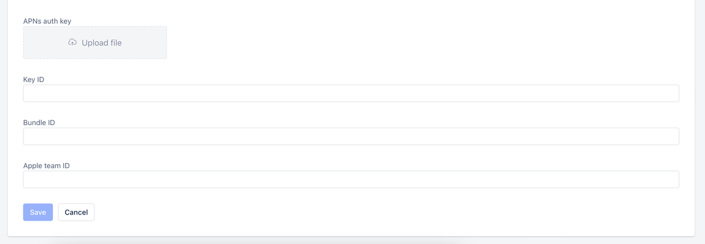

To enable Salesmate Chat SDK push notifications, you first need to create a private key, upload it to the Salesmate **(Web app >> Chat >> Chat Settings >> Installation >> iOS)**, and enter details about your app.

### **Topics covered:**

- [Create a Private Key](#create-a-private-key)

- [Enable in Salesmate Chat SDK](#enable-in-salesmate-chat-sdk)

- [Register Device Tokens](#register-device-tokens)

- [Handling Salesmate Chat Push Notifications](#handling-salesmate-chat-push-notifications)

### Create a Private Key

Using these [instructions](#enable-in-salesmate-chat-sdk), create and download a private key with APNs enabled. Note the Key ID for the next step.
Alternatively, use an existing private key with APNs enabled.

### Enable in Salesmate Chat SDK

Go to your **Chat Settings** and select **Installation > iOS**. In the **"Enable Push Notifications"** section:

- Upload the .p8 file you just created
- Enter the Key ID from Step 1
- Enter the [Bundle ID](https://developer.apple.com/account/resources/identifiers) for the app you want to send notifications to
- Enter the
- [Apple team ID](#create-a-private-key)
- Click Save **Enable Push Notifications** To send push notifications through Salesmate Chat SDK, add the .p8 file, Key ID, Bundle ID, and Apple team ID:



### Register Device Tokens

To enable your users to receive push notifications from Salesmate Chat via Salesmate Chat SDK for iOS, you must [request permission](https://developer.apple.com/documentation/usernotifications/asking_permission_to_use_notifications) to send push notifications and register the device token of your user in your `AppDelegate`.

- **Objective-C**

```objc
- (void)application:(UIApplication *)application didRegisterForRemoteNotificationsWithDeviceToken:(NSData *)deviceToken {}

 NSString *deviceTokenString = [[[[deviceToken description]
 stringByReplacingOccurrencesOfString: @"<" withString: @""]
 stringByReplacingOccurrencesOfString: @">" withString: @""]
 stringByReplacingOccurrencesOfString: @" " withString: @""];

 [SalesmateChat sendDeviceTokenWith:deviceTokenString];
}
```

- *Swift**

```swift
func application(\_ application: UIApplication, didRegisterForRemoteNotificationsWithDeviceToken deviceToken: Data) {}

let deviceTokenString = deviceToken.reduce("") { $0 + String(format: "%02X", $1) }

SalesmateChat.sendDeviceToken(with: strGlobalDeviceToken)
}
````

At this stage, you should also ensure that you have enabled the Push Notifications and Background Modes capability and enabled Remote notifications in Xcode.


### Handling Salesmate Chat Push Notifications

Handle Salesmate Chat SDK push notifications manually in `didReceiveNotificationResponse` in your `UNUserNotificationCenterDelegate`:**Objective-C**

```objc
- (void)userNotificationCenter:(UNUserNotificationCenter *)center didReceiveNotificationResponse:(UNNotificationResponse *)response withCompletionHandler:(void (^)(void))completionHandler {}

 NSDictionary *userInfo = response.notification.request.content.userInfo;

 if (userInfo != nil) {}
 if ([SalesmateChat isSalesmateChatSDKPushNotificationWithUserInfo: userInfo]) {}
 [SalesmateChat handlePushNotificationWithUserInfo: userInfo];
 return;
 }
 }

 completionHandler(UIBackgroundFetchResultNoData);

}
````

- *Swift**```swift
func userNotificationCenter(\_ center: UNUserNotificationCenter, didReceive response: UNNotificationResponse, withCompletionHandler completionHandler: @escaping () -> Void) {}

let dict = response.notification.request.content.userInfo as! [String : AnyObject]

if SalesmateChat.isSalesmateChatSDKPushNotification(userInfo: dict) {}
SalesmateChat.handlePushNotification(userInfo: dict)
return
}
completionHandler()

}

````

Handle Salesmate Chat SDK push notifications manually in `willPresentNotification` in your `UNUserNotificationCenterDelegate`:**Objective-C**

```objc
- (void)userNotificationCenter:(UNUserNotificationCenter *)center willPresentNotification:(UNNotification *)notification withCompletionHandler:(void (^)(UNNotificationPresentationOptions options))completionHandler {}

 NSDictionary *userInfo = notification.request.content.userInfo;

 if (userInfo != nil) {}
 if ([SalesmateChat isSalesmateChatSDKPushNotificationWithUserInfo: userInfo]) {}
 [SalesmateChat handlePushNotificationWithUserInfo: userInfo];
 return;
 }
 }

}
````

- *Swift**

```swift
func userNotificationCenter(_ center: UNUserNotificationCenter, willPresent notification: UNNotification, withCompletionHandler completionHandler: @escaping (UNNotificationPresentationOptions) -> Void) {}

 let dict = notification.request.content.userInfo as! [String : AnyObject]

 if SalesmateChat.isSalesmateChatSDKPushNotification(userInfo: dict) {}
 SalesmateChat.handlePushNotification(userInfo: dict)
 return
 }
}
```
