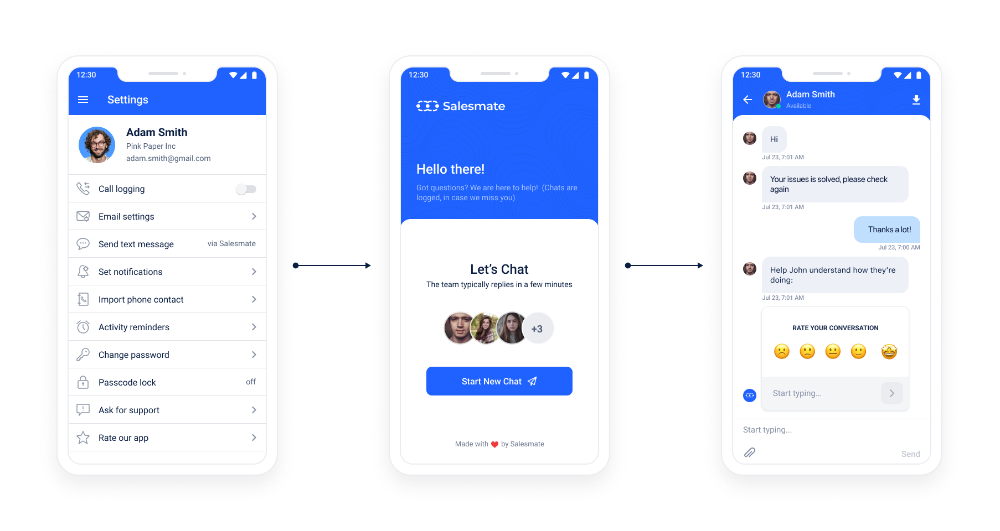

The Salesmate Chat SDK for iOS and Android enables you to use [Salesmate Messenger](/chats/introduction-to-salesmate-chats/what-is-salesmate-chats) in your app, have conversations with your customers, and track events.

Add a chat widget to your app, and:

- Start talking to your visitors in minutes.
- Engage your customers during their buying process and help them make a purchase.
- Resolve your customer support queries quickly to increase customer satisfaction. 
- Salesmate Chats is an add-on and its pricing is based on the number of user seats you wish to add for users who will be managing chat communication. 
- You need to be an admin to install the Chats. 
- Learn about [installing the Chats.](/chats/installing-salesmate-chats/activating-the-salesmate-chats)

###  ioS SDKs:

- [Installation](/chats/salesmate-chat-sdks/ios-sdk-installation)
- [Configuration](/chats/salesmate-chat-sdks/ios-sdk-configuration)
- [Push Notifications](/chats/salesmate-chat-sdks/ios-sdk-push-notifications)

###  Android SDKs:

- [Installation](/chats/salesmate-chat-sdks/android-sdk-installation)
- [Configuration](/chats/salesmate-chat-sdks//android-sdk-configuration)
- [Push Notifications](/chats/salesmate-chat-sdks/android-sdk-push-notifications-fcm)
