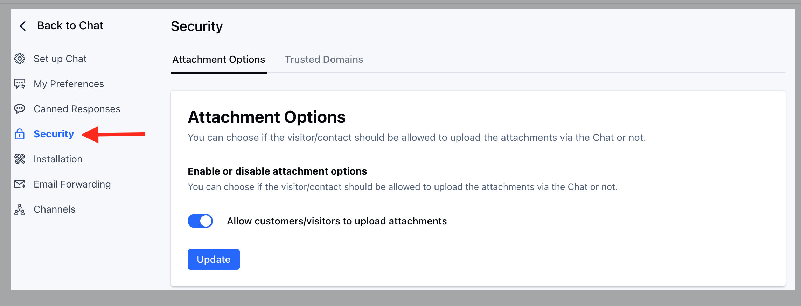

Skara unified inbox provides you the option to choose if your visitor or customer can upload the attachments via unified inbox or not.

**To change the Attachment requirement, you can follow these steps:**

- Navigate to **Conversations Icon** on the left menu bar
- Click on Unified Inbox
- Head to Unified Inbox**Settings**  on bottom left

- Click on the **Security** link on the left sidebar
- Click on the "**Attachment Options**" tab.
- Toggle the "**Allow customers/visitors to upload attachments**" option as per the need.
- Hit **Update** to save yourchanges.

### How do attachments work?

- When a visitor or customer sends an attachment over Unified Inbox, it is uploaded on a server with an accessible URL. Generally, these URLs are not indexed by a search engine, but it is not suggested to ask for private documents over chat.

### Which attachments can a user upload?

- Please note the attachment upload setting is not applicable for the users. They can always upload and send the attachments to the contacts. Learn more about [allowed attachment types](https://support.salesmate.io/hc/en-us/articles/360059349132)

### What happens if a contact sends attachments via email?

- If you have disabled the option for uploading attachments, then attachments sent by the contact are dropped from the Unified Inbox.

<Note>
  **Note:**

  - Only users with  ["Manage Unified Inbox settings” permission](https://support.salesmate.io/hc/en-us/articles/360058438992) can access this setting.
  - When the attachments sent via email are dropped from the Unified Inbox then a timeline entry is shown below theUnified Inbox message 

    "Attachments from this message are dropped".
</Note>