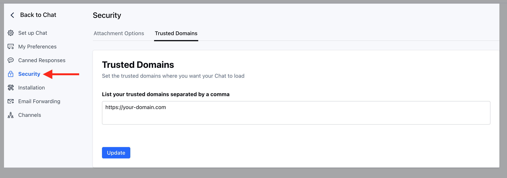

Skara allows you to white list your domain names, whereas Chats will run. Once you have configured trusted domains, your Skara unified inbox will only load on the websites hosted by those domains.

If anyone copies your unified inbox launcher code and place it on their website, the unified inbox will not show up there.

**To set trusted domains, please follow these steps:**

- Navigate to **Conversations Icon** on the left menu bar
- Click on **Chats**
- Head to **Chat Settings** on bottom left.

- Switch to the **Security** tab in the left sidebar
- Click on the "**Trusted Domains**" tab
- List your trusted domains separated by a comma
- Hit **Update** to save your changes.

<Note>
  **Note:** 

  - Only users with ["Manage Chat settings" permission](https://support.salesmate.io/hc/en-us/articles/360058438992) can access this setting.
  - If you skip this setting, then Chat will load from all domains.
  - You can provide multiple domains separated by a comma. E.g. [www.yourwebsite.com](http://www.yourwebsite.com), [www.yourwebsite.net](http://www.yourwebsite.net)
  - To list all subdomains, use an asterisk, like \*.yourwebsite.com.
  - Ensure you add the entire domain name (i.e. [www.yourwebsite.com](http://www.yourwebsite.com)). Please note yourwebsite.com and [www.yourwebsite.com](http://www.yourwebsite.com) are two different domains.
</Note>