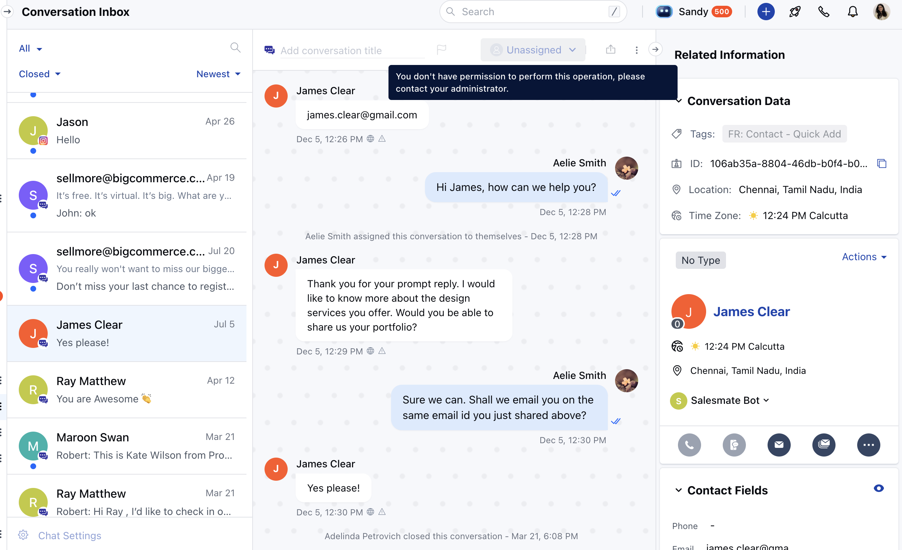

This feature allows users without an assigned chat license to view chat conversations and events in a read-only mode. It ensures that even users without full chat permissions can review important interactions, monitor discussions, and stay informed about relevant events without the ability to modify or interact directly.

### **Topics covered:**

- [How to manage Chat Conversation & Events Permission](#how-to-manage-chat-conversation-events-permission)
- [How conversation will be visible to Users](#how-conversations-will-be-visible-to-users)

### How to manage Chat Conversation & Events Permission

To manage the rights of Chat Conversation to different profiles, follow the below steps:

- Navigate to **Profile Icon** on the top right corner
- Click on **Setup**
- Head over to **Users & Security**
- Click on **Profile Permissions**

- Edit the **Profile**, it could be Standard or any other custom profile
- Now, on the **Chat Conversations & Events** section, assign the rights to the users.

Here you can manage the following:

- **Show Conversations:** Let users view the conversations in read-only mode when they don’t have the chat license.
- **Show Events:** Let users view the page events when they don’t have the chat license.
- **Show Page Views:** Let users view the page visits when they don’t have the chat license.

### How conversations will be visible to users:

Once the permissions are allowed to view Chat Conversations, the user will see all the chats on all pages i:e; Conversation Inbox, Contact/Company Detail & Preview mode, and Recent Conversation Widget.

- Available Options to manage by users:
- Copy Chat URL
- Export as Text
- Email Chat

