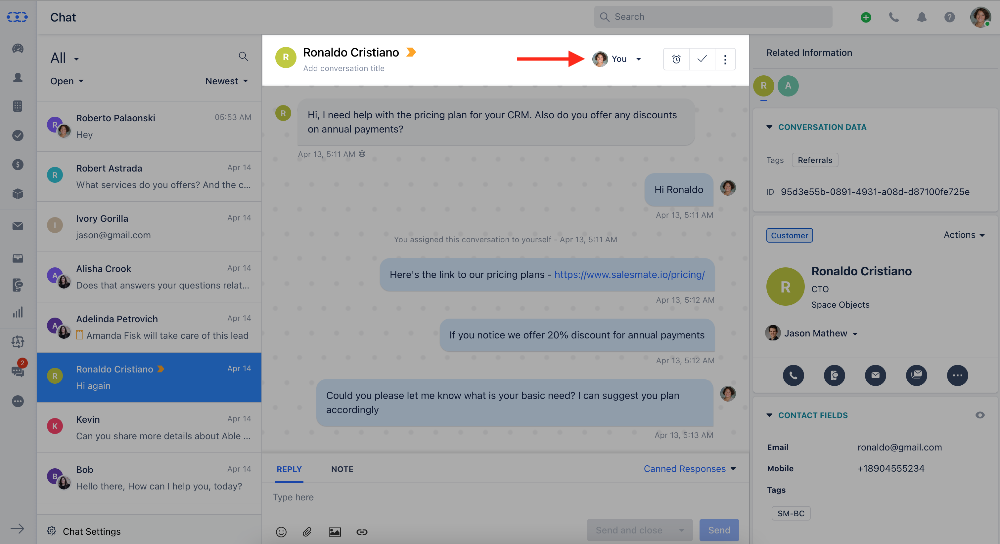
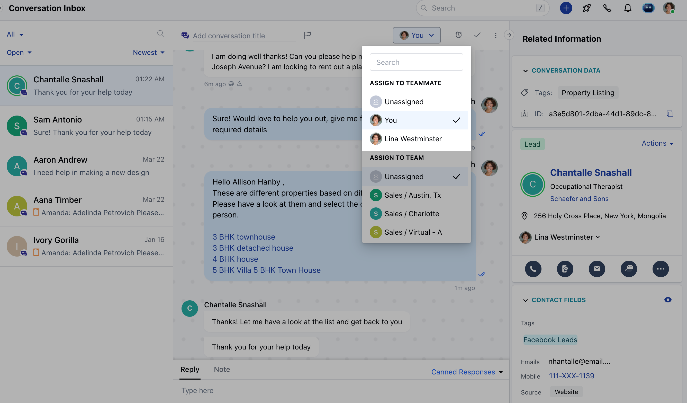
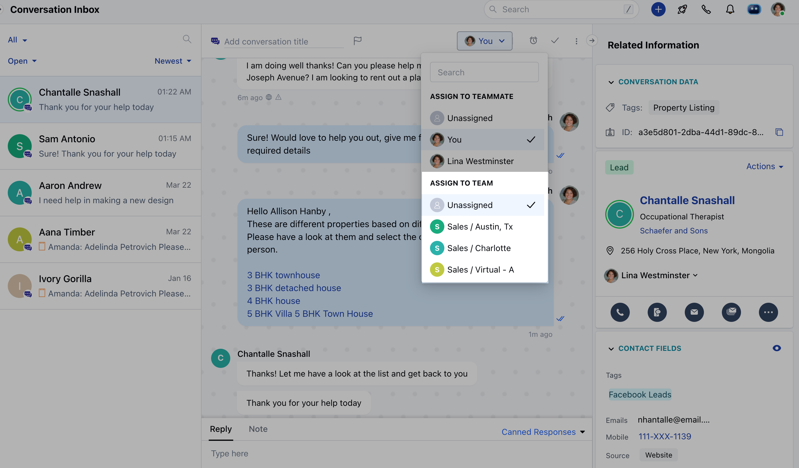

Salesmate Chats allows you to assign a conversation to a user or team so that the customers can get a response on time by the right person and their query gets resolved on time.

**Topics Covered:**

*   [Assigning Conversation to a User](https://support.salesmate.io/hc/en-us/articles/360058878191#h_01HWSAGVQRZCPT20XB8TV2G4XD)
*   [Assigning Conversation to a Team](https://support.salesmate.io/hc/en-us/articles/360058878191#h_01HWSAGVQRHD0F28XSSGKVB6QZ)

### Assigning Conversation to a User

*   Click on the conversation which you want to assign to the user, then click on the dropdown icon in the title bar of the conversation as shown in the figure below.

*   Select the user to whom you want to assign the conversation.

<Note>
**Note:** Conversations can only be assigned to the users who have a Chat license. 
</Note>

*   If the conversation was already assigned to a team then it remains unchanged. As it helps in the case when the assigned user has [enabled away mode](https://support.salesmate.io/hc/en-us/articles/360058439252), other members of the team can respond to the customer.

### Assigning Conversation to a Team

*   In the same way, you assigned a user, you can choose a team from the ownership dropdown and assign a conversation to it, and any user assigned to the conversation will be removed from it.

<Note>
**Notes:**

*   Unassigned conversations can be self-assigned or assigned to other users by any user
*   Assigned conversations can only be re-assigned by the user with ["Manage conversation ownership" permission.](https://support.salesmate.io/hc/en-us/articles/360058438992) 

</Note>